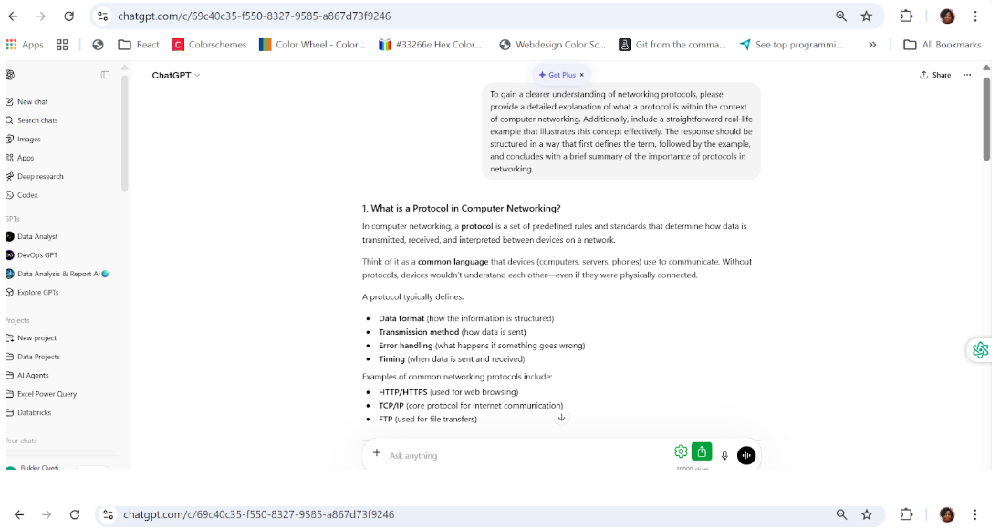
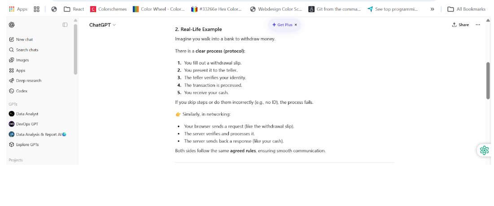
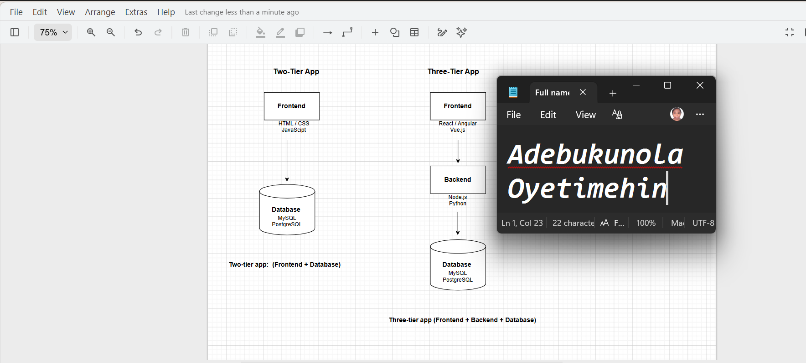
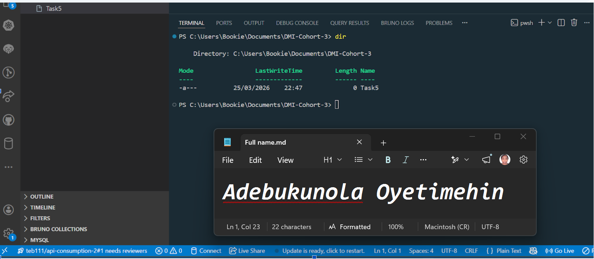

# Week 00 - Internet and Networking

Part of the DevOps Micro Internship (DMI) Cohort 3 with Agentic AI

---

# 🧑‍💻 Task 1: Using ChatGPT as Your Learning Assistant

## Scenario

You're new to DevOps and will frequently encounter technical questions. ChatGPT can be your learning companion.

## Your Task

Write a clear ChatGPT prompt to help you understand:

> "What is a protocol in networking? Explain with a simple real-life example."

Take a screenshot of your interaction showing:

* Your detailed prompt (with clear expectations)
* ChatGPT's simplified response with an example

## Screenshot

Save your screenshot in the `screenshots` folder and update the file name below.




Replace `task-1-chatgpt.png` with your actual screenshot file name.

---

## What I Learned (2–3 lines)

What I learned from the task above:

1. ChatGPT simplifies the process of finding answers, reducing the need to sift through numerous articles. It efficiently summarizes information to address your queries.

2. Protocols are essential because they:

   * Enable communication between different devices and systems
   * Ensure data is transmitted accurately and reliably
   * Provide standardization, so systems built by different companies can work together
   * Help with error detection and recovery

   In short: Without protocols, modern networking—and the internet itself—would not function.

---

# 🌐 Task 2: Internet and Networking

## Scenario

Your friend is launching an online bookstore named **EpicReads**.

He asked you to explain how users globally can access his website hosted in Finland.

## Your Task

Write a short explanation (**100–150 words**) that includes:

* Packet Switching
* IP Address
* TCP/IP
* HTTP/HTTPS

💡 **Tip:** You may use ChatGPT (as demonstrated in Task 1) to refine your explanation.

## Answer

When a user visits EpicReads, their request is broken into small units called **packet switching**, allowing data to travel efficiently across multiple network paths before being reassembled at the destination. Each device on the internet has a unique **IP address**, which acts like a digital home address, ensuring the request reaches the server in Finland. Communication relies on the **TCP/IP protocol suite**: TCP ensures data is delivered accurately and in order, while IP handles routing between networks. Once connected, **HTTP** (HyperText Transfer Protocol) is used to transfer web content, but **HTTPS** (the secure version) encrypts the data, protecting sensitive information like login details. Together, these technologies ensure that users worldwide can reliably and securely access EpicReads regardless of their location.

---

# 🏗️ Task 3: Application Architecture & Stack

## Scenario

EpicReads bookstore has two application versions:

### Two-Tier Application

* Frontend
* Database

### Three-Tier Application

* Frontend
* Backend
* Database

## Your Task

* Draw simple diagrams (hand-drawn or tool-based such as draw.io)
* Label each layer clearly
* List at least two common technologies or tools used for each layer
* Submit a screenshot or photo clearly showing your own drawing

## Diagram Screenshot / Photo

Save your diagram image in the `screenshots` folder and update the file name below.



Replace `task-3-diagram.png` with your actual diagram file name.

---

## Technologies Used

### Frontend

* HTML, CSS, JavaScript
* React or Angular

### Backend

* Node.js (Express)
* Python (Django / Flask)

### Database

* MySQL
* MongoDB

---

# 🌍 Task 4: Domain Name & DNS (Basic Concepts)

## Scenario

Your friend's bookstore **EpicReads** is currently accessible through:

```text
52.172.142.222:3000
```

He purchased the domain:

```text
epicreads.com
```

## Your Task

In **50–100 words**, explain in your own words:

1. What is DNS (Domain Name System)?
2. Which DNS record type should be used to connect the domain to the given IP, and why?

## Answer

The **Domain Name System (DNS)** is a system that translates human-friendly domain names (like *epicreads.com*) into machine-readable IP addresses (like 52,172,142,222), allowing users to access websites without memorizing numeric addresses.
To link *epicreads.com* to the server, an **A record** should be used. An A record maps a domain directly to an IPv4 address, making it the correct choice for pointing the domain to 52,172,142,222.

---

# 💻 Task 5: Visual Studio Code Setup (Hands-on)

## Your Task

Install Visual Studio Code (if not already installed).

Take a screenshot of your VS Code environment showing:

* Terminal open inside VS Code
* Running a basic command:

### Windows

```powershell
dir
```

### Linux / macOS

```bash
pwd
ls
```

* Your selected VS Code theme clearly visible

⚠️ **Important:** The screenshot must show your username or another identifiable detail to confirm it is your environment.

## Screenshot

Save your screenshot in the `screenshots` folder and update the file name below.



Replace `task-5-vscode.png` with your actual screenshot file name.

---

# 🔗 Task 6: Publish Your Assignment as a LinkedIn Post

## Objective

Publishing on LinkedIn helps you:

* Build your professional online presence
* Reinforce your learning
* Document your DevOps journey publicly

## Your Task

Summarize your answers from Tasks 1–5 into a LinkedIn post.

Clearly structure your post into the following sections:

* ChatGPT
* Internet & Networking
* App Architecture
* DNS
* VS Code Setup

Add the following credit note at the end of your post:

> **P.S. This post is a part of DevOps Micro Internship with Agentic AI Cohort-3 by Pravin Mishra. You can start your DevOps journey by joining this Discord community: <https://discord.pravinmishra.com/>**

---

## LinkedIn Post URL

Paste your LinkedIn post URL here:

```text
https://www.linkedin.com/pulse/devops-micro-internship-dmi-bukky-oyetimehin-yruqe
```

---

## LinkedIn Post Backup Copy

Paste the full text of your LinkedIn post here:

DevOps Micro-Internship (DMI)

I recently registered for the DevOps Micro-Internship (DMI) Cohort 3. The assignment tasks covered core concepts, including network protocols and development setup, which are briefly summarised here. This demonstrates my suitability for participation in the cohort.
DevOps Fundamentals: Key Takeaways from Tasks 1-5
Task 1: ChatGPT
Focused on leveraging ChatGPT as a powerful learning assistant for technical subjects.

Task 2: Internet & Networking
Understanding how data travels on the web is key to DevOps. When a user visits a site, their request is broken into small units via packet switching, which allows the data to travel efficiently across multiple network paths before being reassembled at the destination. Every device on the internet has a unique IP address, which acts like a digital home address to ensure the request reaches the correct server. Communication relies on the TCP/IP protocol suite: TCP ensures that data is delivered accurately and in the correct order, while IP handles the routing between networks. For transferring web content, HTTPS (HyperText Transfer Protocol Secure) encrypts the data, protecting sensitive information, unlike standard HTTP.

Task 3: App Architecture
Covered the fundamentals of application architecture & stack.

Task 4: DNS
The Domain Name System (DNS) is essential as it translates human-friendly domain names (like epicreads.com) into machine-readable IP addresses (like 52.172.142.222), so users don't have to memorise numeric addresses. To link a domain to an IPv4 address, an A record must be used, which maps the domain directly to the specified IP.

Task 5:  VS Code Setup
Hands-on exercise focused on setting up Visual Studio Code.

P.S. This post is part of the FREE DevOps Micro Internship Cohort run by Pravin Mishra. You can start your DevOps journey for free from his YouTube Playlist.

---

# Reflection – Week 0

### What did you find easy?

Using ChatGPT and Visual Studio Code.

---

### What was difficult?

I found posting on LinkedIn somewhat challenging, as it's not something I'm accustomed to doing.

---

### What will you improve next week?

I plan to boost my confidence and proficiency in creating LinkedIn posts next week.

---

## 📌 About DMI & CloudAdvisory

DevOps Micro Internship (DMI) is a project-based DevOps program run by Pravin Mishra (The CloudAdvisory) focused on real-world execution, systems thinking, and career readiness.

It helps learners build strong DevOps foundations with hands-on experience.

## 📌 Resources

* 🌐 **DMI Official Website:** <https://pravinmishra.com/dmi>  
* 🎓 **DevOps for Beginners (Udemy):** <https://www.udemy.com/course/devops-for-beginners-docker-k8s-cloud-cicd-4-projects/>  
* 🎓 **Ultimate Agentic AI DevOps with Clude Code** <https://www.udemy.com/course/ultimate-agentic-ai-devops-with-claude-code/?referralCode=448389767BC96284087B>
* 🎓 **DevOps with Claude Code: Terraform, EKS, ArgoCD & Helm** <https://www.udemy.com/course/devops-with-claude-code-terraform-eks-argocd-helm/?referralCode=1C5B734505D65A010FA3>
* ▶️ **YouTube Playlist (DMI Cohort 3):** <https://www.youtube.com/playlist?list=PLFeSNDtI4Cho>  
* 🔗 **Pravin Mishra (LinkedIn):** <https://www.linkedin.com/in/pravin-mishra-aws-trainer/>  
* 🏢 **CloudAdvisory (LinkedIn):** <https://www.linkedin.com/company/thecloudadvisory/>

---

*This submission is part of DevOps Micro Internship (DMI) Cohort 3 — Agentic AI Track*
