# Week 01 — Success Mindset (Mindset OS)

Part of the DevOps Micro Internship (DMI) Cohort 3 with Agentic AI

---

## Purpose (Read This First)

This week is not motivation homework.

This is you building your **Mindset OS** — the system you will use for the next 5 months (and honestly, for years).

### Expectations

* Be honest.
* Be specific.
* Be practical.
* Write like an adult professional: clear sentences, no one-liners.

You will reuse this in later weeks. So do it properly once.

---

## Assignment 1. What is something you believe to be true that most people around you would disagree with?

### Rules

* No "safe" answers.
* Must be your real belief (not copied from internet).
* Minimum 50 words.

**Hint:** What do you believe about career, money, learning, discipline, relationships, health, success, life, tech industry, etc. that most people don't agree with?

## Answer

I firmly believe that **anything worth doing is worth doing well**. Excellence is never accidental—it is the result of intentional effort, continuous improvement, and disciplined execution.

True success requires more than hard work; it demands **working smart**. While dedication lays the foundation, strategic thinking, adaptability, and efficiency are what transform effort into meaningful results.

## Lifelong Learning

I view both professional and personal development as a **lifelong journey**. Learning does not end with formal education or a job title—it is an ongoing commitment. Those who aspire to remain at the forefront of their field must embrace continuous learning, stay curious, and continually expand their knowledge and skills.

## The Power of Meaningful Relationships

Growth is rarely achieved in isolation. The people we surround ourselves with have a profound influence on our mindset, decisions, and aspirations. As the saying goes:

> *"Bad company corrupts good character."*

Our relationships shape our character, well-being, lifestyle, and ultimately our success. For this reason, I intentionally seek environments and communities that inspire growth, integrity, and excellence.

## Embracing Change

Change is inevitable, and adaptability is no longer optional—it is essential. Thriving in an ever-changing world requires the ability to embrace uncertainty, remain resilient, and see challenges as opportunities rather than obstacles.

I approach every challenge as a chance to sharpen my critical thinking, strengthen my problem-solving abilities, and broaden my perspective. My goal is to build expertise that transcends specific tools or platforms, enabling me to remain effective regardless of how technology evolves.

## Discipline and Passion

Discipline and consistency are the cornerstones of sustained success. Talent may open doors, but disciplined execution is what creates lasting impact.

Technology is more than a profession for me—it is a genuine passion. I cannot imagine building a career in any other field. Because the technology landscape is constantly evolving, I am committed to evolving alongside it through continuous learning, practical experience, and an unwavering pursuit of excellence.

---

> **"Learn continuously. Adapt fearlessly. Build meaningful relationships. Work smart. Pursue excellence."**

---

## Assignment 2. What are the top 3 objective truths you discovered through experimentation and results?

### Definition

Objective truths do not depend on opinions. They hold true regardless of how people feel.

Write each truth in this format:

**Truth:** (1 sentence)

**Evidence from my life:** (2–4 lines: what you tried + what happened)

---

## Truth #1

### Truth

**Change is inevitable, but choosing to grow from it is a personal decision**, and I believe **adaptability** is one of the most valuable skills anyone can develop.

### Evidence from my life

After losing a well-paying job, I endured years of uncertainty and several unsuccessful ventures before discovering an online **Full Stack Development** bootcamp. Although I already had experience in **IT Support**, I embraced the challenge, persevering through an intensive program filled with demanding coursework and countless sleepless nights. My dedication paid off when I completed the bootcamp and was offered a job by the program convener, bringing an end to a **six-year period of unemployment**. That experience reinforced my belief that **resilience, continuous learning, and adaptability** have the power to transform setbacks into opportunities and unlock new possibilities for growth.

---

## Truth #2

### Truth

Learning does not end with formal education or a job title; it is an ongoing commitment.

### Evidence from my life

Individuals who wish to remain at the forefront of their respective fields must actively engage in ongoing learning, cultivate curiosity, and consistently enhance their knowledge and skills. This principle has become evident to me in my current role, where I have been entrusted with diverse responsibilities that encourage my growth.

---

## Truth #3

### Truth

Certifications are valuable, but they are not a substitute for practical experience.

### Evidence from my life

True expertise is developed by applying knowledge in real-world environments, solving complex problems, learning from setbacks, and adapting to diverse roles and responsibilities. While certifications validate foundational knowledge, experience is what transforms that knowledge into practical competence.

When I earned my first AWS certification—the AWS Certified Cloud Practitioner—I initially believed I had a solid understanding of DevOps. As I gained hands-on experience, however, I realised that the field is far broader and deeper than any single certification can capture.

---

## Assignment 3. What does your 2.0 version look like?

### Instructions

Write as if a journalist is writing about you **3 to 7 years from now** (not 20 years).

**Minimum 300 words.**

### Rules

* Write in past tense, like it already happened.
* Don't use "likes to / wants to / hopes to."
* Use specifics:

  * built
  * shipped
  * led
  * published
  * earned
  * relocated
  * contributed
* Include skills proof:

  * projects
  * portfolios
  * GitHub
  * blogs
  * certifications
  * job role
  * leadership
  * community contribution
* Add 1–3 images if you can (optional but powerful).

### Publish It Publicly On Any ONE

* LinkedIn
* Medium
* WordPress
* Blogspot
* Personal blog
* Portfolio page

Include this line:

> **P.S. This post is part of the DevOps Micro Internship (DMI) with Agentic AI — Cohort 3 — by [Pravin Mishra](https://www.linkedin.com/in/pravin-mishra-aws-trainer/). My graded progress is public: https://dmi.pravinmishra.com/s/YOUR-GITHUB-USERNAME.html · Start your DevOps journey: https://dmi.pravinmishra.com/?utm_source=student&utm_medium=ps-blog&utm_campaign=cohort3**

## Your Article

## My Vision 2.0

Five years passed faster than I imagined.

The version of myself I once visualized became reality—not because of luck, but because of the small, consistent decisions made every single day.

I **built** secure, scalable, and resilient cloud solutions that solved real business problems.

I **led** cloud infrastructure and DevOps initiatives that improved reliability, security, and operational efficiency.

I **shipped** production-ready solutions that organizations trusted to support their critical workloads.

I **earned** industry-recognized certifications, but more importantly, I proved my skills by building real projects and solving real challenges.

I **published** technical blogs, project documentation, and learning resources that helped engineers grow in their careers.

My **GitHub portfolio** became a collection of practical solutions that demonstrated my ability to design, automate, deploy, and monitor modern cloud infrastructure.

I **contributed** to the technology community through mentoring, knowledge sharing, open-source projects, and technical presentations.

I **led** with integrity, communicated with clarity, and earned the trust of colleagues, clients, and the teams I served.

I remained a lifelong learner, adapting as technology evolved and embracing every challenge as an opportunity to grow.

Looking back, the greatest achievement wasn't the certifications, the projects, or the promotions.

It was the person I became through the journey.

Every early morning study session...

Every difficult project...

Every setback...

Every lesson...

Every line of code...

Every conversation...

Every act of consistency shaped the professional and the person I had envisioned years earlier.

This post isn't a celebration of something that has already happened.

It's a declaration of the future I'm intentionally building—one day, one project, and one decision at a time.

**What's one decision you're making today that your future self will thank you for?**

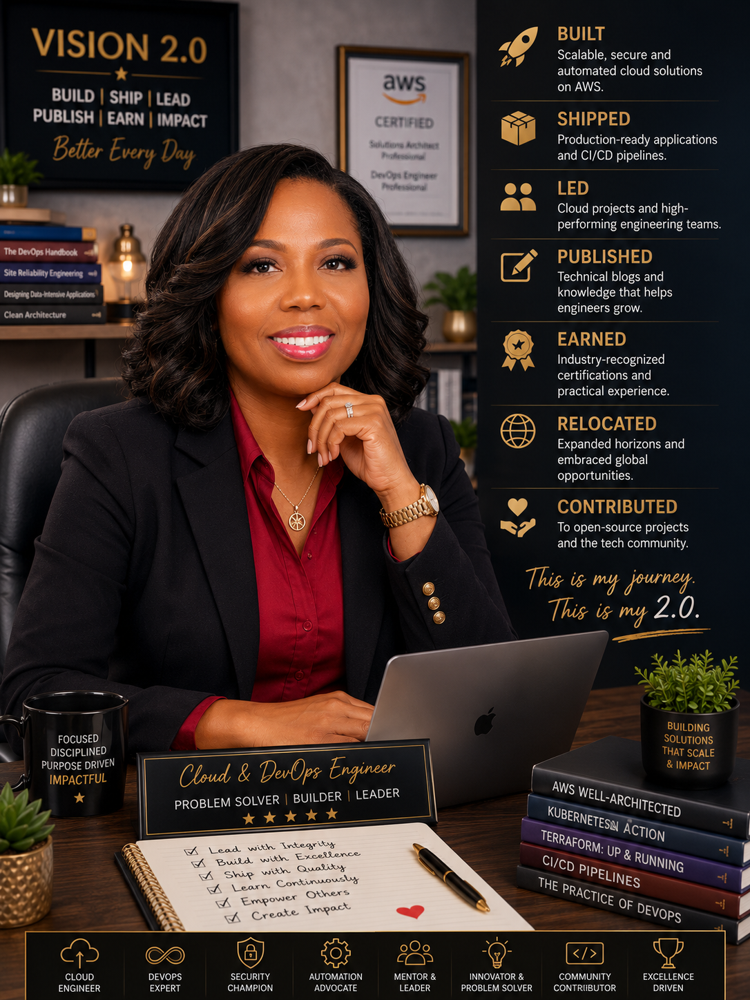

### Public Link

Paste your link here:

`(https://www.linkedin.com/posts/bukky-oyetimehin_dmi-devops-cloudcomputing-share-7478823904011128833-ooO6/?utm_source=share&utm_medium=member_desktop&rcm=ACoAABEGQlgB1AkrO3hQl21ZivPMvp3RJYKW6KI)`

---

# Assignment 4. Have you ever cut corners (unethical / dishonest / shortcut behavior — not necessarily illegal)? If yes, how did it make you feel?

### Important

You don't need to write the full story.

Focus on the feeling:

* guilt
* fear
* shame
* stress
* regret
* numbness
* etc.

This is about self-awareness, not judgment.

### Answer Format

**Yes / No**

If Yes:

**What emotion did you feel?** (minimum 50–100 words)

## Answer

**Yes!** I was left with a heavy sense of guilt, shame, and regret.

---

## Assignment 5. What are 10 non-fiction books you plan to read in the next 1 year?

### Rules

* Mention **Title + Author**
* Any language allowed
* No fiction novels

### Tip

Choose books that improve:

* mindset
* communication
* productivity
* health
* money
* career
* leadership

## Book List

1. **Atomic Habits — James Clear** 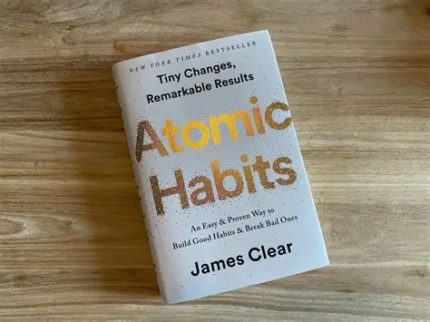
2. **Deep Work — Cal Newport** 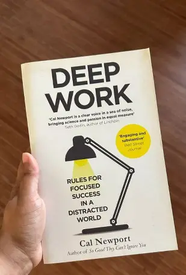
3. **Mindset — Carol S. Dweck** 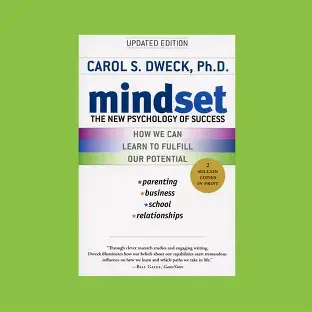
4. **Lateral Thinking — Edward de Bono** 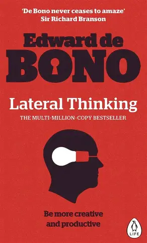
5. **How to Win Friends and Influence People — Dale Carnegie**
   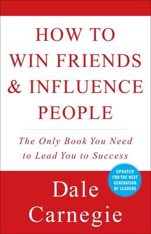
6. **So Good They Can't Ignore You — Cal Newport** 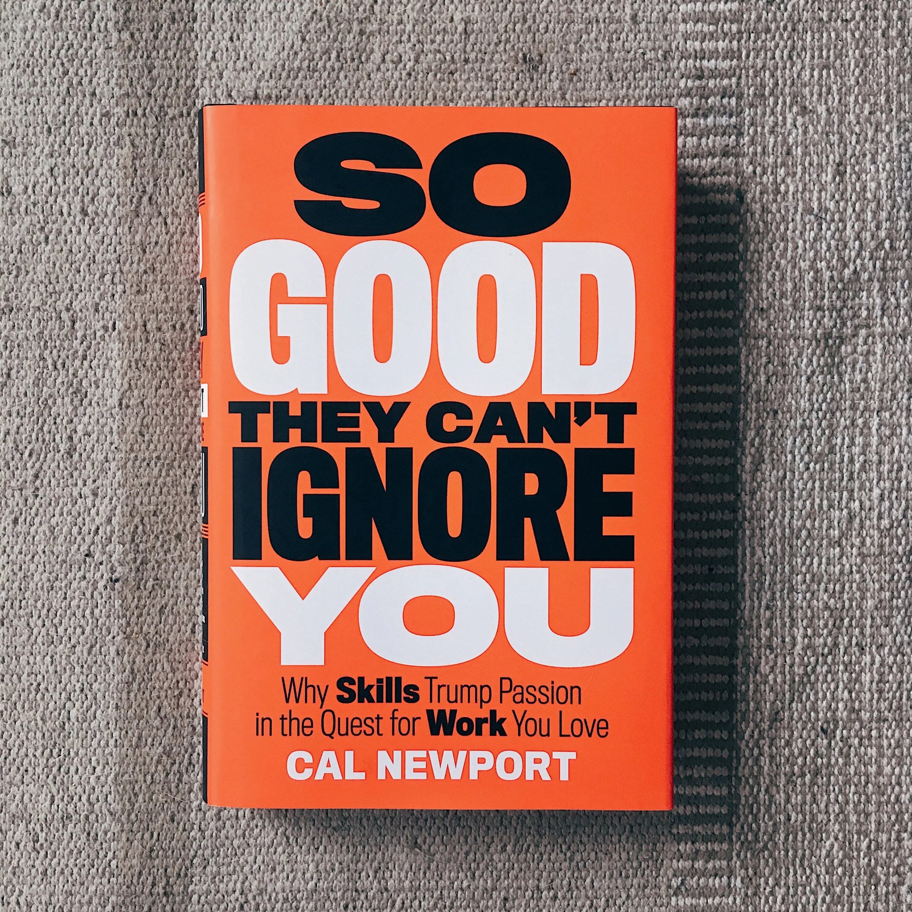
7. **Extreme Ownership — Jocko Willink & Leif Babin** 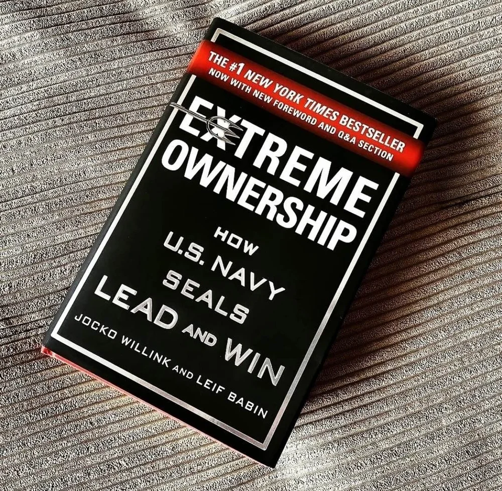
8. **The 5 AM Club — Robin Sharma** 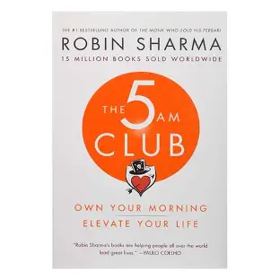
9. **The Effective Engineer — Edmond Lau** 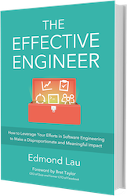
10. **Why We Sleep — Matthew Walker** 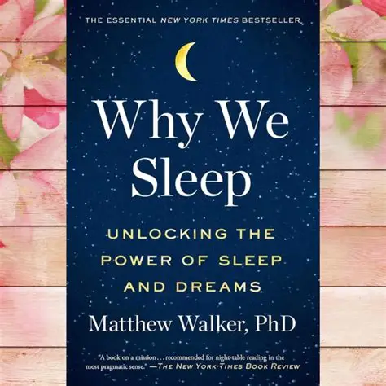

---

## Assignment 6. What are the things you will measure regularly in your life and career?

### Rules

List topics only. No need to share numbers.

### Must Include

* Learning / skill
* Output / proof
* Health / energy
* Time / focus
* Money / finance (personal or business)

### Example

* Learning hours per week
* Deep work sessions per week
* Projects shipped / documented
* Steps / workouts
* Sleep hours
* Spending tracker

## My Metrics

* Sleep hours
* Exercise days per week
* Projects deployed /documented /published
* Deep work hours per week
* Hours spent learning cloud/DevOps/data skills
* Books/courses completed
* Income growth
* Savings rate
* Spiritual growth
* Meaningful professional connections

---

## Assignment 7. Brain Dump + 5-Month System Plan

## Step 1: Brain Dump (Private)

Do a brain dump of everything in your mind into a notebook.

Examples:

* Bills
* Tasks
* Worries
* Goals
* Pending messages
* Ideas
* Responsibilities

### Did You Do It?

**Yes / No**

Answer:

Yes

---

## Step 2: Your 5-Month Routine + Focus Blocks

Create a simple plan you can realistically follow for the next 5 months.

### Weekly Routine

Example:

* Mon–Thu: 60 min deep work
* Sat: DMI session
* Sun: Weekly review

#### My Weekly Routine

Mon-Fri: Walk (60 mins), Deep Work (2-3 hours), Read a book (30 mins), Comment on LinkedIn (30 mins), Write a technical article (1 hour), Work on assignments (2 hours)
Sat: DMI session
Sun: Church, Family, Rest, Weekly review

### Weekly Review

I will ask myself:

* What did I learn?
* What did I build this week?
* What did I ship?
* What feedback did I receive?
* What drained my energy?
* What did I improve?
* What will I ship next week?
* What should I stop doing?
* What should I do more?

---

### Focus Blocks

#### When Will You Do DMI Work? (Days + Time)

Mon-Wed (12noon-3pm)

#### How Many Sessions Per Week?

3 Sessions Per Week

---

### Distraction Rules

Examples:

* Phone rules
* Social media rules
* Environment setup

#### My Distraction Rules

| **Rule**                             | **Description**                                                                                                                                        |
| ------------------------------------ | ------------------------------------------------------------------------------------------------------------------------------------------------------ |
| **Prioritize What Matters**          | Before opening any app or website, I will myself ask: **"Does this move me closer to my goals?"** If the answer is **No**, don't do it.                              |
| **No Social Media Before Deep Work** | Avoid social media, news, and entertainment until I've completed your **Most Important Task (MIT)** for the day.                                     |
| **Time-Box Entertainment**           | Limit entertainment to: **Social Media: 30 mins/day**, **YouTube (non-learning): 30–60 mins/day**, **TV/Movies: Only after planned work is complete.** |
| **Silence Notifications**            | Turn off all non-essential notifications. Allow only **phone calls, calendar reminders, and urgent family messages**.                                  |
| **One Task at a Time**               | Avoid multitasking. During deep work, focus on **one project, one objective, and as few browser tabs as possible**.                                    |
| **Schedule Email Checks**            | Check personal emails only at designated times say Mornings      |
| **Maintain a Clean Workspace**       | End each day by organizing your desk, closing unnecessary tabs, and tidying your notes and files.                                                      |
| **Protect Deep Work Time**           | Reserve **2–4 uninterrupted hours** daily for focused work. No phone, social media, messaging apps, or unnecessary meetings.                           |
| **Digital Shutdown Routine**         | At least **30 minutes before bed**, disconnect from screens. Reflect, or prepare for the next day instead.                                         |

---

# Reflection – Week 1

### Biggest insight I got about myself this week

> **My next level won't come from learning more—it will come from demonstrating what I already know.**

Every project I build, every solution I ship, every GitHub commit, every article I publish, and every contribution I make becomes tangible proof of my growth.

**I am no longer measured by what I know. I am measured by what I consistently build, ship, and share.**

---

### My biggest weakness/loop I noticed

#### My Biggest Weakness: Over-Preparation Instead of Shipping

One of the biggest patterns I've noticed about myself is a tendency toward **over-preparation instead of execution**.

I naturally invest a great deal of time in:

* Planning
* Documenting
* Reading
* Learning

While these activities are valuable, they can become a form of **productive procrastination** when they delay real-world execution.

#### The Question I Must Keep Asking

> **"What have I shipped into the real world this week?"**

#### The Loop I Need to Break

❌ **Current Pattern**

```text
Learn
   ↓
Plan
   ↓
Improve the Plan
   ↓
Read More
   ↓
Optimize
   ↓
Repeat
```

✅ **The Pattern I Need**

```text
Learn
   ↓
Build
   ↓
Ship
   ↓
Receive Feedback
   ↓
Improve
   ↓
Repeat
```

### One system I will implement from this week (exact habit + time)

#### My New Rule

> **Build first. Improve later.**

Progress comes from execution—not endless preparation. The fastest learners are those who are willing to produce imperfect work, gather feedback, and improve through experience.

#### My New Mindset

Instead of asking:

> **"What should I learn next?"**

I will ask:

> **"What should I build next?"**

#### Turning Knowledge into Proof

Knowledge only becomes valuable when it is visible and applied.

| **Instead of Only...**     | **I Will Also...**                  |
| -------------------------- | ----------------------------------- |
| Earning a certification | Build a real project             |
| Reading a book          | Publish a blog or summary        |
| Completing a tutorial   | Create a GitHub repository       |
| Learning a concept      | Apply it to solve a real problem |

To make that vision real, I will focus on reducing the gap between **learning** and **shipping**.

I will adopt a simple ratio:

> **For every hour I spend learning, I will spend at least one hour applying what I learned.**

This habit will help ensure your portfolio, GitHub, blog, and professional reputation grow alongside my knowledge. Over time, they'll become tangible evidence of the person my Vision 2.0 describes.

### LinkedIn Post

Paste your LinkedIn post link here:

`https://www.linkedin.com/posts/bukky-oyetimehin_dmi-devops-cloudcomputing-share-7478900868457771008-6hut/?utm_source=share&utm_medium=member_desktop&rcm=ACoAABEGQlgB1AkrO3hQl21ZivPMvp3RJYKW6KI`

---

## 10. Proof of Work

* LinkedIn Post URL:
  
`https://www.linkedin.com/posts/bukky-oyetimehin_dmi-devops-cloudcomputing-activity-7478823905214853122-6Dsp?utm_source=share&utm_medium=member_desktop&rcm=ACoAABEGQlgB1AkrO3hQl21ZivPMvp3RJYKW6KI`  

* Blog / Medium : **(<https://cloudcraftjournal.hashnode.dev/building-the-engineer-before-building-the-technology>)**  

---

## 📌 About DMI & CloudAdvisory

DevOps Micro Internship (DMI) is a project-based DevOps program run by Pravin Mishra (The CloudAdvisory) focused on real-world execution, systems thinking, and career readiness.

It helps learners build strong DevOps foundations with hands-on experience.

## 📌 Resources

* 🌐 **DMI Official Website:** <https://pravinmishra.com/dmi>  
* 🎓 **DevOps for Beginners (Udemy):** <https://www.udemy.com/course/devops-for-beginners-docker-k8s-cloud-cicd-4-projects/>  
* 🎓 **Ultimate Agentic AI DevOps with Clude Code** <https://www.udemy.com/course/ultimate-agentic-ai-devops-with-claude-code/?referralCode=448389767BC96284087B>
* 🎓 **DevOps with Claude Code: Terraform, EKS, ArgoCD & Helm** <https://www.udemy.com/course/devops-with-claude-code-terraform-eks-argocd-helm/?referralCode=1C5B734505D65A010FA3>
* ▶️ **YouTube Playlist (DMI Cohort 3):** <https://www.youtube.com/playlist?list=PLFeSNDtI4Cho>  
* 🔗 **Pravin Mishra (LinkedIn):** <https://www.linkedin.com/in/pravin-mishra-aws-trainer/>  
* 🏢 **CloudAdvisory (LinkedIn):** <https://www.linkedin.com/company/thecloudadvisory/>

---

*This submission is part of DevOps Micro Internship (DMI) Cohort 3 — Agentic AI Track*
