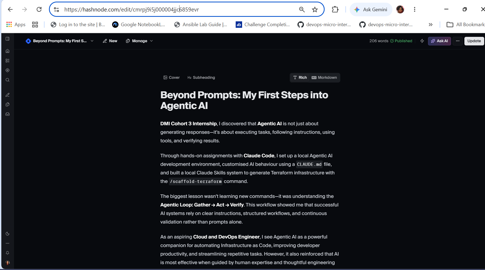
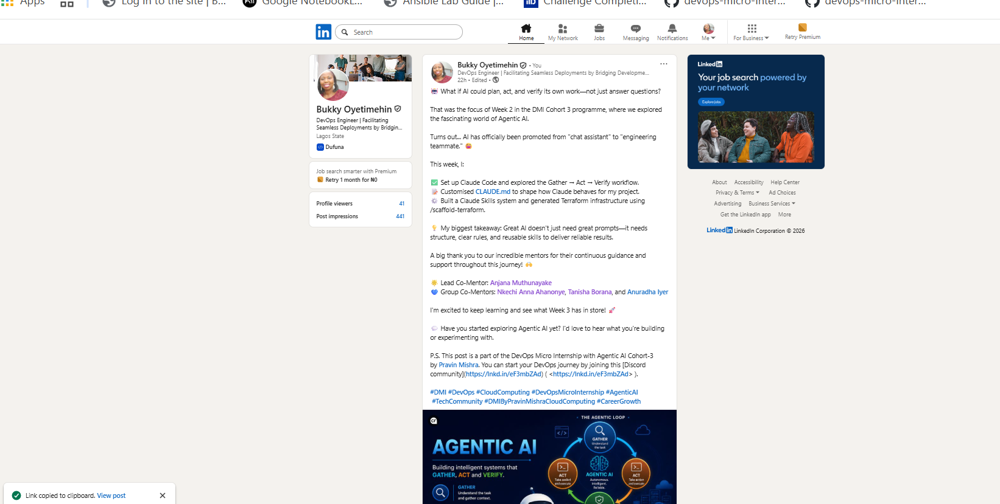

# Assignment 8 — Week 2 Reflection Blog

Part of the DevOps Micro Internship (DMI) Cohort 3 with Agentic AI

---

# Purpose

In this assignment, you will reflect on your Week 2 learning journey and write a short blog capturing your experience working with Agentic AI tools such as Claude Code, Skills, Subagents, MCP, Hooks, Permissions, and Memory.

You will also publish a LinkedIn post summarizing your learning and share both links for evaluation.

---

# Task 1 — Write Your Reflection Blog

## Goal

Write a reflection blog covering your Week 2 learning experience.

### Blog Requirements

Your blog must include:

* Title: **Reflection – Week 2**
* Minimum 300 words
* At least 2–3 topics from Week 2 (Claude Code, Skills, Subagents, MCP, Hooks, Permissions, Memory)
* Honest personal reflection (learning, challenges, mindset)
* One habit/system you plan to implement
* Your full name clearly visible

### Allowed Platforms

You can publish your blog on:

* Hashnode
* Medium
* Dev.to
* LinkedIn Article
* GitHub Markdown file
* Substack

---

### Evidence

#### Screenshot 1 — Blog published and visible



---

### Submission Field

Blog Link:

`(https://cloudcraftjournal.hashnode.dev/beyond-prompts-my-first-steps-into-agentic-ai)`

---

# Task 2 — Create LinkedIn Post

## Goal

Share your Week 2 learning publicly on LinkedIn.

---

### LinkedIn Post Requirements

Your post must include:

* One screenshot from any Week 2 assignment
* Short reflection (what you learned or built)
* Required P.S. line exactly as given below

---

### Required P.S. Line (Must Include Exactly)

> **P.S. This post is a part of DevOps Micro Internship with Agentic AI Cohort-3 by [Pravin Mishra](https://www.linkedin.com/in/pravin-mishra-aws-trainer/). You can start your DevOps journey by joining [DMI waiting list](https://forms.gle/3hvrWJBDzsDeJoPs6) (https://forms.gle/3hvrWJBDzsDeJoPs6).**

---

### Suggested Hashtags

# DMIByPravinMishra #AgenticAI #ClaudeCode #DevOps #LearningInPublic

---

### Evidence

#### Screenshot 2 — LinkedIn post published



---

### Submission Field

🤖 What if AI could plan, act, and verify its own work—not just answer questions?

That was the focus of Week 2 in the DMI Cohort 3 programme, where we explored the fascinating world of Agentic AI.

Turns out... AI has officially been promoted from "chat assistant" to "engineering teammate." 😄

This week, I:

✅ Set up Claude Code and explored the Gather → Act → Verify workflow.
📝 Customised CLAUDE.md to shape how Claude behaves for my project.
⚙️ Built a Claude Skills system and generated Terraform infrastructure using /scaffold-terraform.

💡 My biggest takeaway: Great AI doesn't just need great prompts—it needs structure, clear rules, and reusable skills to deliver reliable results.

A big thank you to our incredible mentors for their continuous guidance and support throughout this journey! 🙌

🌟 Lead Co-Mentor: Anjana Muthunayake
💙 Group Co-Mentors: Nkechi Anna Ahanonye, Tanisha Borana, and Anuradha Iyer

I'm excited to keep learning and see what Week 3 has in store! 🚀

💬 Have you started exploring Agentic AI yet? I'd love to hear what you're building or experimenting with.

```
🤖 What if AI could plan, act, and verify its own work—not just answer questions?

That was the focus of Week 2 in the DMI Cohort 3 programme, where we explored the fascinating world of Agentic AI.

Turns out... AI has officially been promoted from "chat assistant" to "engineering teammate." 😄

This week, I:

✅ Set up Claude Code and explored the Gather → Act → Verify workflow.
📝 Customised CLAUDE.md to shape how Claude behaves for my project.
⚙️ Built a Claude Skills system and generated Terraform infrastructure using /scaffold-terraform.

💡 My biggest takeaway: Great AI doesn't just need great prompts—it needs structure, clear rules, and reusable skills to deliver reliable results.

A big thank you to our incredible mentors for their continuous guidance and support throughout this journey! 🙌

🌟 Lead Co-Mentor: Anjana Muthunayake
💙 Group Co-Mentors: Nkechi Anna Ahanonye, Tanisha Borana, and Anuradha Iyer

I'm excited to keep learning and see what Week 3 has in store! 🚀

💬 Have you started exploring Agentic AI yet? I'd love to hear what you're building or experimenting with.

P.S. This post is a part of the DevOps Micro Internship with Agentic AI Cohort-3 by Pravin Mishra. You can start your DevOps journey by joining this [Discord community](https://lnkd.in/eF3mbZAd) ( <https://lnkd.in/eF3mbZAd> ).

hashtag#DMI hashtag#DevOps hashtag#CloudComputing hashtag#DevOpsMicroInternship hashtag#AgenticAI hashtag#TechCommunity hashtag#DMIByPravinMishraCloudComputing hashtag#CareerGrowth


---

### LinkedIn Post Link


`[Add your URL here](https://www.linkedin.com/posts/bukky-oyetimehin_dmi-devops-cloudcomputing-activity-7481150571962531840-09Ox?utm_source=share&utm_medium=member_desktop&rcm=ACoAABEGQlgB1AkrO3hQl21ZivPMvp3RJYKW6KI)`

---

# Submission Instructions

* Blog must be publicly accessible
* LinkedIn post must be visible (public or unlisted where applicable)
* All required fields must be filled
* Screenshot proofs must be added to GitHub repository
* Do not include sensitive information in blog or post

---

# Completion Checklist

* [ ] Blog written with required structure
* [ ] Blog includes at least 2–3 Week 2 topics
* [ ] Blog is publicly accessible
* [ ] LinkedIn post created
* [ ] Required P.S. line included
* [ ] LinkedIn post content copied in submission field
* [ ] Blog link added
* [ ] LinkedIn post link added
* [ ] Screenshots added to GitHub repo

---

# About DMI & CloudAdvisory

DevOps Micro Internship (DMI) is a project-based DevOps program run by Pravin Mishra (The CloudAdvisory), focused on real-world execution, systems thinking, and agentic AI workflows.

It helps learners build strong DevOps foundations through hands-on experience.

---

# Resources

* 🌐 DMI Official Website: [https://pravinmishra.com/dmi](https://pravinmishra.com/dmi)
* 🎓 DevOps for Beginners (Udemy): [https://www.udemy.com/course/devops-for-beginners-docker-k8s-cloud-cicd-4-projects/](https://www.udemy.com/course/devops-for-beginners-docker-k8s-cloud-cicd-4-projects/)
* 🎓 Agentic AI DevOps with Claude Code: [https://www.udemy.com/course/ultimate-agentic-ai-devops-with-claude-code/](https://www.udemy.com/course/ultimate-agentic-ai-devops-with-claude-code/)
* 🎓 DevOps with Claude Code: Terraform, EKS, ArgoCD & Helm: [https://www.udemy.com/course/devops-with-claude-code-terraform-eks-argocd-helm/](https://www.udemy.com/course/devops-with-claude-code-terraform-eks-argocd-helm/)
* ▶️ YouTube Playlist: [https://www.youtube.com/playlist?list=PLFeSNDtI4Cho](https://www.youtube.com/playlist?list=PLFeSNDtI4Cho)
* 🔗 Pravin Mishra (LinkedIn): [https://www.linkedin.com/in/pravin-mishra-aws-trainer/](https://www.linkedin.com/in/pravin-mishra-aws-trainer/)
* 🏢 CloudAdvisory (LinkedIn): [https://www.linkedin.com/company/thecloudadvisory/](https://www.linkedin.com/company/thecloudadvisory/)
