# Assignment 3 — Production Maintenance Drill (OPS Checklist)

Part of the DevOps Micro Internship (DMI) Cohort 3 with Agentic AI

***

## Purpose

In this assignment, you will treat your already deployed React application (on Ubuntu VM with Nginx) as a live production system. You will perform structured operational checks covering network validation, service health, log analysis, resource monitoring, configuration verification, and incident simulation with recovery — mirroring real on-call DevOps responsibilities.

***

# Task 1 — Server Access & Networking Validation

## Goal

Verify that the deployed React application is reachable from the browser and confirm basic network connectivity of the Ubuntu VM.

### Evidence

#### Screenshot 1 — Browser showing the React app with your Full Name visible on the UI

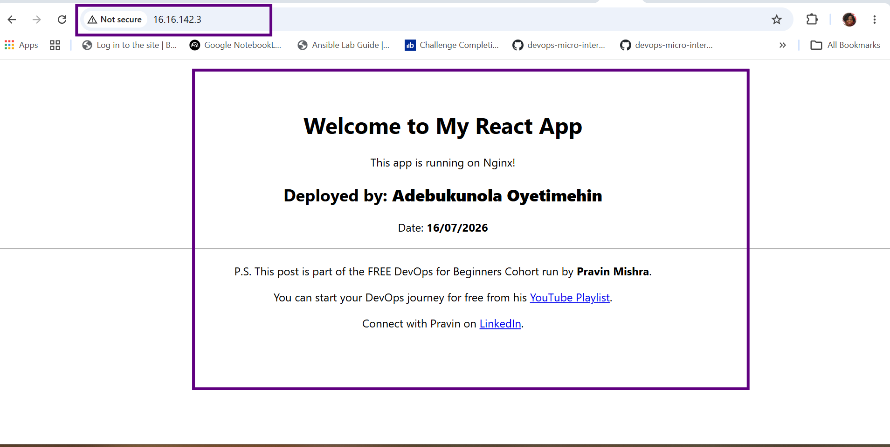

***

#### Screenshot 2 — Output of `ip a`

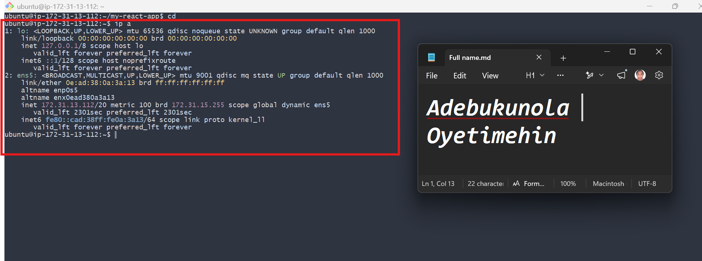

***

#### Screenshot 3 — Output of `sudo ss -tulpen`

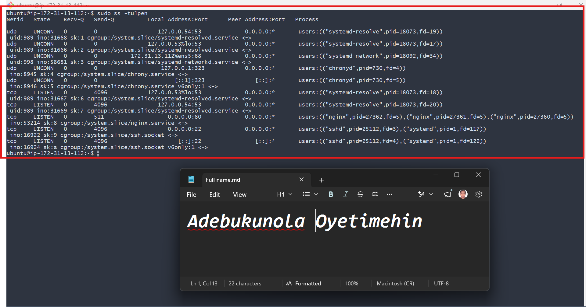

***

#### Screenshot 4 — Output of `sudo ufw status`

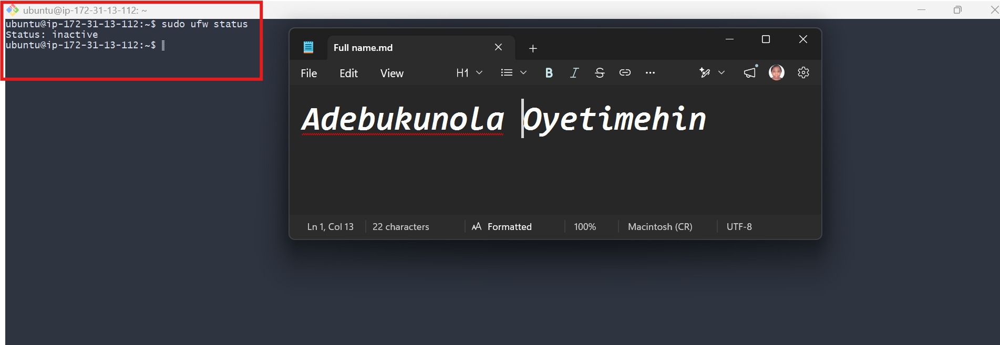

***

### Notes

Answer the following in your own words:

**1. What proves Nginx is listening on 0.0.0.0:80?**

A simple way to prove that Nginx is listening on 0.0.0.0:80 is to check the listening ports on the server using a command such as:

```markdown
sudo ss -tulnp | grep :80
```

The output showed:
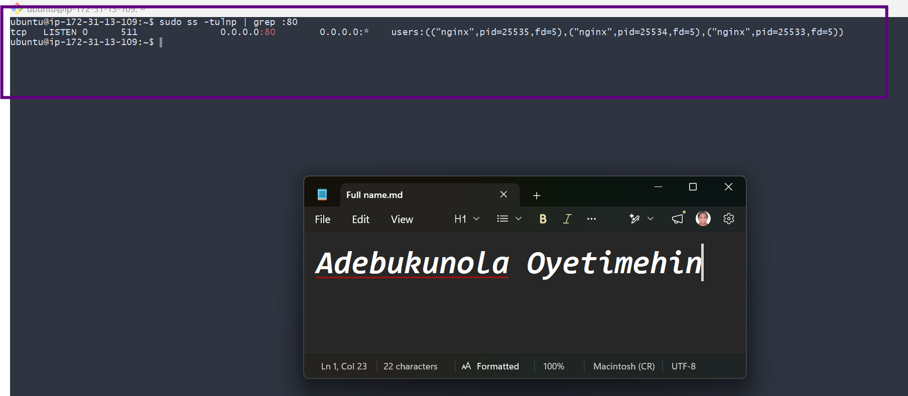

It confirms that Nginx is listening on port 80 on 0.0.0.0, meaning it accepts HTTP connections from all available network interfaces, not just the local machine (127.0.0.1). This makes the web server accessible to other devices on the network.

***

**2. What proves SSH is active on port 22?**

I proved that SSH is active on port 22 by running the command:

```markdown
sudo ss -lptn '( sport = :22 )'
```

The output: 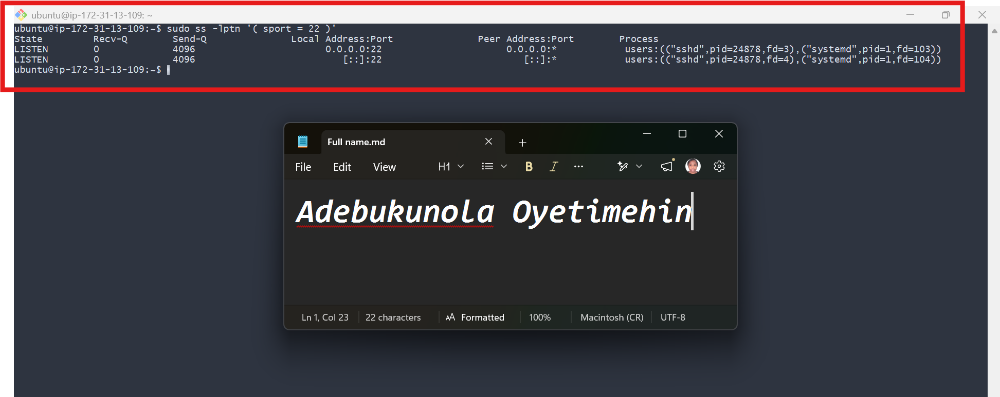

Running sudo ss -lptn '( sport = :22 )' shows that the SSH daemon (sshd) is in the LISTEN state on port 22. The output confirms that the SSH service is active and ready to accept incoming SSH connections on the server.
***

**3. Did you find any unexpected open ports? Explain briefly.**

I checked for unexpected open ports using 'sudo ss -tulpen'. The results show that only the expected services are listening for network connections. SSH is listening on port 22, Nginx is listening on port 80, while the DNS resolver (systemd-resolved), DHCP client (systemd-networkd), and time synchronization service (chronyd) are running on their standard ports. I did not find any unexpected or suspicious open ports.

Here is the output: 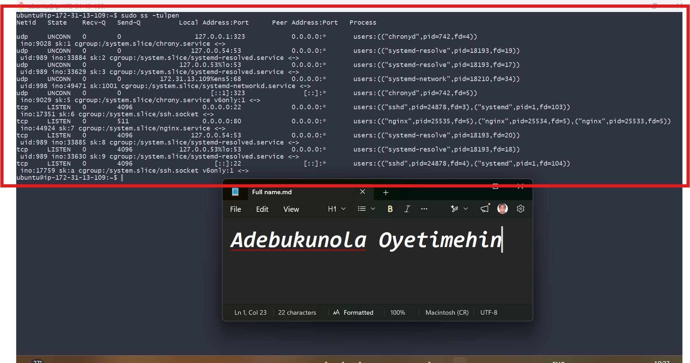

- SSH (22) is open and listening on all interfaces (0.0.0.0 and [::]), allowing remote SSH connections.
- Nginx (80) is open and listening on all interfaces, allowing HTTP traffic.
- Port 53 is only listening on 127.0.0.53 and 127.0.0.54, which means it is only accessible locally by the server itself—not
  from the internet.
- Port 68 (DHCP) and 323 (Chrony/NTP) are standard system services and are not unusual.

***

# Task 2 — Service Health & Systemd Validation (Nginx)

## Goal

Verify that Nginx is properly installed, running, enabled at boot, and safely configured.

### Evidence

#### Screenshot 1 — Output of `systemctl status nginx --no-pager`

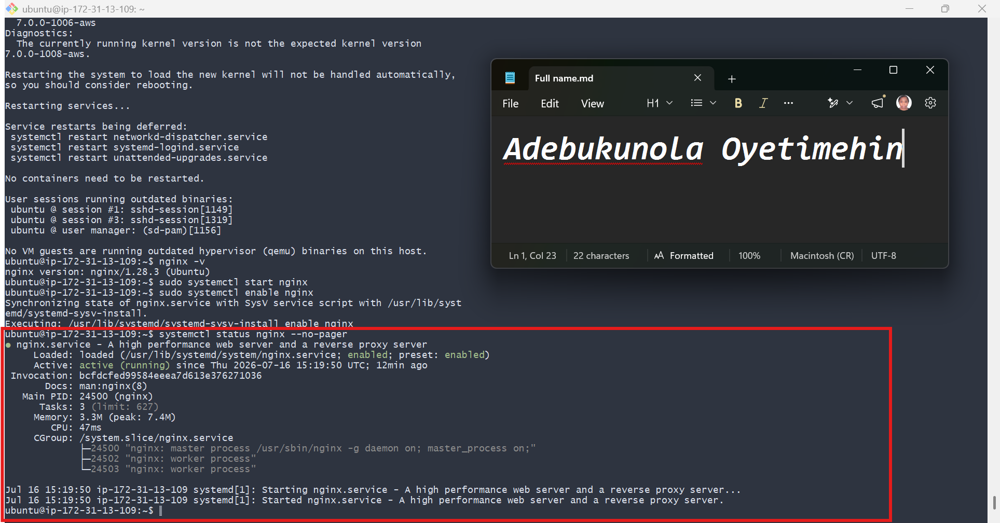

***

#### Screenshot 2 — Output of `sudo nginx -t`

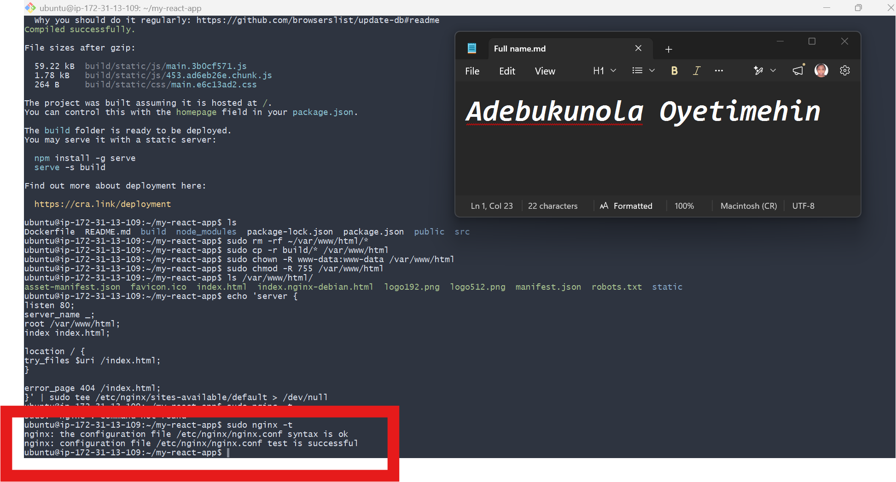

***

#### Screenshot 3 — Output of `sudo ss -lptn '( sport = :80 )'`

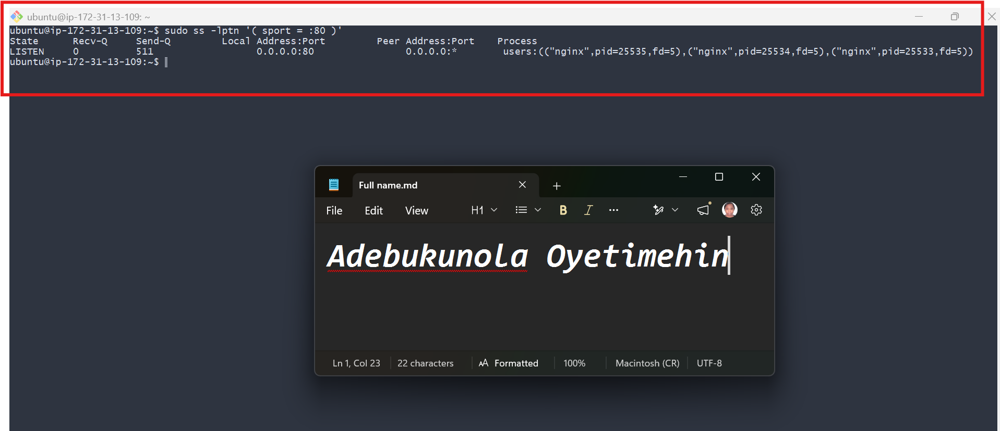

***

### Notes

Answer the following in your own words:

**1. What happens if Nginx fails to restart in production?**

If Nginx fails to restart in production, the web server stops running and becomes unavailable. As a result, users will not be able to access the website or application, leading to downtime. This can happen if there is a configuration error, missing files, or another issue preventing Nginx from starting.

***

**2. What's your basic rollback plan?**

Nginx Rollback Plan:

1. Pre-deployment Validation: Run sudo nginx -t to verify configuration integrity before applying changes.

2. Backup Maintenance: Retain a copy of the last known stable configuration for rapid restoration.

3. Restoration Procedure: If the service fails to restart, restore the backup, re-validate with nginx -t, and reload the
   service.

4. Post-rollback Verification: Confirm site availability and analyse error logs to resolve the underlying issue.

***

# Task 3 — Logs & Request Trace

## Goal

Verify real traffic flow and analyze logs to understand system behavior and errors.

### Evidence

#### Screenshot 1 — Output of `sudo tail -n 30 /var/log/nginx/access.log`

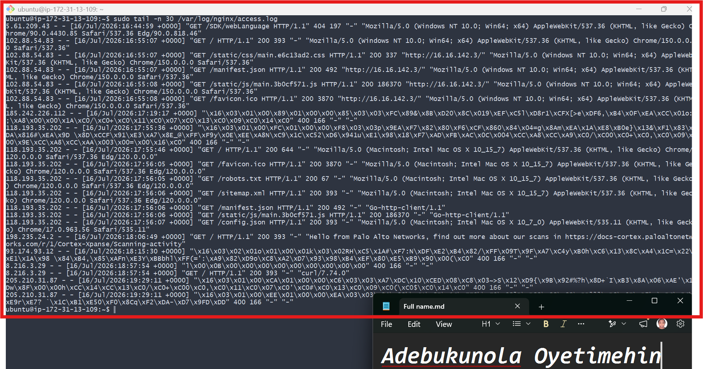

***

#### Screenshot 2 — Output of `sudo tail -n 30 /var/log/nginx/error.log`

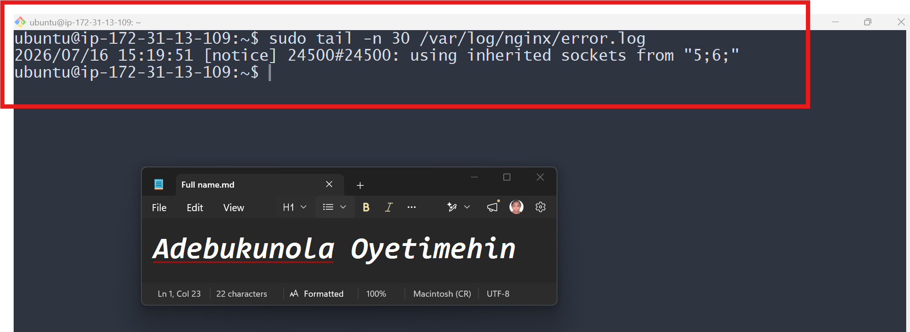

***

#### Screenshot 3 — Output of `sudo journalctl -u nginx --no-pager -n 50`

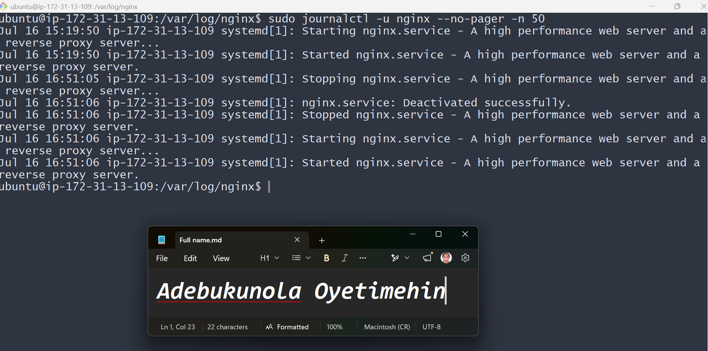

---

### Notes

Answer the following in your own words:

**1. Were there any errors in the logs?**

- If yes, mention 1–2 example error lines from the logs and explain what each one means in simple terms.
- If no, explain what it means if the error log is empty or shows no recent errors during your check.

No, there were no errors in the logs.

If the Nginx error log is empty or shows no recent errors, it generally indicates that Nginx is running normally and has not encountered any issues that needed to be logged.

---

**2. If there were no errors, what does that indicate about the system?**

If the Nginx error log is empty or contains no recent errors, it means Nginx has not encountered any problems that required logging. This is usually a good sign that the web server is operating normally. However, it does not guarantee that the entire application is functioning correctly, so I would also verify that the Nginx service is running, check the access log, and test the website to ensure it is responding as expected.

---

**3. Based on the access logs, were your curl requests visible in the log entries? What does that prove about traffic flow?**

Yes, the curl requests were visible in the Nginx access log. I can identify it by the User-Agent field, which shows curl/7.74.0. The log entry also shows a successful GET / request with an HTTP status code of 200, confirming that the request reached the Nginx server, was processed successfully, and was recorded in the access log. This proves that traffic flowed correctly from the client to the web server and that Nginx was able to serve the request.

---

# Task 4 — System Resource Health Check (Capacity Red Flags)

## Goal

Assess server capacity and detect potential performance or failure risks.

### Evidence

#### Screenshot 1 — Output of `uptime`

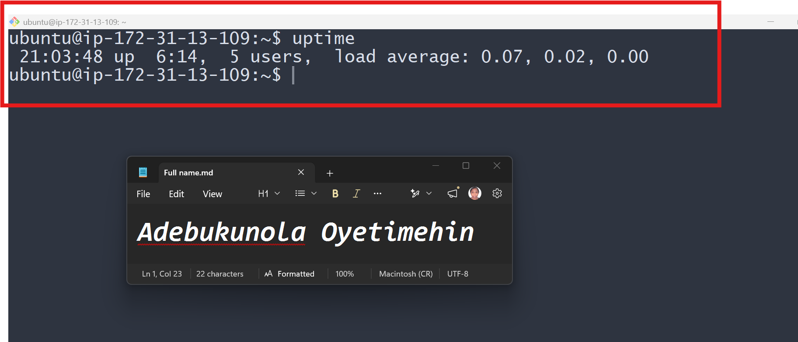

---

#### Screenshot 2 — Output of `free -h`

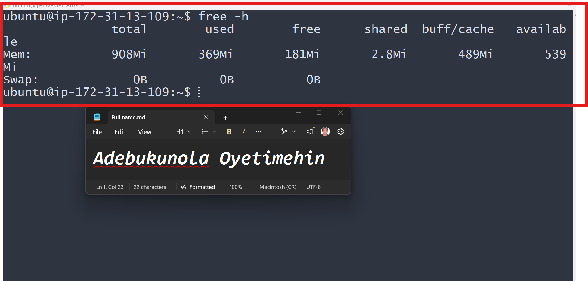

---

#### Screenshot 3 — Output of `df -h`

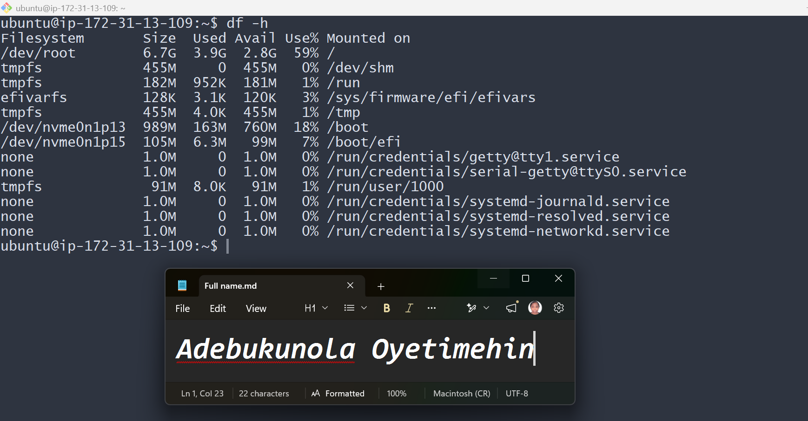

---

#### Screenshot 4 — Output of `sudo du -sh /var/* | sort -h`

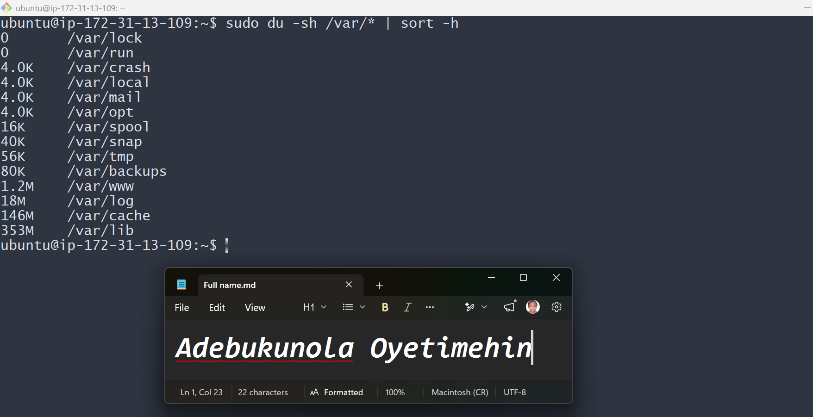

---

### Notes

Answer the following in your own words:

**1. Which resource looks most critical right now? (CPU/load, memory, or disk) Explain why.**

The resource that looks most critical is memory, mainly because the server has only 908 MB of RAM and no swap space configured. Although there is still about 544 MB of available memory, a sudden increase in memory usage could cause applications to run out of RAM, since there is no swap available as a backup. Disk usage is currently at 59%, which is within a safe range, so it is not an immediate concern.

---

**2. What happens if disk becomes 100% full in a production server?**

If the disk becomes 100% full in a production server, applications and system services may stop working correctly because they can no longer write data to the disk. This can lead to failed log writes, database errors, application crashes, failed updates, and even system instability. To prevent this, disk usage should be monitored regularly, old logs and unnecessary files should be cleaned up, and storage should be expanded before the disk reaches full capacity.

---

# Task 5 — Configuration & Deployment Verification

## Goal

Ensure the correct React build is deployed and Nginx is serving it properly.

### Evidence

#### Screenshot 1 — Output of `ls -lah /var/www/html | head -n 20`

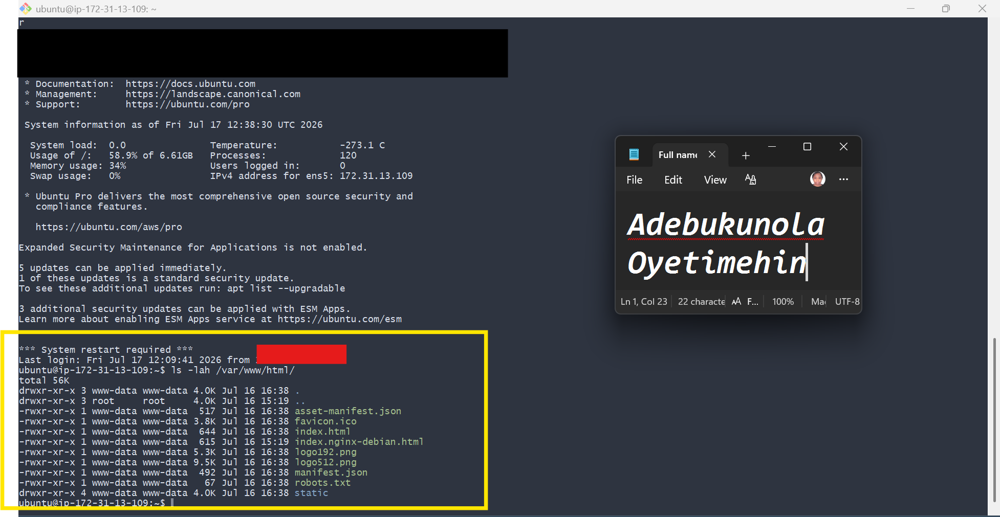

---

#### Screenshot 2 — Output of `grep -R "Deployed by" -n /var/www/html 2>/dev/null | head`

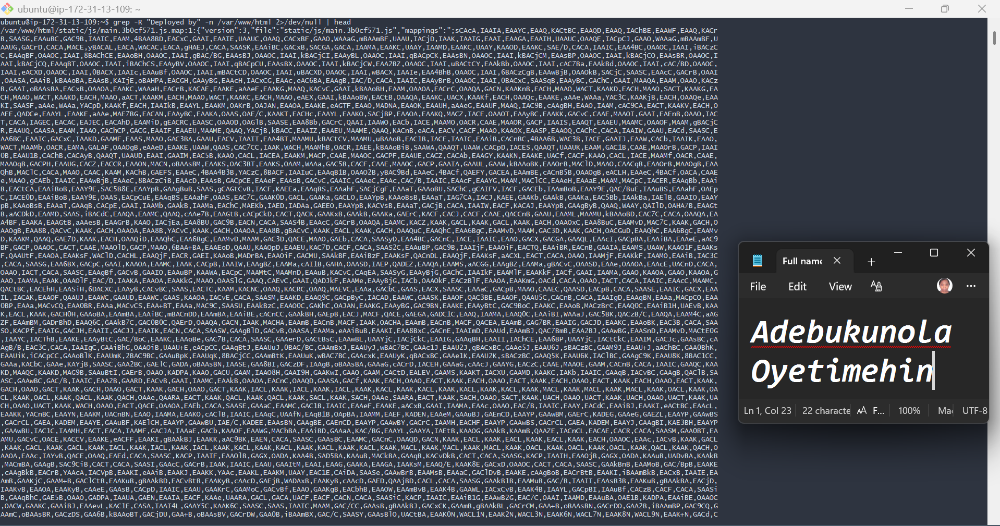
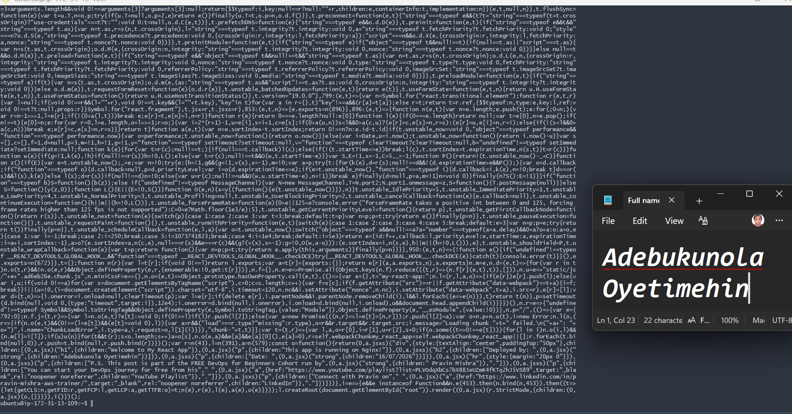

---

#### Screenshot 3 — Output of `grep -n "try_files" /etc/nginx/sites-available/default`

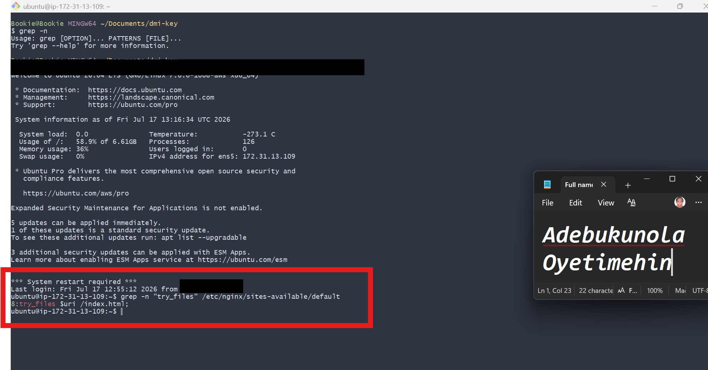

---

### Notes

Answer the following in your own words:

**1. How do you confirm that the correct version of the application is deployed?**

There are several ways to confirm that the correct version of an application is deployed.

i. Access the application in a browser

- Open the application's URL.
- Verify that the expected features, changes, or UI updates are present.

ii. Check the deployed files

Inspect the web root:

```bash
ls -lah /var/www/html
```

Verify that the expected files (e.g., index.html, static/, CSS, JavaScript) are present and have recent timestamps.
If the application contains a version string or deployment message, search for it using the command:

```markdown
grep -R "Deployed by" -n /var/www/html
```

or

```markdown
grep -R "v1.2.0" -n /var/www/html
```

iii. Use curl to verify the response

curl http://<server-ip>

Check that the returned page contains the expected content or version information.

# Task 6 — Nginx Configuration Failure Simulation

## Goal

Simulate a real-world Nginx misconfiguration and recover the service safely.

### Evidence

#### Screenshot 1 — Output of `sudo nginx -t` showing the syntax error (broken config)

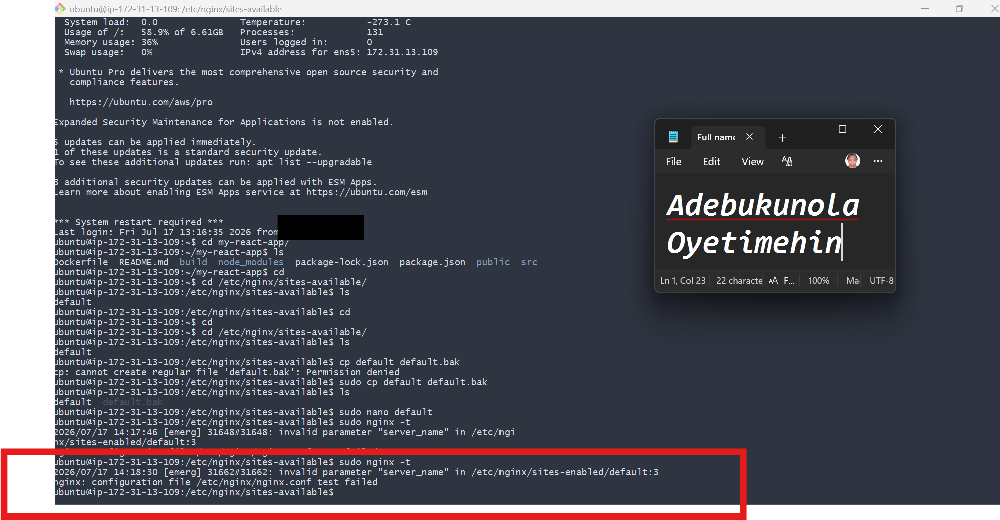

---

#### Screenshot 2 — Output of `sudo nginx -t` showing syntax ok (fixed config)

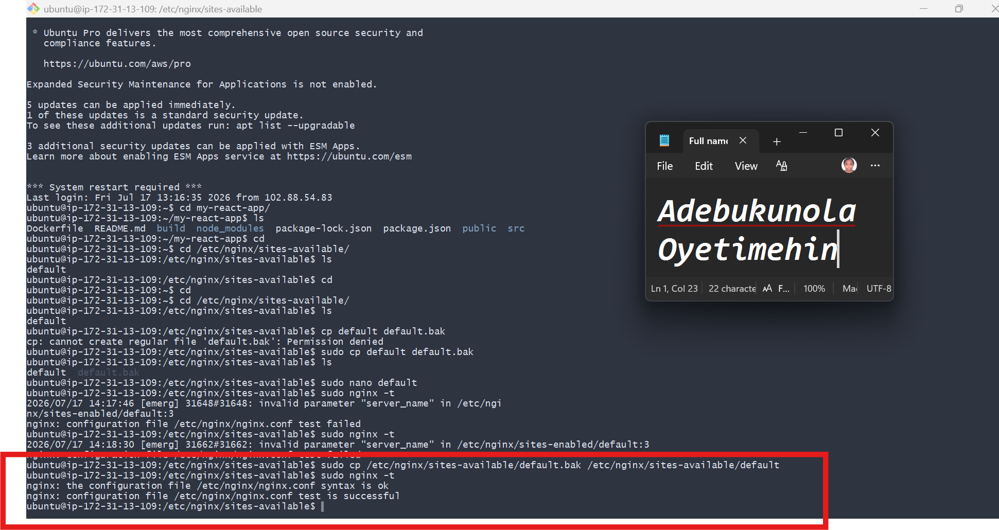

---

#### Screenshot 3 — Output of `curl -I http://<public-ip>` confirming recovery (200 OK)

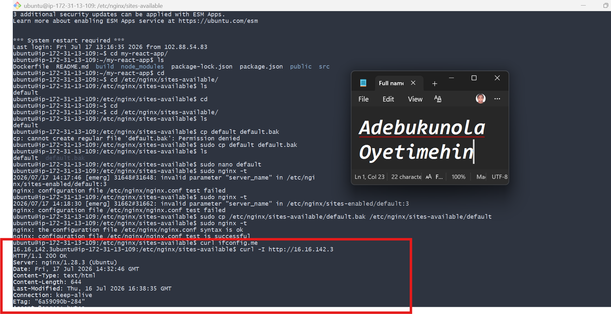

---

### Notes

Answer the following in your own words:

**1. What caused the configuration failure?**

The configuration failure was caused by a syntax error that I intentionally introduced into the Nginx configuration file. I removed a required semicolon which caused nginx -t to fail because Nginx could no longer parse the configuration correctly. As a result, Nginx rejected the configuration and would not restart until the error was fixed.

---

**2. How did you fix the issue?**

I fixed the issue by restoring the previous working Nginx configuration from the backup. After restoring it, I ran sudo nginx -t to verify that the configuration syntax was correct. Once the test passed successfully, I started (or reloaded) the Nginx service and confirmed that it was running normally and the website was accessible again.

---

**3. How can you avoid this kind of issue in real production systems?**

> To avoid this kind of issue in a real production environment, I would always test the Nginx configuration with `sudo nginx -t` before applying any changes. I would keep a backup of the last known working configuration so I can quickly roll back if needed. Instead of restarting the service, I would use `sudo systemctl reload nginx` after a successful configuration test, as this applies changes without interrupting active connections. Additionally, I would manage configuration changes through version control and a CI/CD pipeline, where changes can be reviewed, tested, and validated before being deployed to production.

---

# Task 7 — Web Application Failure Simulation

## Goal

Simulate missing deployment content and recover the application safely.

### Evidence

#### Screenshot 1 — Output of `curl -I http://<public-ip>` showing failure (non-200 response)

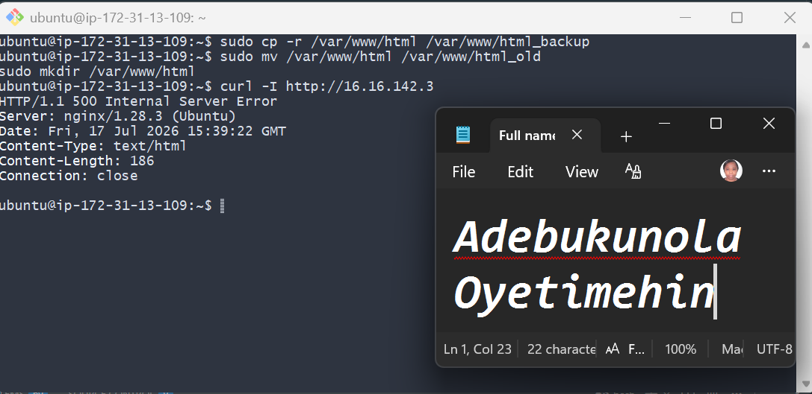

---

#### Screenshot 2 — Output of `curl -I http://<public-ip>` confirming recovery (200 OK)


---

### Notes

Answer the following in your own words:

**1. What caused the application to break in this scenario?**

The application broke because the website files in the web root (/var/www/html) were missing. Although the Nginx service was still running, it could not find the files needed to serve the application, so users received errors such as 403 Forbidden or 404 Not Found. This simulates a failed deployment where the application content was not deployed correctly or was accidentally removed

---

**2. How did you fix the issue and restore the application?**

I fixed the issue by restoring the original application files from the backup to the web root (/var/www/html). After restoring the files, I verified that they were present, confirmed that Nginx was running correctly, and tested the application using a browser or curl to ensure it was serving the website successfully again.

---

**3. What steps would you take to prevent this kind of issue in real production systems?**

Production best practice

In a production environment, I would avoid deleting or overwriting the live application directory directly. Instead I would:

- Deploy the new version to a separate release directory.
- Verify the deployment is complete.
- Switch the web root or update a symbolic link to the new release.
- Keep the previous release available so you can roll back immediately if something goes wrong.

---

# Task 8 — Security & Reliability Review

## Goal

Review and reflect on the security and reliability practices applied during this assignment.

### Security & Reliability Notes

Answer the following in your own words:

**1. Why is SSH key-based authentication more secure than sharing passwords?**

SSH key-based authentication is more secure than sharing passwords because it uses a pair of cryptographic keys—a private key that remains on the user's device and a public key stored on the server. The private key is never transmitted over the network, making it much harder for attackers to intercept or guess. Unlike passwords, SSH keys are resistant to brute-force attacks and cannot be easily shared or reused, providing stronger authentication and better protection for remote server access.

---

**2. Why should only required ports be open on a production server?**

Only the required ports should be open on a production server to reduce its attack surface and improve security. Every open port is a potential entry point that attackers can scan for vulnerabilities or attempt to exploit. By allowing access only to essential services, such as SSH (22) for administration and HTTP/HTTPS (80/443) for web traffic, the risk of unauthorized access and cyberattacks is minimized. This also makes the server easier to monitor and manage while following the principle of least privilege.

---

**3. Why is it important for Nginx to be enabled on boot?**

It is important for Nginx to be enabled on boot so that the web server starts automatically whenever the server is restarted or recovers from a power outage. This helps ensure that the website or application becomes available without requiring manual intervention, reducing downtime and improving service reliability. Automatically starting Nginx also supports high availability and helps maintain consistent access for users in a production environment.

---

**4. What are the risks of sharing secrets, keys, or credentials publicly?**

Sharing secrets, keys, or credentials publicly can allow unauthorized users to gain access to servers, applications, databases, or cloud resources. This can lead to data breaches, unauthorized changes, service disruption, financial losses, and compromise of sensitive information. Attackers can also use exposed credentials to launch further attacks or take control of infrastructure. To reduce these risks, secrets and credentials should be stored securely using tools such as environment variables or secret management services, and they should never be committed to public repositories or shared in plain text.

---

**5. Why should cloud resources be stopped or terminated when they are no longer needed?**

Cloud resources should be stopped or terminated when they are no longer needed to avoid unnecessary costs and reduce security risks. Leaving unused resources running can result in ongoing charges, even if they are not being used. Unused servers or services may also become targets for attackers if they are left unpatched or misconfigured. Regularly shutting down or deleting unused resources helps optimize costs, improves security, and keeps the cloud environment clean and easier to manage.

---

# LinkedIn Post (Required)

## Evidence

#### LinkedIn Post URL

Paste your LinkedIn post URL here:

`(https://www.linkedin.com/posts/bukky-oyetimehin_dmi-dmicohort3-devops-share-7483951078753935360-X-80/?utm_source=share&utm_medium=member_desktop&rcm=ACoAABEGQlgB1AkrO3hQl21ZivPMvp3RJYKW6KI)`

---

#### Screenshot — Published LinkedIn post

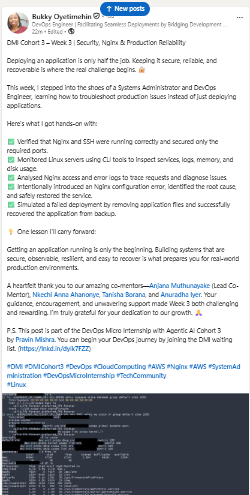

---

# Submission Instructions

- Add all required screenshots in your submission
- Full name must be visible in required screenshots
- Do not expose sensitive information (keys, passwords, account IDs)

---

# Completion Checklist

- [✅] Task 1: Screenshots (browser, ip a, ss -tulpen, ufw status) + Notes answered
- [✅] Task 2: Screenshots (nginx status, nginx -t, ss port 80) + Notes answered
- [✅] Task 3: Screenshots (access log, error log, journalctl) + Notes answered
- [✅] Task 4: Screenshots (uptime, free -h, df -h, du -sh) + Notes answered
- [✅] Task 5: Screenshots (ls html, grep deployed by, grep try_files) + Notes answered
- [✅] Task 6: Screenshots (nginx -t fail, nginx -t pass, curl recovery) + Notes answered
- [✅] Task 7: Screenshots (curl failure, curl recovery) + Notes answered
- [✅] Task 8: Security & Reliability Notes answered
- [✅] LinkedIn post published and URL submitted
- [✅] Full Name visible in all required screenshots
- [✅] No sensitive data exposed

---

## 📌 About DMI & CloudAdvisory

DevOps Micro Internship (DMI) is a project-based DevOps program run by Pravin Mishra (The CloudAdvisory) focused on real-world execution, systems thinking, and career readiness.

It helps learners build strong DevOps foundations with hands-on experience.

---

## 📌 Resources

- 🌐 DMI Official Website: https://dmi.pravinmishra.com?utm_source=github&utm_medium=readme  
- 🎓 University: https://university.pravinmishra.com?utm_source=github&utm_medium=readme  
- 💬 Discord Community: https://discord.pravinmishra.com?utm_source=github&utm_medium=readme  
- 📝 Blog: https://dmi.pravinmishra.com/blog?utm_source=github&utm_medium=readme  
- ▶️ YouTube Playlist: https://www.youtube.com/playlist?list=PLFeSNDtI4Cho  
- 🔗 Pravin Mishra (LinkedIn): https://www.linkedin.com/in/pravin-mishra-aws-trainer/  
- 🏢 CloudAdvisory (LinkedIn): https://www.linkedin.com/company/thecloudadvisory/

---

*This submission is part of DevOps Micro Internship (DMI) Cohort 3 — Agentic AI Track.*
