# Assignment 5 — Bash Script Automation Drill (OPS Checklist)

Part of the DevOps Micro Internship (DMI) with Agentic AI

---

## Purpose

In this assignment, you will practice Bash scripting by building a series of small automation scripts covering environment setup, variables, arrays, loops, file conditionals, if-else logic, and functions. These scripts form the foundation of real-world Linux automation used in DevOps, cloud, and production support environments.

---

# Task 1 — Bash Environment & Workspace Setup

## Goal

Verify that Bash is available on your system and create a clean workspace for this assignment.

### Evidence

#### Screenshot 1 — Output of `echo $SHELL` and `bash --version`

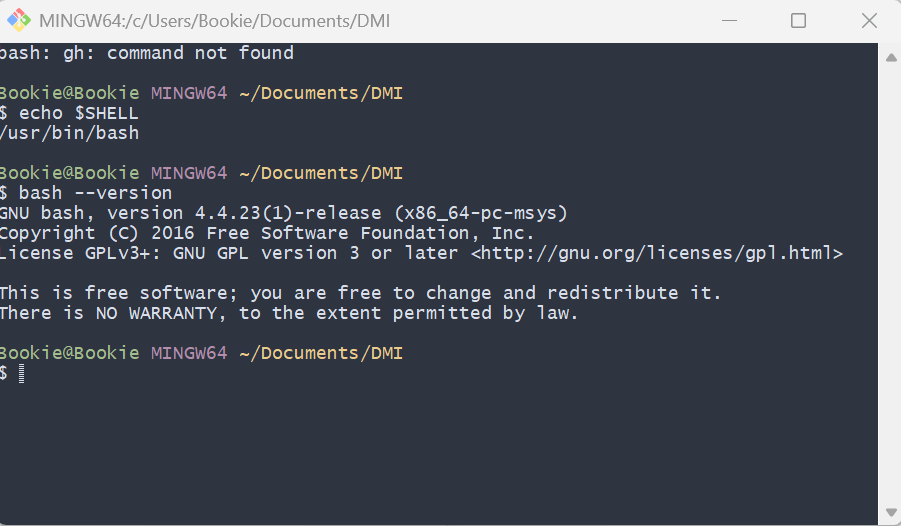

---

#### Screenshot 2 — Output of `pwd` and `ls -lah` showing the scripts directory

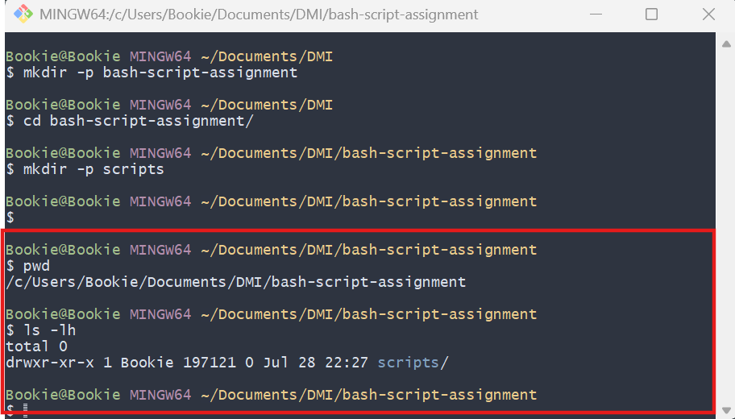

---

### Notes

Answer the following in your own words:

**1. What is Bash?**

**Bash (Bourne Again SHell)** is a Unix/Linux command-line interpreter and scripting language that allows users to interact with the operating system by executing commands, automating repetitive tasks, and managing files, processes, and system resources.

It serves as the default shell on many Linux distributions and provides a powerful environment for system administration, software deployment, and DevOps automation.

In DevOps, Bash is commonly used to:

* Automate repetitive tasks using shell scripts.
* Manage files and directories.
* Monitor system performance and processes.
* Configure servers and deploy applications.
* Execute Linux commands efficiently without a graphical interface.

This command lists all files and directories, including hidden ones, in the current directory with detailed information.

Bash enables engineers to automate infrastructure management, deployments, server maintenance, and troubleshooting, making operations faster, more consistent, and less prone to human error. 🚀

---

**2. What is the difference between shell and Bash?**

A **shell** is a program that provides an interface between the user and the operating system. It interprets commands entered by the user and passes them to the operating system for execution. There are several types of shells, such as Bash, Zsh, Korn Shell (ksh), and C Shell (csh).

**Bash (Bourne Again SHell)** is a specific type of shell. It is an enhanced version of the original Bourne Shell (`sh`) and is the default shell on many Linux distributions. Bash includes additional features such as command history, command-line editing, tab completion, variables, functions, and powerful scripting capabilities.

**Key Difference**

| Shell                                                                       | Bash                                                                                   |
| --------------------------------------------------------------------------- | -------------------------------------------------------------------------------------- |
| A general command-line interface for interacting with the operating system. | A specific implementation of a shell.                                                  |
| There are many types of shells (sh, Bash, Zsh, Fish, ksh, csh).             | Bash is one of the most widely used shells.                                            |
| May offer different features depending on the shell.                        | Provides advanced scripting, command history, tab completion, and automation features. |

**In simple terms:**

* **Shell** is the general concept or interface for running commands.
* **Bash** is one specific shell that provides many additional features and is commonly used for Linux administration and DevOps automation.

---

**3. Why is it important to confirm the Bash version before writing scripts?**

Confirming the **Bash version** is important because different versions of Bash support different features and syntax. A script that works on a newer version of Bash may fail on an older version if it uses commands or features that are not supported.

Checking the Bash version helps to:

* **Ensure compatibility** across different Linux systems.
* **Avoid syntax errors** caused by unsupported features.
* **Write portable scripts** that run reliably on the target environment.
* **Simplify troubleshooting** by identifying whether an issue is related to the Bash version.
* **Use the appropriate features** available in the installed version.

For example, some features such as **associative arrays** are only available in **Bash 4.0 and later**. Running a script that uses these features on Bash 3.x would result in errors.

**Why this matters in DevOps:**
DevOps engineers often deploy scripts across multiple servers, containers, or cloud environments that may have different Bash versions. Verifying the Bash version before writing or running scripts helps ensure the scripts execute consistently and reduces deployment issues. 🚀

---

# Task 2 — Your First Bash Script

## Goal

Create your first Bash script, make it executable, and run it from the terminal.

### Evidence

#### Screenshot 1 — Content of `first-script.sh`

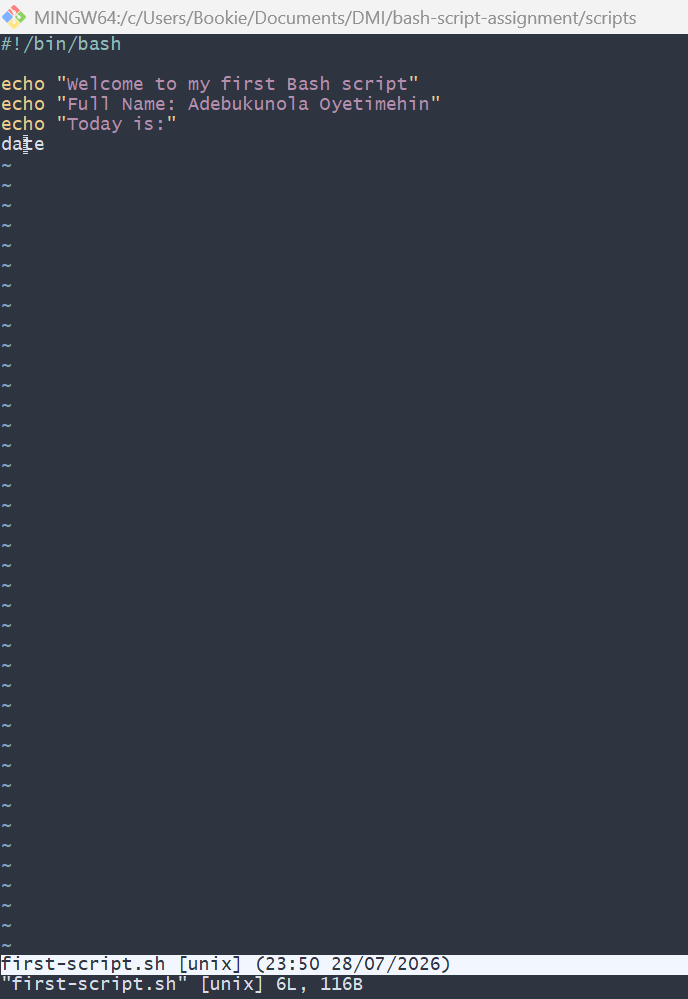

---

#### Screenshot 2 — Output of `./first-script.sh`

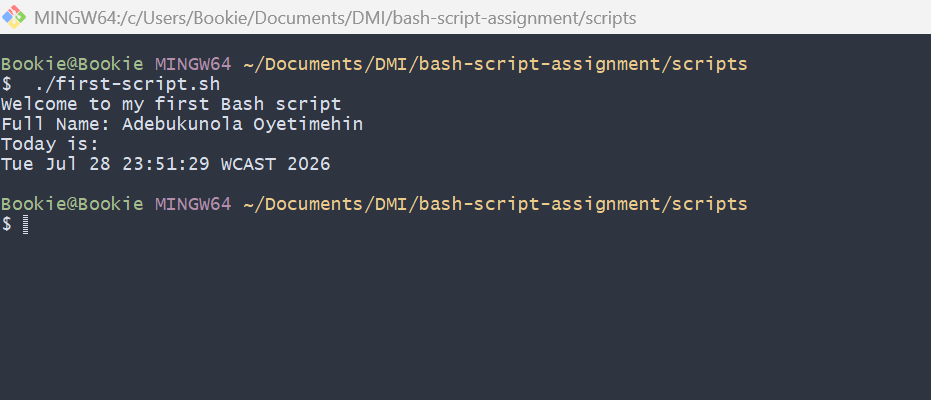

---

#### Screenshot 3 — Output of `ls -l first-script.sh` showing executable permission

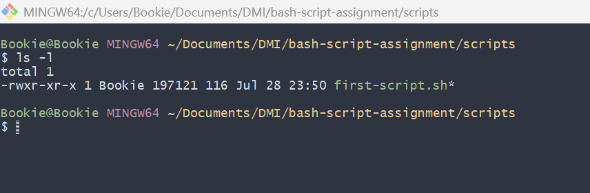

---

### Notes

Answer the following in your own words:

**1. What is the purpose of `#!/bin/bash`?**

The line `#!/bin/bash` is called a **shebang** (or **hashbang**). It is placed at the beginning of a shell script to specify which interpreter should be used to execute the script.

In this case, `#!/bin/bash` tells the operating system to run the script using the **Bash shell** located at `/bin/bash`.

**Why is it important?**

* **Specifies the interpreter:** Ensures the script is executed with Bash rather than another shell.
* **Ensures compatibility:** Prevents errors that may occur if the default system shell is not Bash.
* **Provides consistent behavior:** The script runs the same way regardless of the user's default shell.
* **Supports Bash-specific features:** Allows the use of Bash syntax and features, such as arrays, functions, and advanced scripting constructs.

**Example:**

```bash
#!/bin/bash

echo "Hello, World!"
```

When this script is made executable (`chmod +x script.sh`) and run (`./script.sh`), the operating system uses the Bash interpreter to execute it.

**In summary:**
`#!/bin/bash` tells the operating system to execute the script using the Bash interpreter, ensuring consistent and reliable execution of Bash commands and features.

---

**2. Why do we use `chmod +x` before running a script?**

The `chmod +x` command is used to **make a script executable**. By default, a newly created script is usually treated as a regular file and does not have permission to be run as a program.

Adding the **execute (`x`) permission** allows the operating system to execute the script directly.

**Why is it important?**

* **Grants execute permission:** Allows the script to be run as a program.
* **Enables direct execution:** Lets you run the script using `./script.sh` instead of invoking the interpreter manually.
* **Improves usability:** Makes the script behave like other executable programs.
* **Supports automation:** Executable scripts can be used in scheduled tasks, deployment pipelines, and other automation workflows.

**Example:**

```bash
chmod +x script.sh
```

After making the script executable, you can run it with:

```bash
./script.sh
```

Without execute permission, attempting to run the script directly will result in a **"Permission denied"** error.

**Why this matters in DevOps:**
DevOps engineers frequently use shell scripts to automate deployments, server configuration, monitoring, and maintenance tasks. Using `chmod +x` ensures these scripts can be executed directly and integrated into automated workflows and CI/CD pipelines. 🚀

---

**3. What is the difference between running a script using `./script.sh` and `bash script.sh`?**

Both commands execute a Bash script, but they do so in different ways.

| `./script.sh`                                                            | `bash script.sh`                                                                  |
| ------------------------------------------------------------------------ | --------------------------------------------------------------------------------- |
| Executes the script as a program.                                        | Runs the script by explicitly invoking the Bash interpreter.                      |
| Requires the script to have **execute (`x`) permission**.                | Does **not** require execute permission (only read permission is needed).         |
| Uses the interpreter specified in the **shebang** (e.g., `#!/bin/bash`). | Ignores the shebang and runs the script using the Bash interpreter you specified. |
| Commonly used for executable scripts and automation.                     | Useful for testing or running scripts without changing file permissions.          |

**Examples**

Run the script as an executable:

```bash
chmod +x script.sh
./script.sh
```

Run the script directly with Bash:

```bash
bash script.sh
```

**Key Difference**

* **`./script.sh`** executes the script as an executable file and relies on the shebang (`#!/bin/bash`) to determine which interpreter to use. It requires execute permission.
* **`bash script.sh`** explicitly starts the Bash interpreter and passes the script to it. It does not require execute permission and will run the script with Bash regardless of the shebang.

**Why this matters in DevOps:**
When deploying or automating tasks, executable scripts (`./script.sh`) are commonly used in production environments and CI/CD pipelines. Running `bash script.sh` is helpful during development, testing, or troubleshooting when execute permissions have not yet been set. 🚀

---

# Task 3 — Variables: User Information Script

## Goal

Use variables to store and display user-related information.

### Evidence

#### Screenshot 1 — Content of `user-info.sh`

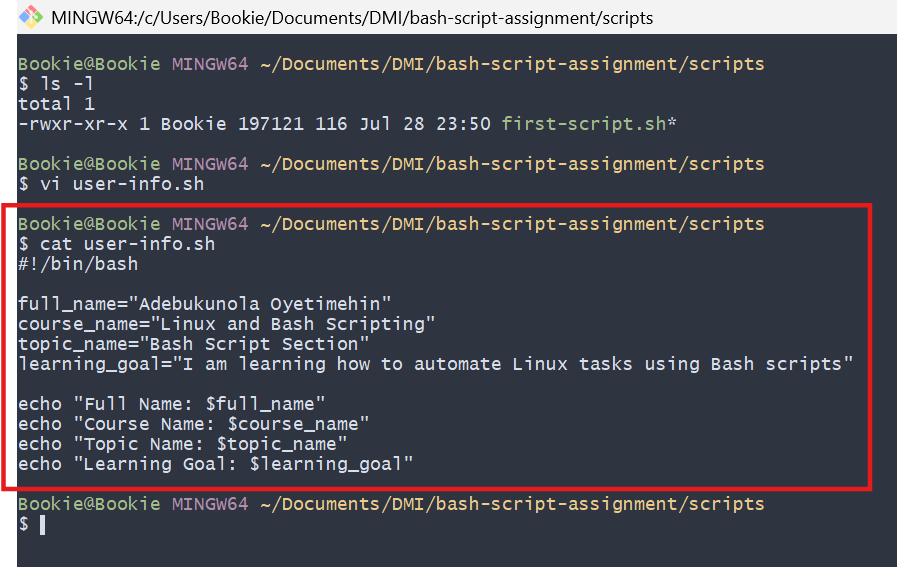

---

#### Screenshot 2 — Output of `./user-info.sh`

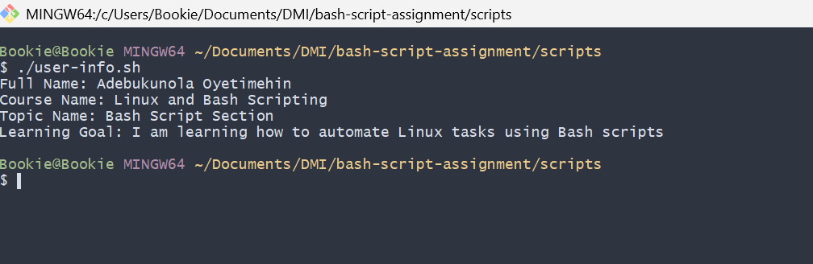

---

### Notes

Answer the following in your own words:

**1. What is a variable in Bash?**

A **variable** in Bash is a named storage location used to hold data, such as text, numbers, or command output. Variables make scripts more flexible by allowing values to be stored and reused instead of being hardcoded.

In Bash, you assign a value to a variable using the `=` operator **without spaces**, and access its value by placing a `$` before the variable name.

### **Why are variables important?**

* **Store data** for later use in a script.
* **Avoid repeating values**, making scripts easier to update.
* **Make scripts more dynamic** by accepting user input or command output.
* **Improve readability and maintainability** of Bash scripts.

**Example**

```bash
#!/bin/bash

name="Bukky"
echo "Hello, $name!"
```

**Output:**

```text
Hello, Bukky!
```

In this example:

* `name="Bukky"` creates a variable named `name` and assigns it the value `"Bukky"`.
* `$name` retrieves the value stored in the variable and prints it.

**Why this matters in DevOps**

Variables are widely used in DevOps scripts to store server names, file paths, environment variables, credentials (securely), and configuration values. This makes automation scripts reusable, easier to maintain, and adaptable across different environments. 🚀

---

**2. Why should we avoid spaces around the `=` sign when creating variables?**

In Bash, **spaces are not allowed around the `=` sign** when assigning a value to a variable. Bash interprets spaces as separators between commands and arguments, so adding spaces causes the assignment to be treated as a command instead of a variable assignment.

### **Correct syntax**

```bash id="v7n0l8"
name="Bukky"
```

### **Incorrect syntax**

```bash id="qg6uhc"
name = "Bukky"
```

This will produce an error similar to:

```text id="jllmpw"
bash: name: command not found
```

because Bash interprets:

* `name` as the command,
* `=` as the first argument,
* `"Bukky"` as the second argument.

**Why is this important?**

* **Prevents syntax errors** in your scripts.
* **Ensures variables are assigned correctly.**
* **Allows scripts to run reliably** without unexpected failures.
* **Follows standard Bash syntax**, making scripts easier to read and maintain.

**Why this matters in DevOps:**
DevOps engineers rely heavily on variables in automation scripts for configuration values, file paths, environment settings, and deployment parameters. Using the correct assignment syntax (`variable=value`) helps ensure scripts execute consistently across different systems and environments. 🚀

---

**3. How do you access the value stored inside a Bash variable?**

To access the value stored in a Bash variable, place a **dollar sign (`$`)** before the variable name. The `$` tells Bash to substitute the variable with its stored value.

### **Example**

```bash
#!/bin/bash

name="Bukky"
echo $name
```

**Output:**

```text
Bukky
```

You can also use the variable inside a string:

```bash
#!/bin/bash

name="Bukky"
echo "Welcome, $name!"
```

**Output:**

```text
Welcome, Bukky!
```

For better readability and to avoid ambiguity, you can enclose the variable name in braces:

```bash
name="Bukky"
echo "Hello, ${name}!"
```

The braces are especially useful when the variable is adjacent to other text:

```bash
file="report"
echo "${file}.txt"
```

**Output:**

```text
report.txt
```

**Why is this important?**

* Retrieves the value stored in a variable.
* Allows variables to be used in commands, strings, and scripts.
* Makes scripts more dynamic and reusable.
* Helps avoid errors when combining variables with other text.

**Why this matters in DevOps:**
DevOps engineers use variables to store values such as server names, file paths, environment variables, and deployment configurations. Accessing these values with `$variable` or `${variable}` makes automation scripts flexible, reusable, and easier to maintain. 🚀

---

# Task 4 — Arrays & Loops: Tools Checklist Script

## Goal

Use arrays and loops to print a checklist of tools used in Bash scripting.

### Evidence

#### Screenshot 1 — Content of `tools-checklist.sh`

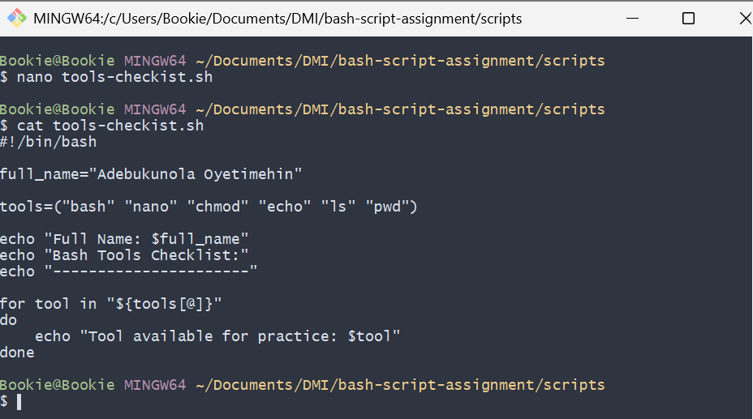

---

#### Screenshot 2 — Output of `./tools-checklist.sh`

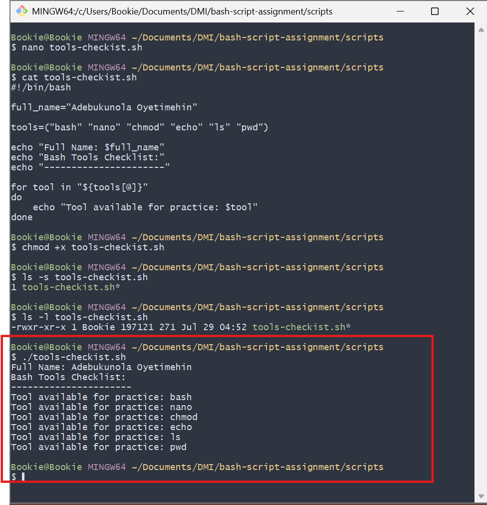

---

### Notes

Answer the following in your own words:

**1. What is an array in Bash?**

An **array** in Bash is a variable that can store **multiple values** under a single name. Each value in the array is assigned an **index**, starting from **0**, which allows you to access individual elements.

Arrays are useful for storing lists of related data, such as file names, server names, or user accounts.

### **Example**

```bash
#!/bin/bash

fruits=("Apple" "Banana" "Orange")
```

In this example:

* `fruits` is the array name.
* `"Apple"` is stored at index `0`.
* `"Banana"` is stored at index `1`.
* `"Orange"` is stored at index `2`.

To access an individual element, use its index:

```bash
echo ${fruits[0]}
```

**Output:**

```text
Apple
```

To display all elements in the array:

```bash
echo ${fruits[@]}
```

**Output:**

```text
Apple Banana Orange
```

**Why are arrays important?**

* **Store multiple related values** in a single variable.
* **Simplify loops** by processing a list of items.
* **Reduce repetitive code**, making scripts cleaner and easier to maintain.
* **Improve automation** when working with collections of files, servers, or users.

**Why this matters in DevOps:**
Arrays are commonly used in DevOps scripts to manage lists of servers, IP addresses, directories, or applications. They enable engineers to automate repetitive tasks efficiently by iterating over multiple items with a single script. 🚀

---

**2. Why are arrays useful in scripts?**

Arrays are useful in Bash scripts because they allow you to **store and manage multiple related values** in a single variable. This makes scripts more organized, efficient, and easier to maintain.

**Benefits of using arrays**

* **Store multiple values** under one variable instead of creating many separate variables.
* **Simplify loops** by allowing you to process each element one at a time.
* **Reduce repetitive code**, making scripts shorter and easier to read.
* **Improve maintainability**, since you can update the list of values in one place.
* **Support automation** by handling collections of items such as files, servers, users, or directories.

**Example**

```bash id="o2tl92"
#!/bin/bash

servers=("web1" "web2" "web3")

for server in "${servers[@]}"
do
    echo "Connecting to $server"
done
```

**Output:**

```text id="ew3kl8"
Connecting to web1
Connecting to web2
Connecting to web3
```

**Why this matters in DevOps**

DevOps engineers often need to perform the same operation on multiple resources, such as deploying applications to several servers, backing up multiple directories, or monitoring different services. Arrays make these tasks easier by storing all related items in one place and processing them efficiently with loops, reducing manual effort and improving automation. 🚀

---

**3. What does `"${tools[@]}"` mean?**

`"${tools[@]}"` is a Bash expression that represents **all the elements in the `tools` array**. It is commonly used when you want to loop through or display every item in an array.

Let's break it down:

* **`tools`** → The name of the array.
* **`@`** → Means **all elements** of the array.
* **`${...}`** → Expands (retrieves) the value of the variable or array.
* **`"` (double quotes)** → Ensures that each array element is treated as a separate item, even if an element contains spaces.

In your script:

```bash
tools=("bash" "nano" "chmod" "echo" "ls" "pwd")

for tool in "${tools[@]}"
do
    echo "Tool available for practice: $tool"
done
```

The `for` loop processes each array element one at a time:

1. `tool="bash"`
2. `tool="nano"`
3. `tool="chmod"`
4. `tool="echo"`
5. `tool="ls"`
6. `tool="pwd"`

So the output will be:

```text
Tool available for practice: bash
Tool available for practice: nano
Tool available for practice: chmod
Tool available for practice: echo
Tool available for practice: ls
Tool available for practice: pwd
```

**Why use `"${tools[@]}"` instead of `${tools[*]}`?**

* **`"${tools[@]}"`** treats **each array element as a separate item**, making it the correct choice for loops.
* **`"${tools[*]}"`** combines all elements into a **single string**, separated by the first character of the `IFS` (Internal Field Separator).

For example, if an array contains spaces:

```bash
tools=("Visual Studio Code" "Git" "Docker")
```

Using:

```bash
for tool in "${tools[@]}"
```

produces:

```text
Visual Studio Code
Git
Docker
```

Whereas using:

```bash
"${tools[*]}"
```

treats the entire array as one string:

```text
Visual Studio Code Git Docker
```

**Why this matters in DevOps**

DevOps engineers often store lists of servers, directories, applications, or configuration files in arrays. Using `"${array[@]}"` allows scripts to process each item individually, making automation tasks such as deployments, backups, and monitoring more reliable and less error-prone. 🚀

---

**4. What is the purpose of the `for` loop in this script?**

The purpose of the **`for` loop** is to **iterate through each element of the `tools` array** and perform the same action for every item. In this script, it prints the name of each Bash tool available for practice.

### **How it works**

```bash
for tool in "${tools[@]}"
do
    echo "Tool available for practice: $tool"
done
```

* **`for tool in "${tools[@]}"`** → Loops through each element in the `tools` array.
* **`tool`** → A temporary variable that stores the current array element during each iteration.
* **`echo`** → Displays the current tool name.
* **`done`** → Marks the end of the loop.

### **Step-by-step execution**

Given the array:

```bash
tools=("bash" "nano" "chmod" "echo" "ls" "pwd")
```

The loop executes six times:

| Iteration | Value of `tool` | Output                               |
| --------- | --------------- | ------------------------------------ |
| 1         | `bash`          | `Tool available for practice: bash`  |
| 2         | `nano`          | `Tool available for practice: nano`  |
| 3         | `chmod`         | `Tool available for practice: chmod` |
| 4         | `echo`          | `Tool available for practice: echo`  |
| 5         | `ls`            | `Tool available for practice: ls`    |
| 6         | `pwd`           | `Tool available for practice: pwd`   |

### **Why is the `for` loop useful?**

* **Automates repetitive tasks** by executing the same command for multiple items.
* **Reduces code duplication**, making scripts shorter and easier to maintain.
* **Improves efficiency** when working with arrays or lists of data.
* **Makes scripts scalable**, since adding more tools to the array requires no changes to the loop.

### **Why this matters in DevOps**

`for` loops are widely used in DevOps to automate repetitive operations, such as deploying applications to multiple servers, checking the status of services, processing log files, or backing up directories. Instead of writing the same command multiple times, a single loop can perform the task for every item in a list, making scripts more efficient and easier to maintain. 🚀

---

# Task 5 — Loops: Number Counter Script

## Goal

Use loops to repeat a task multiple times.

### Evidence

#### Screenshot 1 — Content of `counter.sh`

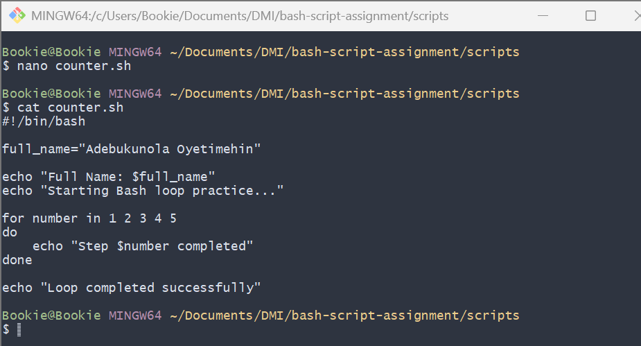

---

#### Screenshot 2 — Output of `./counter.sh`

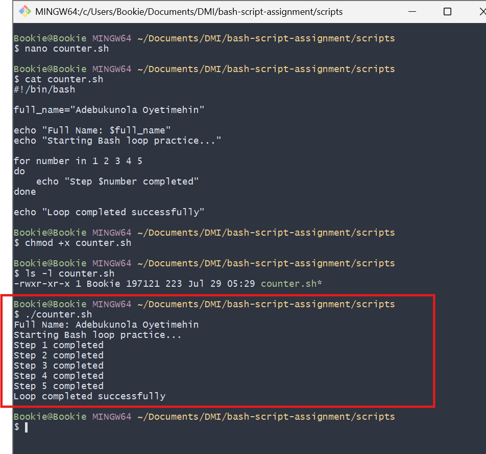

---

### Notes

Answer the following in your own words:

**1. What is a loop?**

A **loop** is a programming construct that allows a set of commands to be **executed repeatedly** until a specified condition is met or until all items in a collection have been processed.

In Bash, loops help automate repetitive tasks, making scripts more efficient and reducing the need to write the same commands multiple times.

### **Common types of loops in Bash**

* **`for` loop** – Repeats a block of code for each item in a list or array.
* **`while` loop** – Repeats as long as a specified condition is true.
* **`until` loop** – Repeats until a specified condition becomes true.

### **Example of a `for` loop**

```bash id="0ov1uu"
#!/bin/bash

for number in 1 2 3 4 5
do
    echo "Number: $number"
done
```

**Output:**

```text id="2egwdx"
Number: 1
Number: 2
Number: 3
Number: 4
Number: 5
```

**Why are loops important?**

* **Automate repetitive tasks** without duplicating code.
* **Save time and effort** by processing multiple items automatically.
* **Improve script readability** and maintainability.
* **Increase efficiency** when working with files, directories, arrays, or system resources.

**Why this matters in DevOps:**
Loops are essential in DevOps for automating tasks such as deploying applications to multiple servers, monitoring services, processing log files, creating backups, and managing cloud resources. They help engineers write scalable and efficient automation scripts. 🚀

---

**2. Why do we use loops in Bash scripting?**

Loops are used in Bash scripting to **automate repetitive tasks** by executing the same set of commands multiple times. Instead of writing the same code repeatedly, a loop performs the task efficiently for each item in a list or while a condition is true.

**Benefits of using loops**

* **Automate repetitive tasks**, reducing manual effort.
* **Reduce code duplication**, making scripts shorter and easier to maintain.
* **Process multiple items**, such as files, directories, or array elements.
* **Improve efficiency** by performing repeated operations with minimal code.
* **Make scripts scalable**, allowing them to handle larger datasets or more resources without major changes.

**Example**

```bash id="jlwmm4"
#!/bin/bash

files=("file1.txt" "file2.txt" "file3.txt")

for file in "${files[@]}"
do
    echo "Processing $file"
done
```

**Output:**

```text id="oh9e10"
Processing file1.txt
Processing file2.txt
Processing file3.txt
```

Instead of writing three separate `echo` commands, the `for` loop processes each file automatically.

**Why this matters in DevOps**

Loops are fundamental in DevOps because they automate repetitive operations such as:

* Deploying applications to multiple servers.
* Creating backups of several directories.
* Monitoring multiple services.
* Processing log files.
* Managing cloud resources.

Using loops makes Bash scripts more efficient, reusable, and easier to maintain, which is essential for reliable automation in DevOps environments. 🚀

---

**3. How many times did the loop run in your script?**

The for loop will run 5 times because it iterates over the five values listed after the in keyword:

---

**4. What would you change if you wanted the loop to run 10 times?**

To make the loop run **10 times**, change the list of numbers so it includes the values **1 through 10**.

### **Modified script**

```bash id="5s3d9w"
#!/bin/bash

full_name="<Your Full Name>"

echo "Full Name: $full_name"
echo "Starting Bash loop practice..."

for number in 1 2 3 4 5 6 7 8 9 10
do
    echo "Step $number completed"
done

echo "Loop completed successfully"
```

### **Alternative (Recommended) Method**

A more efficient and commonly used approach is to use **brace expansion**:

```bash id="5w7i3b"
for number in {1..10}
do
    echo "Step $number completed"
done
```

This automatically generates the numbers from **1 to 10**, making the script shorter, cleaner, and easier to modify.

**Why use `{1..10}`?**

* **Simpler to read** than listing each number individually.
* **Easier to maintain**, especially for larger ranges (e.g., `{1..100}`).
* **Reduces the chance of errors** from missing or repeating numbers.

**Why this matters in DevOps**

In DevOps, loops often need to repeat tasks a specific number of times, such as retrying a deployment, checking a service's status, or performing health checks. Using ranges like `{1..10}` makes these scripts more concise, scalable, and easier to maintain. 🚀

---

# Task 6 — Files & Conditionals: File Validation Script

## Goal

Use file checks and conditionals to verify whether files and directories exist.

### Evidence

#### Screenshot 1 — Output of `ls -lah ../test-folder`

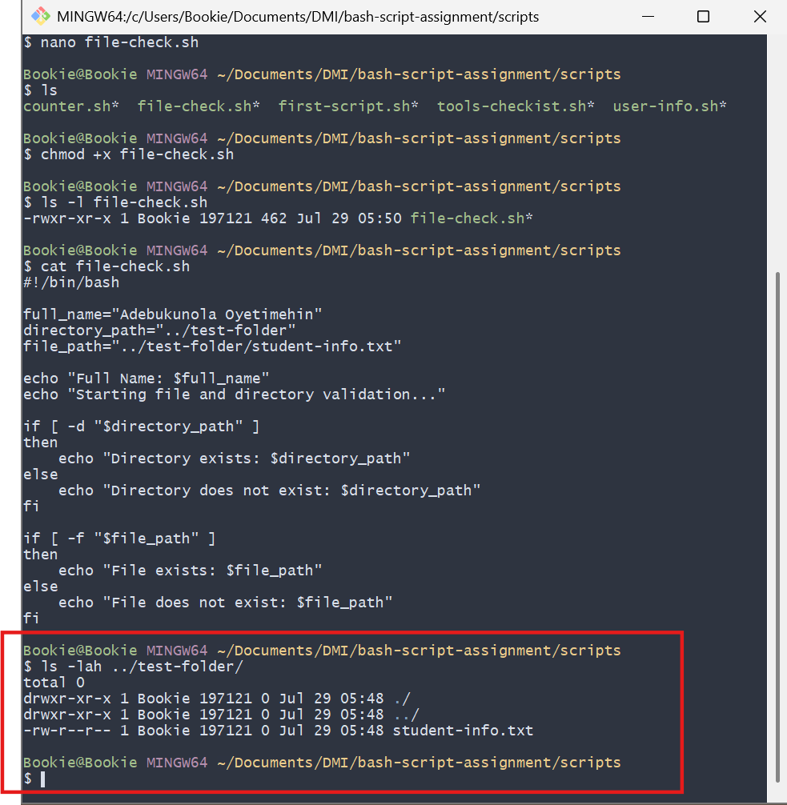

---

#### Screenshot 2 — Content of `file-check.sh`

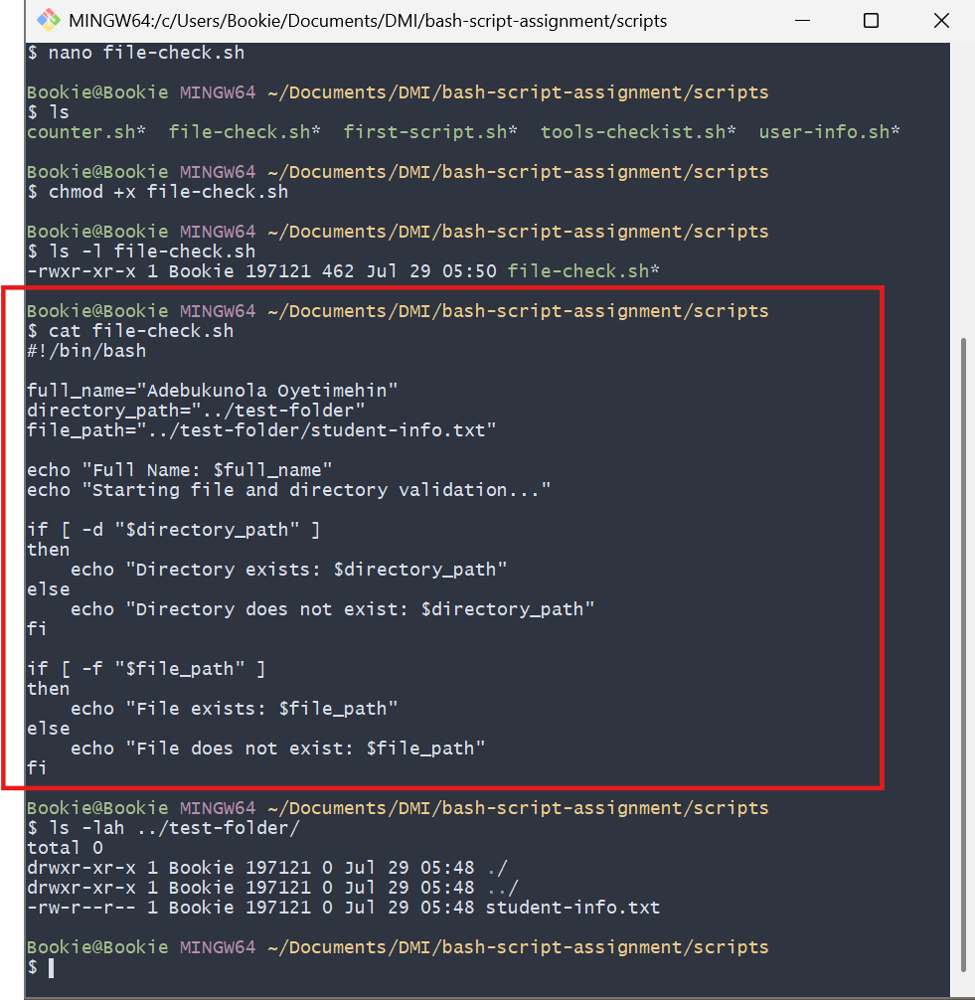

---

#### Screenshot 3 — Output of `./file-check.sh`

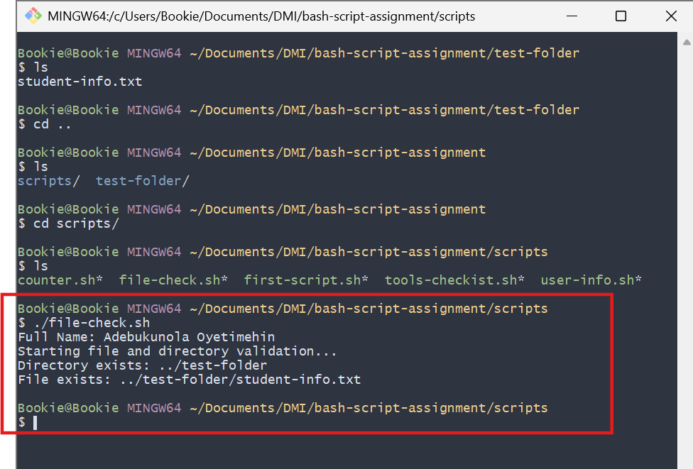

---

### Notes

Answer the following in your own words:

**1. What does `-d` check in Bash?**

In Bash, the **`-d`** file test operator checks **whether a specified path exists and is a directory**.

It is commonly used in `if` statements to verify that a directory exists before performing operations such as creating files, copying data, or navigating into it.

**Syntax**

```bash
if [ -d "directory_name" ]; then
    # Commands to execute if the directory exists
fi
```

**Example**

```bash id="e96vzg"
#!/bin/bash

if [ -d "/home/user/Documents" ]; then
    echo "Directory exists."
else
    echo "Directory does not exist."
fi
```

**Output**

If the directory exists:

```text id="ut2x0y"
Directory exists.
```

If it does not exist:

```text id="p6l2eo"
Directory does not exist.
```

**Why is `-d` important?**

* **Checks whether a directory exists** before using it.
* **Prevents errors** caused by trying to access a non-existent directory.
* **Supports conditional execution**, allowing scripts to make decisions based on the file system.
* **Improves script reliability** by validating paths before performing operations.

**Why this matters in DevOps**

DevOps engineers frequently use `-d` to verify that required directories exist before deploying applications, storing logs, creating backups, or managing configuration files. This helps ensure automation scripts run reliably and avoid failures caused by missing directories. 🚀

---

**2. What does `-f` check in Bash?**

In Bash, the **`-f`** file test operator checks **whether a specified path exists and is a regular file**.

A regular file is a standard file that contains data, such as a text file, script, image, or document. It does **not** match directories, symbolic links, or special device files.

**Syntax**

```bash
if [ -f "filename" ]; then
    # Commands to execute if the file exists
fi
```

**Example**

```bash
#!/bin/bash

if [ -f "backup.sh" ]; then
    echo "File exists."
else
    echo "File does not exist."
fi
```

**Output**

If the file exists:

```text
File exists.
```

If it does not exist:

```text
File does not exist.
```

**Why is `-f` important?**

* **Checks whether a regular file exists** before using it.
* **Prevents errors** caused by trying to read or execute a file that doesn't exist.
* **Supports conditional execution**, allowing scripts to make decisions based on the presence of files.
* **Improves script reliability** by validating file paths before performing operations.

**Difference between `-d` and `-f`**

| Operator | Checks for                 |
| -------- | -------------------------- |
| `-d`     | A **directory** exists.    |
| `-f`     | A **regular file** exists. |

**Why this matters in DevOps**

DevOps engineers commonly use `-f` to verify that configuration files, deployment scripts, log files, or backup files exist before attempting to read, copy, execute, or modify them. This helps automation scripts run safely and reduces the risk of failures due to missing files. 🚀

---

**3. Why should file and directory paths be stored in variables?**

Storing file and directory paths in variables makes Bash scripts **more flexible, readable, and easier to maintain**. Instead of hardcoding the same path multiple times, you define it once in a variable and reuse it throughout the script.

**Benefits of storing paths in variables**

* **Improves readability** by giving paths meaningful names.
* **Reduces duplication**, since the path is defined only once.
* **Makes maintenance easier**, because changing the path requires updating only the variable.
* **Minimizes errors** by avoiding inconsistent or mistyped paths.
* **Increases reusability**, allowing the same script to work in different environments by changing a single variable.

**Example**

```bash id="igce92"
#!/bin/bash

backup_dir="/home/user/backups"

if [ -d "$backup_dir" ]; then
    echo "Backup directory exists."
else
    echo "Backup directory does not exist."
fi
```

If the backup directory changes, you only need to update this line:

```bash id="eq4vfo"
backup_dir="/new/location/backups"
```

The rest of the script continues to work without modification.

**Why this matters in DevOps**

DevOps engineers often work with configuration files, deployment directories, log locations, and backup folders. Storing these paths in variables makes automation scripts easier to update, reduces mistakes, and allows the same script to be reused across development, staging, and production environments. 🚀

---

**4. What happens if the file does not exist?**

If the file does **not** exist, the condition using **`-f`** evaluates to **false**. As a result, Bash skips the commands inside the `if` block and executes the commands inside the `else` block (if one is provided).

**Example**

```bash id="sdynvo"
#!/bin/bash

file="backup.sh"

if [ -f "$file" ]; then
    echo "File exists."
else
    echo "File does not exist."
fi
```

**Output (if the file is missing)**

```text id="w5gqbf"
File does not exist.
```

**Why is this useful?**

* **Prevents errors** by checking for a file before trying to access it.
* **Allows the script to handle missing files gracefully**, such as displaying an error message or creating the file.
* **Improves reliability** by avoiding failures caused by invalid file paths.

**Why this matters in DevOps**

In DevOps, scripts often rely on configuration files, deployment scripts, or backup files. Checking whether a file exists before using it helps prevent automation failures and allows the script to take appropriate action, such as creating the file, logging an error, or exiting safely. 🚀

---

# Task 7 — Conditionals: Pass or Retry Script

## Goal

Use if-else conditionals to make decisions based on a variable value.

### Evidence

#### Screenshot 1 — Content of `score-check.sh` with `score=85`

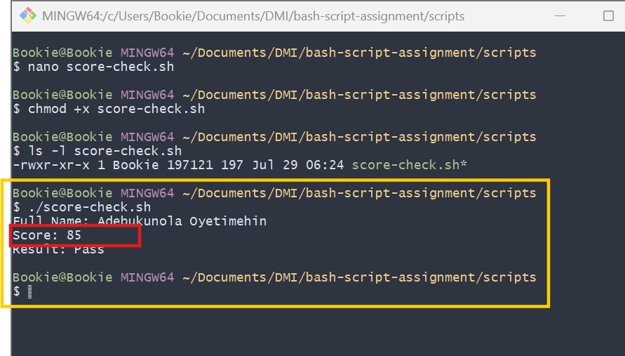

---

#### Screenshot 2 — Output showing `Result: Pass`

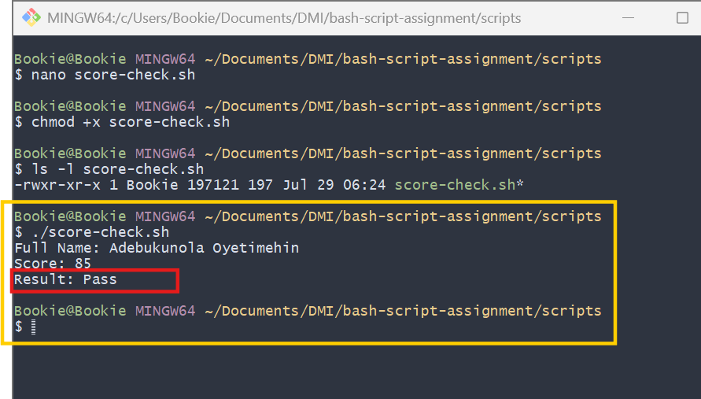

---

#### Screenshot 3 — Content of `score-check.sh` with `score=55`

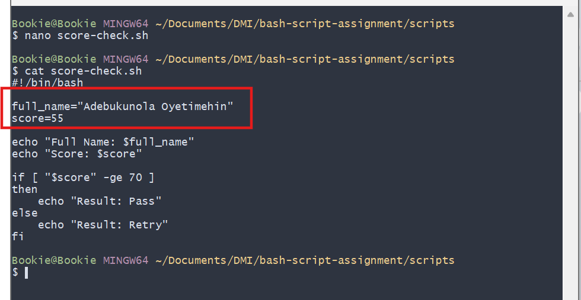
---

#### Screenshot 4 — Output showing `Result: Retry`

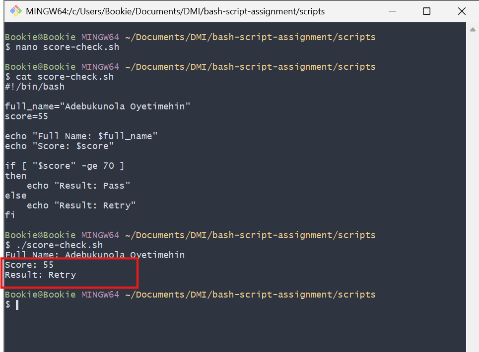
---

### Notes

Answer the following in your own words:

**1. What is the purpose of if-else in Bash?**

The **`if-else`** statement in Bash is used to **make decisions** by executing different blocks of code based on whether a specified condition is **true** or **false**.

It enables scripts to respond to different situations, such as checking if a file exists, verifying user input, or determining whether a command executed successfully.

**Syntax**

```bash id="dw5gr8"
if [ condition ]; then
    # Commands to run if the condition is true
else
    # Commands to run if the condition is false
fi
```

**Example**

```bash id="rntg9g"
#!/bin/bash

file="backup.sh"

if [ -f "$file" ]; then
    echo "The file exists."
else
    echo "The file does not exist."
fi
```

**Output**

If the file exists:

```text id="fcrkqf"
The file exists.
```

If the file does not exist:

```text id="eyq1sp"
The file does not exist.
```

**Why is `if-else` important?**

* **Enables decision-making** in scripts.
* **Executes different actions** based on conditions.
* **Prevents errors** by checking conditions before performing operations.
* **Makes scripts more dynamic** and adaptable to different scenarios.
* **Improves reliability** by handling both expected and unexpected situations.

**Why this matters in DevOps**

DevOps engineers frequently use `if-else` statements to automate decisions, such as checking whether a server is running, verifying that a configuration file exists, testing the success of a deployment, or ensuring required directories are present before proceeding. This makes automation scripts more robust, reliable, and capable of handling real-world conditions. 🚀

---

**2. What does `-ge` mean?**

In Bash, **`-ge`** is a **comparison operator** that means **"greater than or equal to."** It is used to compare **integer values** in conditional statements such as `if` statements or loops.

If the first number is **greater than or equal to** the second number, the condition evaluates to **true**. Otherwise, it evaluates to **false**.

**Syntax**

```bash
if [ number1 -ge number2 ]; then
    # Commands to execute if number1 is greater than or equal to number2
fi
```

**Example**

```bash
#!/bin/bash

age=20

if [ "$age" -ge 18 ]; then
    echo "You are an adult."
else
    echo "You are a minor."
fi
```

**Output:**

```text
You are an adult.
```

Since `20` is greater than `18`, the condition is true, so the first message is displayed.

**Other numeric comparison operators**

| Operator | Meaning                  |
| -------- | ------------------------ |
| `-eq`    | Equal to                 |
| `-ne`    | Not equal to             |
| `-gt`    | Greater than             |
| `-ge`    | Greater than or equal to |
| `-lt`    | Less than                |
| `-le`    | Less than or equal to    |

**Why this matters in DevOps**

DevOps engineers use `-ge` in Bash scripts to make decisions based on numeric values, such as checking CPU or memory usage, verifying disk space, counting retries, or ensuring a minimum version number is met before continuing with deployment or automation tasks. 🚀

---

**3. Why should conditions be tested with different values?**

Conditions should be tested with different values to ensure that a Bash script behaves **correctly in all possible scenarios**. Testing different inputs verifies that both the **true** and **false** paths of a condition work as expected.

**Why is this important?**

* **Verifies correctness** by confirming the condition produces the expected result.
* **Identifies errors** in the script before it is used in production.
* **Tests all possible outcomes**, including edge cases and invalid inputs.
* **Improves reliability**, ensuring the script handles different situations correctly.
* **Builds confidence** that the script will work as intended in real-world environments.

**Example**

```bash id="v0y8f3"
#!/bin/bash

age=18

if [ "$age" -ge 18 ]; then
    echo "Access granted."
else
    echo "Access denied."
fi
```

Test the script with different values:

| `age` | Result         |
| ----: | -------------- |
|  `20` | Access granted |
|  `18` | Access granted |
|  `17` | Access denied  |

By testing multiple values, you can confirm that the script behaves correctly when the condition is **true**, **equal to the threshold**, and **false**.

**Why this matters in DevOps**

DevOps engineers test conditions with different values to ensure automation scripts handle all expected scenarios, such as sufficient or insufficient disk space, successful or failed deployments, and healthy or unhealthy services. This helps prevent unexpected failures and makes automation more reliable in production environments. 🚀

---

**4. How can conditionals help in automation scripts?**

Conditionals in Bash allow automation scripts to **make decisions** based on specific conditions. They enable a script to execute different actions depending on the result of a test, making the script more intelligent, flexible, and reliable.

**How conditionals help**

* **Make decisions automatically** based on system conditions or user input.
* **Prevent errors** by checking whether files, directories, or services exist before using them.
* **Handle different scenarios**, such as success or failure of a command.
* **Improve reliability** by allowing scripts to respond appropriately to unexpected situations.
* **Support automation** by eliminating the need for manual intervention.

**Example**

```bash id="v8u2xg"
#!/bin/bash

file="backup.sh"

if [ -f "$file" ]; then
    echo "Starting backup..."
else
    echo "Backup script not found. Exiting."
fi
```

In this example:

* If `backup.sh` exists, the script proceeds with the backup.
* If the file does not exist, the script displays an error message and avoids running an invalid operation.

**Why this matters in DevOps**

Conditionals are essential in DevOps automation because they allow scripts to respond to real-world conditions. For example, they can:

* Check if a server or service is running before restarting it.
* Verify that a configuration file exists before deployment.
* Ensure there is enough disk space before creating backups.
* Confirm that a previous command completed successfully before continuing to the next step.

Using conditionals makes automation scripts more robust, reliable, and capable of handling different situations without manual intervention. 🚀

---

# Task 8 — Functions: Final Bash Automation Script

## Goal

Create a final Bash script using functions to organize reusable code.

### Evidence

#### Screenshot 1 — Content of `final-automation.sh`

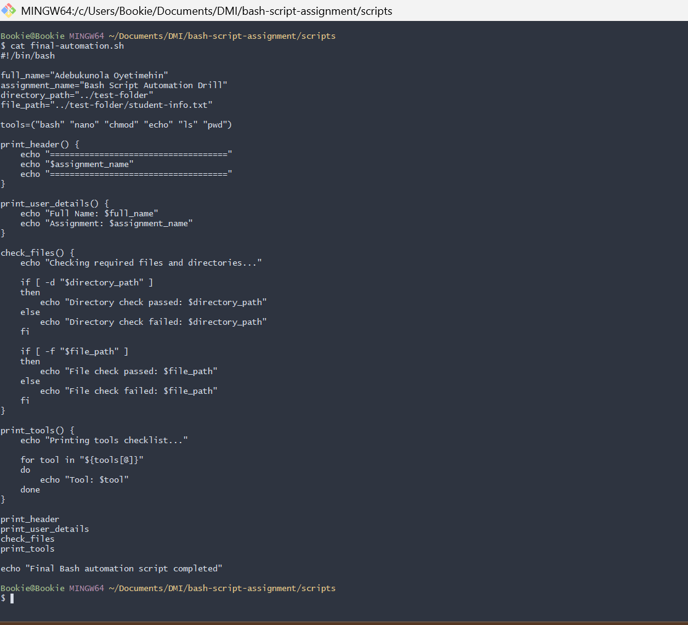

---

#### Screenshot 2 — Output of `./final-automation.sh`

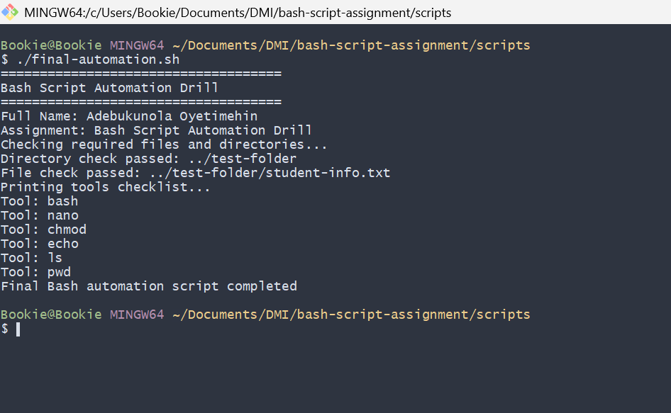

---

#### Screenshot 3 — Output of `ls -lah` showing all created scripts

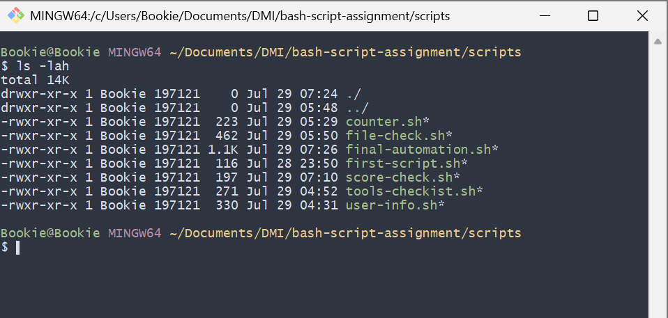

---

### Notes

Answer the following in your own words:

**1. What is a function in Bash?**

A **function** in Bash is a **named block of commands** that performs a specific task. Instead of writing the same commands multiple times, you can place them inside a function and call the function whenever needed.

Functions help make Bash scripts **more organized, reusable, and easier to maintain**.

**Syntax**

```bash id="tjlwmg"
function_name() {
    # Commands
}
```

or

```bash id="jlwmkv"
function function_name {
    # Commands
}
```

**Example**

```bash id="e5vx8e"
#!/bin/bash

greet() {
    echo "Welcome to Bash scripting!"
}

greet
```

**Output:**

```text id="r2dl3y"
Welcome to Bash scripting!
```

In this example:

* `greet()` defines a function.
* The `echo` command is executed whenever `greet` is called.

**Why are functions important?**

* **Promote code reuse** by avoiding repeated code.
* **Improve readability** by organizing related commands into logical blocks.
* **Simplify maintenance**, since changes only need to be made in one place.
* **Make scripts modular**, allowing different tasks to be separated into functions.

**Why this matters in DevOps**

DevOps engineers use functions to organize automation scripts into reusable tasks, such as installing software, deploying applications, checking server health, or creating backups. This makes scripts easier to maintain, debug, and reuse across multiple projects and environments. 🚀

---

**2. Why are functions useful in scripts?**

Functions are useful in Bash scripts because they allow you to **group related commands into reusable blocks**. Instead of writing the same code multiple times, you can define it once in a function and call it whenever needed.

**Benefits of using functions**

* **Reduce code duplication** by reusing the same block of code.
* **Improve readability** by organizing scripts into smaller, logical sections.
* **Simplify maintenance**, since changes only need to be made in one place.
* **Make scripts modular**, with each function performing a specific task.
* **Improve debugging**, as problems can be isolated to individual functions.

**Example**

```bash id="i3m8kh"
#!/bin/bash

greet() {
    echo "Welcome to Bash scripting!"
}

greet
greet
```

**Output:**

```text id="cjlwm1"
Welcome to Bash scripting!
Welcome to Bash scripting!
```

Instead of writing the `echo` command twice, the script defines it once in the `greet` function and calls the function whenever the message is needed.

**Why this matters in DevOps**

Functions are widely used in DevOps to organize automation tasks such as installing software, deploying applications, creating backups, checking server health, and monitoring services. By separating these tasks into reusable functions, scripts become cleaner, easier to maintain, and more scalable, especially as automation grows more complex. 🚀

---

**3. Which functions did you create in this script?**

The script defines **four Bash functions**, each responsible for a specific task:

1. **`print_header()`**

   * Displays the title and formatting for the script.
   * Prints a header containing the assignment name.

2. **`print_user_details()`**

   * Displays the user's full name and the assignment name.
   * Uses the variables `full_name` and `assignment_name`.

3. **`check_files()`**

   * Checks whether the required directory and file exist.
   * Uses:

     * `-d` to verify that the directory (`directory_path`) exists.
     * `-f` to verify that the file (`file_path`) exists.
   * Displays a success or failure message based on the results.

4. **`print_tools()`**

   * Prints all the Bash tools stored in the `tools` array.
   * Uses a `for` loop to iterate through each tool and display it.

**Function Summary**

| Function               | Purpose                                               |
| ---------------------- | ----------------------------------------------------- |
| `print_header()`       | Displays the script header and assignment title.      |
| `print_user_details()` | Prints the user's name and assignment information.    |
| `check_files()`        | Checks whether the required directory and file exist. |
| `print_tools()`        | Loops through the `tools` array and prints each tool. |

**How the functions are used**

At the end of the script, each function is called in sequence:

```bash id="04rmj4"
print_header
print_user_details
check_files
print_tools
```

This causes the script to:

1. Display the header.
2. Show the user and assignment details.
3. Verify the required directory and file.
4. Print the list of Bash tools.
5. Finally, display:

```text id="rm3mnr"
Final Bash automation script completed
```

**Why this matters in DevOps**

Breaking a script into functions makes it easier to organize and reuse code. In DevOps, functions are commonly used to separate tasks such as server setup, application deployment, configuration checks, backups, and monitoring. This modular approach improves readability, simplifies maintenance, and makes automation scripts more scalable and easier to debug. 🚀

---

**4. How does this final script combine variables, arrays, loops, conditionals, files, and functions?**

The final Bash script combines several fundamental Bash concepts to create a well-structured automation script. Each concept plays a specific role in making the script organized, reusable, and efficient.

**How each concept is used**

* **Variables**

  * Store important information such as the user's full name, assignment name, directory path, and file path.
  * Examples:

    ```bash
    full_name="<Your Full Name>"
    assignment_name="Bash Script Automation Drill"
    directory_path="../test-folder"
    file_path="../test-folder/student-info.txt"
    ```

  * Using variables avoids repeating values and makes the script easier to update.

* **Arrays**

  * Store multiple Bash tools in a single variable.
  * Example:

    ```bash
    tools=("bash" "nano" "chmod" "echo" "ls" "pwd")
    ```

  * This keeps related data together and simplifies processing.

* **Loops**

  * The `for` loop iterates through each element in the `tools` array.
  * Example:

    ```bash
    for tool in "${tools[@]}"
    do
        echo "Tool: $tool"
    done
    ```

  * This eliminates the need to write separate `echo` statements for each tool.

* **Conditionals**

  * `if-else` statements check whether the required directory and file exist.
  * The script uses:

    * `-d` to check for a directory.
    * `-f` to check for a file.
  * Based on the result, it displays either a success or failure message.

* **Files and Directories**

  * The script verifies the existence of:

    * The directory stored in `directory_path`.
    * The file stored in `file_path`.
  * This helps prevent errors before performing file operations.

* **Functions**

  * The script is divided into four functions:

    * `print_header()`
    * `print_user_details()`
    * `check_files()`
    * `print_tools()`
  * Each function performs a specific task, making the script modular, reusable, and easier to maintain.

**Overall workflow**

The script follows this sequence:

1. Stores data in variables and an array.
2. Defines functions for different tasks.
3. Calls each function in order.
4. Uses conditionals to verify the required directory and file.
5. Uses a loop to print each tool from the array.
6. Displays a final completion message.

**Why this matters in DevOps**

This script demonstrates how core Bash features work together to automate tasks. Variables store configuration values, arrays manage collections of data, loops process multiple items, conditionals make decisions, file checks improve reliability, and functions organize the code into reusable modules. These are the same building blocks DevOps engineers use to automate deployments, server management, system monitoring, and other operational tasks efficiently. 🚀

---

# LinkedIn Post (Required)

## Evidence

#### LinkedIn Post URL

Paste your LinkedIn post URL here:

`https://www.linkedin.com/posts/bukky-oyetimehin_devops-linux-bash-share-7488141311573872640-G4RB/?utm_source=share&utm_medium=member_desktop&rcm=ACoAABEGQlgB1AkrO3hQl21ZivPMvp3RJYKW6KI`

---

#### Screenshot — Published LinkedIn post


---

# Submission Instructions

* Add all required screenshots in your submission
* Full name must be visible in required screenshots
* All script files must be created and run successfully
* Required notes must be answered clearly for every task
* Do not expose sensitive information (keys, passwords, credentials)

---

# Completion Checklist

* [ ] Task 1: Environment setup verified, workspace created (Screenshots 1–2, Notes answered)
* [ ] Task 2: First script created, executed, permissions verified (Screenshots 1–3, Notes answered)
* [ ] Task 3: Variables script created and run (Screenshots 1–2, Notes answered)
* [ ] Task 4: Arrays and loops script created and run (Screenshots 1–2, Notes answered)
* [ ] Task 5: Counter loop script created and run (Screenshots 1–2, Notes answered)
* [ ] Task 6: File validation script created and run (Screenshots 1–3, Notes answered)
* [ ] Task 7: Pass/Retry conditional script tested with both values (Screenshots 1–4, Notes answered)
* [ ] Task 8: Final automation script created and run (Screenshots 1–3, Notes answered)
* [ ] All scripts run without errors
* [ ] Full Name visible in all required screenshots
* [ ] LinkedIn post published and URL submitted
* [ ] No sensitive data exposed

---

## 📌 About DMI & CloudAdvisory

DevOps Micro Internship (DMI) is a project-based DevOps program run by Pravin Mishra (The CloudAdvisory) focused on real-world execution, systems thinking, and career readiness.

It helps learners build strong DevOps foundations with hands-on experience.

---

## 📌 Resources

* 🌐 DMI Official Website: <https://dmi.pravinmishra.com?utm_source=github&utm_medium=readme>  
* 🎓 University: <https://university.pravinmishra.com?utm_source=github&utm_medium=readme>  
* 💬 Discord Community: <https://discord.pravinmishra.com?utm_source=github&utm_medium=readme>  
* 📝 Blog: <https://dmi.pravinmishra.com/blog?utm_source=github&utm_medium=readme>  
* ▶️ YouTube Playlist: <https://www.youtube.com/playlist?list=PLFeSNDtI4Cho>  
* 🔗 Pravin Mishra (LinkedIn): <https://www.linkedin.com/in/pravin-mishra-aws-trainer/>  
* 🏢 CloudAdvisory (LinkedIn): <https://www.linkedin.com/company/thecloudadvisory/>

---

*This submission is part of DevOps Micro Internship (DMI) Cohort 3 — Agentic AI Track.*