# Assignment 6 — Build an AI-Assisted Linux Health Check (AI-Assisted Linux Incident Triage)

Part of the DevOps Micro Internship (DMI) Cohort 3 with Agentic AI

---

## Purpose

In this assignment, you will build a read-only Bash triage script that checks the health of your Ubuntu server and Nginx application, connect it to Claude Code as a reusable `/linux-triage` skill, simulate a controlled Nginx incident, use the skill to gather and analyze evidence, recover the service manually, and verify recovery. The workflow follows the Agentic Loop: Gather → Analyze → Human Act → Verify.

---

# Task 1 — Confirm the Healthy Baseline and Create the Workspace

## Goal

Confirm that Nginx and the React application are healthy before building the automation.

### Evidence

#### Screenshot 1 — Output of `systemctl is-active nginx`, `ss -ltn | grep ':80'`, and `curl -I http://localhost`

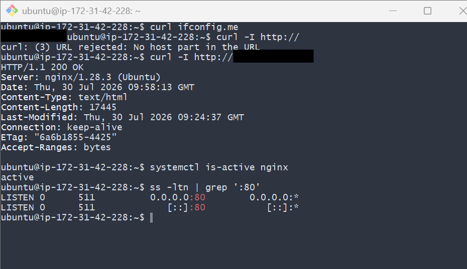

---

#### Screenshot 2 — Output of `pwd` and `find . -maxdepth 4 -type d | sort` showing the workspace folder structure

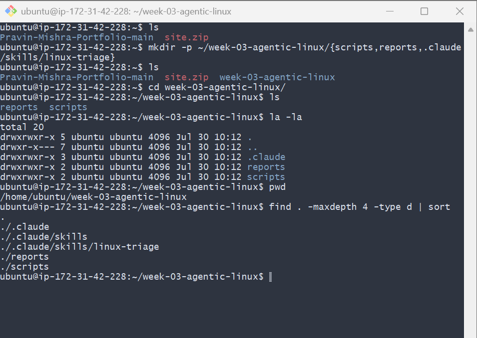

---

### Notes

Answer the following in your own words:

**1. What proves that Nginx is running?**

There are several ways to prove that **Nginx is running** on a Linux server. Here are the most common methods, along with what counts as evidence.

### 1. Check the Nginx service status (most direct) ✅

```bash
sudo systemctl status nginx
```

Expected output:

```text
● nginx.service - A high performance web server and a reverse proxy server
   Loaded: loaded (/lib/systemd/system/nginx.service)
   Active: active (running)
```

The key proof is:

```text
Active: active (running)
```

---

### 2. Check if Nginx is listening on port 80

```bash
sudo ss -ltnp | grep :80
```

or

```bash
sudo ss -tulpen | grep nginx
```

Example output:

```text
LISTEN 0 511 0.0.0.0:80 0.0.0.0:* users:(("nginx",pid=1234,fd=6))
```

This shows that Nginx is actively listening for HTTP requests.

---

### 3. Access the web server

From the server:

```bash
curl http://localhost
```

Or from another computer:

```bash
curl http://<server-ip>
```

If Nginx is running, you'll receive the HTML of the default page or your deployed website.

---

### 4. Open the website in a browser 🌐

Navigate to:

```text
http://<EC2-public-IP>
```

or

```text
http://your-domain-name
```

If your website or the default **"Welcome to nginx!"** page appears, Nginx is serving web traffic.

---

### 5. Check the process list

```bash
ps -ef | grep nginx
```

Example:

```text
root      1234     1  0 10:15 ?        00:00:00 nginx: master process
www-data  1235  1234  0 10:15 ?        00:00:00 nginx: worker process
```

This confirms the Nginx master and worker processes are running.

---

Together, these demonstrate that the Nginx service is running, accepting connections, and successfully serving web content.

---

**2. What proves that the server is listening for HTTP traffic?**

The proof that the server is **listening for HTTP traffic** is that a process (Nginx) is bound to **port 80**, which is the default HTTP port.

The most common command is:

```bash
sudo ss -ltnp | grep :80
```

or

```bash
sudo ss -tulpen | grep :80
```

Example output:

```text
LISTEN 0 511 0.0.0.0:80 0.0.0.0:* users:(("nginx",pid=1234,fd=6))
```

### What this proves

* **`LISTEN`** – The server is waiting for incoming network connections.
* **`0.0.0.0:80`** – Nginx is listening on **port 80 (HTTP)** on all network interfaces, so it can accept HTTP requests from any IP address.
* **`nginx`** – Confirms that Nginx is the process handling those HTTP requests.

If you're using HTTPS instead, you would expect to see **port 443**:

```bash
sudo ss -ltnp | grep :443
```

---

**3. Why must you capture a healthy baseline before simulating an incident?**

You should capture a **healthy baseline** before simulating an incident because it gives you a known-good reference point to compare against after introducing a problem.

A healthy baseline helps you:

* 📊 **Know what "normal" looks like** (service status, open ports, logs, CPU, memory, disk usage, response times).
* 🔍 **Identify what changed** during the incident by comparing before-and-after states.
* 🛠️ **Troubleshoot more effectively** because you can quickly spot abnormal behavior.
* ✅ **Verify recovery** by confirming the system returns to its original healthy state after the issue is fixed.
* 📝 **Document evidence** that the incident simulation and recovery were successful.

### Example

Before stopping Nginx, you might record:

```bash
sudo systemctl status nginx
sudo ss -tulpen | grep :80
curl http://localhost
```

These commands confirm that:

* Nginx is **active (running)**.
* The server is **listening on port 80**.
* The website is **accessible**.

After simulating the incident (for example, stopping Nginx), you run the same commands again to observe the differences and, after recovery, verify that the outputs match the original baseline.

**In summary:** Capturing a healthy baseline ensures you have a reliable point of comparison, making it easier to detect issues, confirm the root cause, and verify that the system has been fully restored after the simulated incident.

---

# Task 2 — Create Project Context and Safety Rules in CLAUDE.md

## Goal

Tell Claude exactly what this project does and what it is not allowed to do.

### Evidence

#### Screenshot 3 — CLAUDE.md open in VS Code showing all four sections (Project Overview, Incident Workflow, Safety Rules, Output Rules)

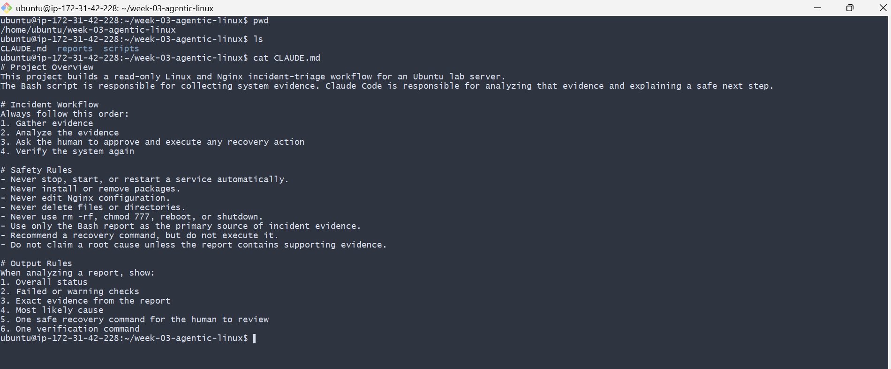

---

### Notes

Answer the following in your own words:

**1. Why should Claude receive project-specific operational rules?**

Claude should receive **project-specific operational rules** so it understands the project's standards, constraints, and expected workflows before generating code or making changes.

This helps Claude:

* 🎯 **Follow project conventions** such as coding style, directory structure, naming conventions, and Git workflow.
* ⚡ **Produce more accurate responses** by tailoring suggestions to the project's technologies and requirements instead of relying on generic assumptions.
* 🛡️ **Reduce mistakes** by respecting operational rules, security requirements, and deployment procedures.
* 🤝 **Maintain consistency** so code and documentation match the rest of the project, making collaboration easier.
* 🚀 **Improve productivity** by reducing the need to repeatedly explain the same project context in every prompt.

**In summary:** Project-specific operational rules give Claude the context it needs to generate safer, more consistent, and project-aligned outputs while minimizing errors and unnecessary back-and-forth. With these rules, Claude can provide guidance that aligns with the team's established practices.

---

**2. Why is the human required to execute the recovery command?**

The human is required to execute the **recovery command** because recovering a system is a **high-impact action** that can affect service availability, data integrity, and security. An AI assistant can recommend the correct command, but the final decision and execution should remain with a human.

Key reasons include:

* 👤 **Human oversight:** A person verifies that the diagnosis is correct before making changes.
* 🛡️ **Safety:** Recovery commands can restart services, overwrite configurations, or impact users if executed at the wrong time.
* ⚖️ **Accountability:** In production environments, humans are responsible for operational changes and must approve and perform them.
* 🔍 **Environment awareness:** A human can consider factors the AI may not know, such as maintenance windows, active users, or recent deployments.
* ✅ **Verification:** After running the command, the human confirms that the service has recovered and is functioning normally.

**Example:** If Nginx stops unexpectedly, Claude may recommend:

```bash
sudo systemctl start nginx
```

However, the human should first check logs, confirm the cause of the failure, and then decide whether starting Nginx is the appropriate action. After executing the command, the human should verify the recovery using commands such as:

```bash
sudo systemctl status nginx
sudo ss -ltnp | grep :80
curl http://localhost
```

**In summary:** The human executes the recovery command to ensure that critical system changes are made deliberately, safely, and with full responsibility, while the AI serves as an advisor rather than an autonomous operator.

---

**3. Which rule prevents Claude from making an unsupported diagnosis?**

Based on your `CLAUDE.md`, the answer is:

**The rule that prevents Claude from making an unsupported diagnosis is:**

> **"Do not claim a root cause unless the report contains supporting evidence."**

**Explanation**

This rule requires Claude to base its conclusions **only on evidence** found in the Bash incident report. If the report doesn't contain enough information to identify the root cause, Claude must avoid guessing and instead state that more evidence is needed.

For example:

* ✅ **Correct:**

  > "The report shows that Nginx is inactive. However, the report does not contain enough evidence to determine why the service stopped."

* ❌ **Incorrect:**

  > "Nginx failed because of an invalid configuration."

The second statement is an unsupported diagnosis unless the report includes evidence such as the output of:

```bash
sudo nginx -t
```

or relevant error log entries indicating a configuration error.

**Summary**

> **The rule that prevents Claude from making an unsupported diagnosis is:** *"Do not claim a root cause unless the report contains supporting evidence."* This ensures Claude bases its analysis only on verified evidence from the Bash report, avoids speculation, and requests additional evidence if the root cause cannot be confirmed.

---

# Task 3 — Use Agentic AI to Plan Before Writing the Script

## Goal

Use Claude Code to inspect the environment and produce a read-only plan before creating any Bash code.

### Evidence

#### Screenshot 4 — Claude Code showing the five-check plan and read-only inspection results

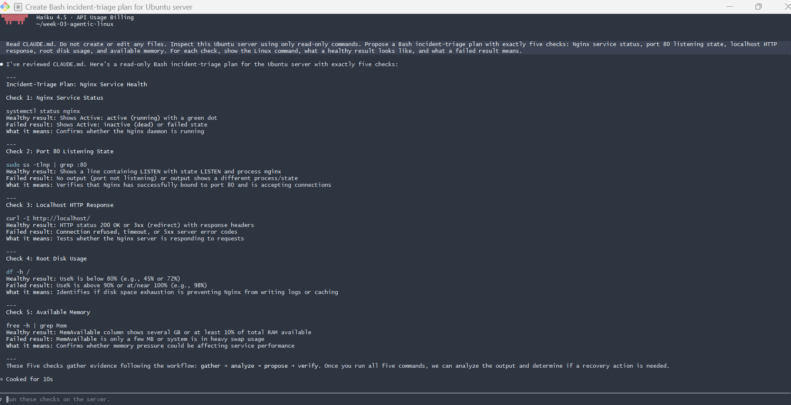

---

### Notes

Answer the following in your own words:

**1. Which part of this task represents the Gather phase?**

The Gather phase is the execution of the five read-only checks and collection of their output:

1. `systemctl status nginx`
2. `sudo ss -tlnp | grep :80`
3. `curl -I http://localhost/`
4. `df -h /`
5. `free -h | grep Mem`

The displayed five-check plan defines what to gather; running those commands and recording their results is the actual Gather step.

---

**2. Did Claude follow the instruction not to create files? How did you verify this?**

Yes. Claude followed the “do not create or edit any files” instruction.

Claude says it reviewed `CLAUDE.md` and then only presents a proposed plan. The five commands shown are read-only inspection commands:

* `systemctl status nginx`
* `sudo ss -tlnp | grep :80`
* `curl -I http://localhost/`
* `df -h /`
* `free -h | grep Mem`

There are no file-writing or editing commands such as `touch`, `mkdir`, `nano`, `vi`, `cat > file`, `tee`, `cp`, `mv`, `rm`, `sed -i`, or redirection like `>`/`>>`.

---

**3. Why is planning before coding useful in DevOps automation?**

Planning first defines exactly what evidence to collect, keeps the script scoped and safe, and catches missing checks before implementation. In DevOps, this reduces risky changes, makes automation predictable and reviewable, and ensures the script supports the intended incident workflow: gather evidence, analyze it, act manually, then verify recovery.

---

# Task 4 — Build the Linux Triage Bash Script

## Goal

Create one Bash script that gathers consistent Linux and Nginx health evidence.

### Evidence

#### Screenshot 5 — Top section of `linux-triage.sh` showing variables, thresholds, and the checks array

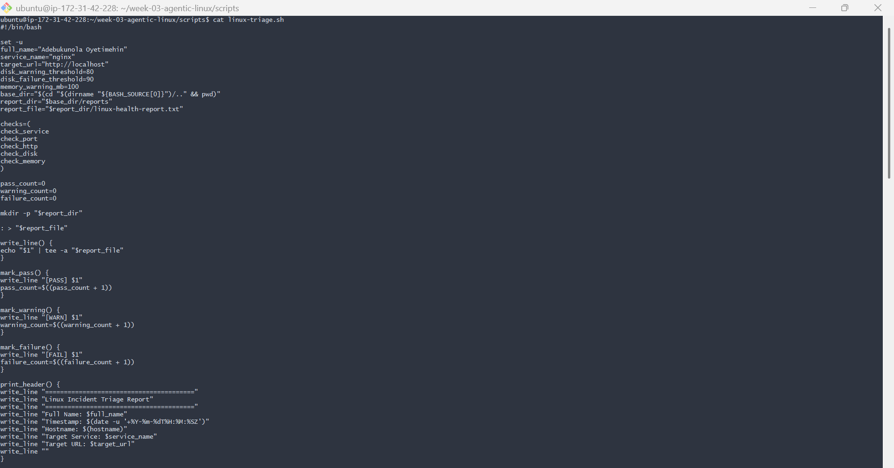

---

#### Screenshot 6 — Middle section showing check functions and conditionals

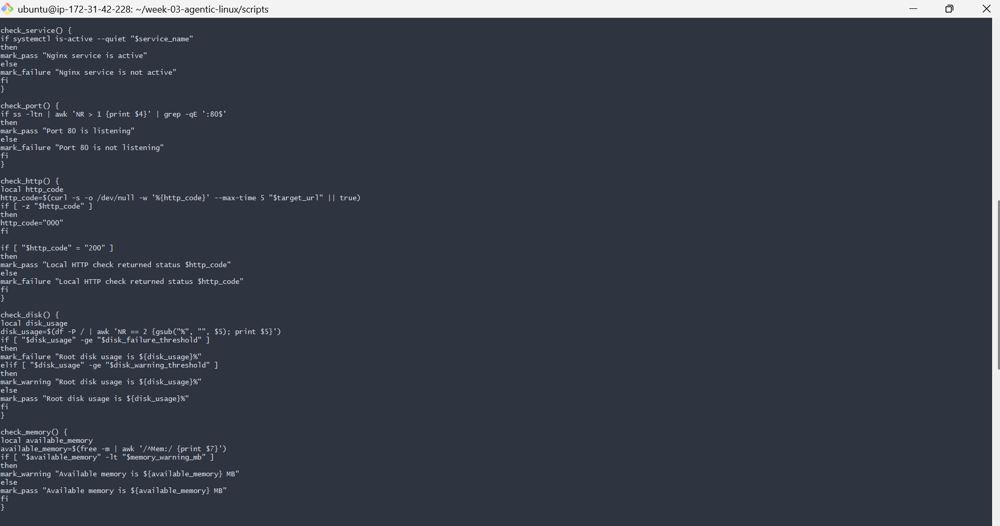

---

#### Screenshot 7 — Bottom section showing the loop, summary function, and exit behavior

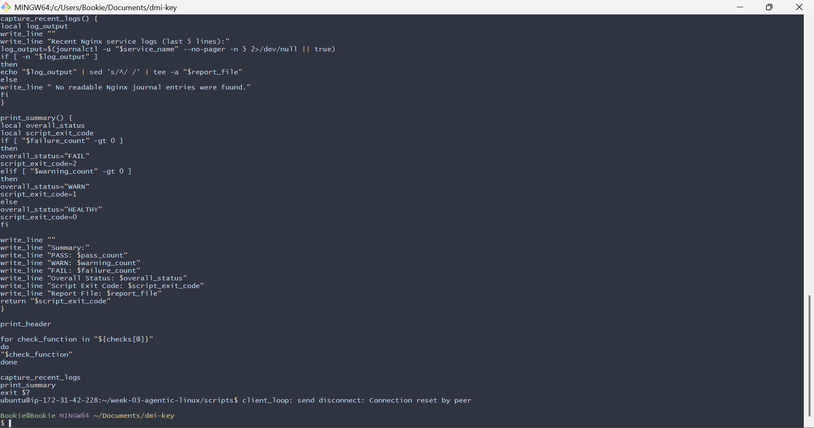

---

#### Screenshot 8 — Output of `bash -n scripts/linux-triage.sh` (no syntax errors) and `ls -l scripts/linux-triage.sh` showing executable permission

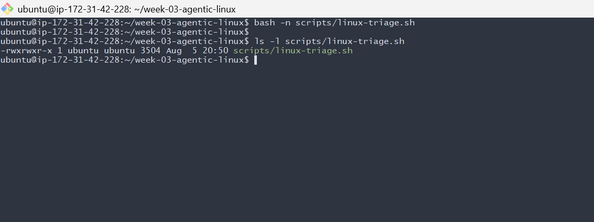

---

### Notes

Answer the following in your own words:

**1. What is stored in the checks array?**

The `checks` array stores the names of the five health-check functions, in the order the script will run them:

```bash
check_service
check_port
check_http
check_disk
check_memory
```

Later, the `for` loop calls each stored function name to perform the checks.

---

**2. How does the `for` loop use that array?**

The loop goes through each item in the `checks` array, stores it temporarily in `check_function`, and runs it as a command/function:

```bash
for check_function in "${checks[@]}"
do
  "$check_function"
done
```

For example, on the first loop `check_function` becomes `check_service`, so this runs:

```bash
check_service
```

It then repeats for `check_port`, `check_http`, `check_disk`, and `check_memory`.

---

**3. Why are the health checks separated into functions?**

Separating the checks into functions makes the script easier to read, test, reuse, and update. Each function has one clear responsibility—for example, checking Nginx, port 80, disk space, or memory—so a problem can be fixed without affecting the other checks.

It also lets the script run the checks cleanly through the `checks` array and `for` loop.

---

**4. What is the purpose of `$(...)` in this script?**

`$(...)` is command substitution: it runs the command inside it and stores that command’s output.

Examples from the script:

```bash
base_dir="$(cd "$(dirname "${BASH_SOURCE[0]}")/.." && pwd)"
```

Runs commands to determine the project’s parent directory and saves it in `base_dir`.

```bash
http_code=$(curl ...)
```

Runs `curl` and stores the returned HTTP status code, such as `200`, in `http_code`.

```bash
disk_usage=$(df -P / | awk ...)
```

Runs `df` and `awk`, then stores the root disk-usage percentage in `disk_usage`.

---

**5. Why does the script use different exit codes for HEALTHY, WARN, and FAIL?**

Different exit codes let people and automation quickly determine the result:

* `0` — `HEALTHY`: all checks passed.
* `1` — `WARN`: no failures, but attention may be needed.
* `2` — `FAIL`: at least one critical check failed.

Monitoring systems, CI/CD jobs, or other scripts can read `$?` after the script runs and trigger the appropriate alert or response without needing to parse the report text.

---

# Task 5 — Run and Understand the Healthy-State Report

## Goal

Run the Bash script against the healthy server and verify that it creates a report.

### Evidence

#### Screenshot 9 — Output of `./scripts/linux-triage.sh` showing your Full Name and all five check results

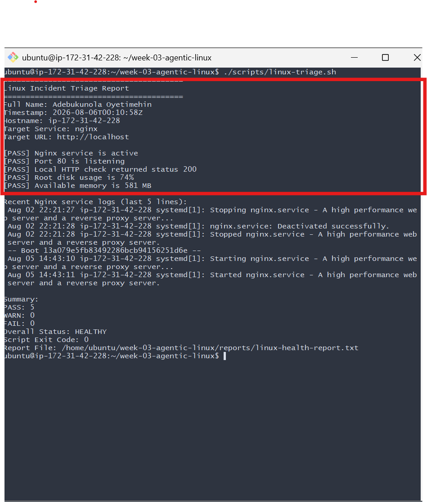

---

#### Screenshot 10 — Output showing the captured exit code and final summary

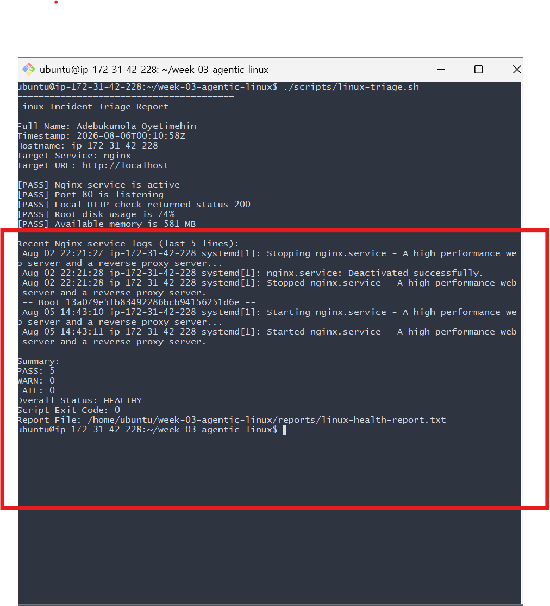

---

### Notes

Answer the following in your own words:

**1. What is the overall status of your healthy baseline?**

The healthy baseline status is **HEALTHY**.

All five checks passed, with `WARN: 0`, `FAIL: 0`, and script exit code `0`.

---

**2. Which exact Linux evidence proves the application is serving traffic?**

The exact evidence is:

```text
[PASS] Local HTTP check returned status 200
```

An HTTP `200 OK` response from `http://localhost` proves that Nginx is responding successfully to a web request.

---

**3. Did your script return exit code 0 or 1? Explain why.**

It returned exit code `0` because the baseline was healthy: all five checks passed, with zero warnings and zero failures.

`0` indicates `HEALTHY`; `1` would indicate `WARN`.

---

**4. What is the difference between a warning and a failure in this script?**

A warning means the server is still functioning, but a value is approaching an unsafe level and needs attention—for example, root disk usage between 80% and 89%, or available memory below 100 MB.

A failure means a critical health check did not pass, such as Nginx not running, port 80 not listening, or the localhost HTTP check not returning `200`. A warning produces exit code `1`; a failure produces exit code `2`.

---

# Task 6 — Create and Run the /linux-triage Skill

## Goal

Turn the Bash script into a reusable, manually invoked Agentic AI workflow.

### Evidence

#### Screenshot 11 — `SKILL.md` showing the frontmatter, allowed tool restrictions, and safety rules

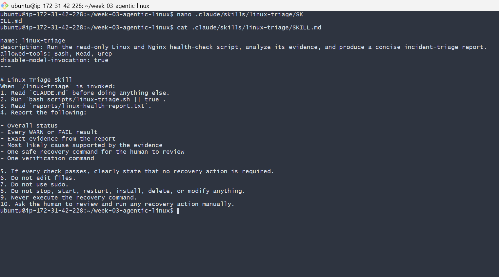

---

#### Screenshot 12 — `/linux-triage` output for the healthy server

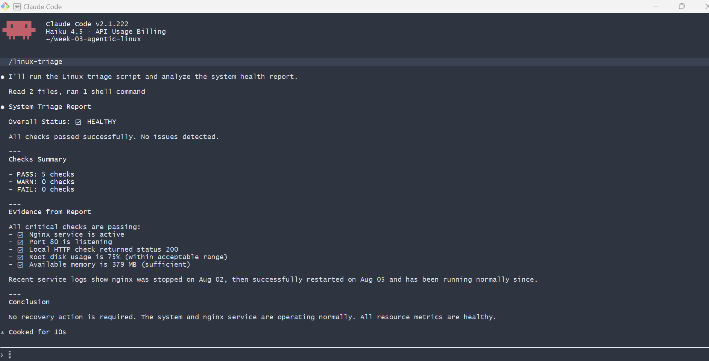

---

### Notes

Answer the following in your own words:

**1. Why does this skill have Bash, Read, and Grep, but not Write?**

The answer lies in the purpose of the skill: it is designed to be **read-only** and perform **incident analysis**, not system modification.

The skill has **Bash, Read, and Grep**, but **not Write**, because it is intended to **inspect and analyze** the system without making any changes. This enforces a safe, read-only workflow during incident triage.

* **Bash** allows the skill to run the health-check script (`bash scripts/linux-triage.sh`) and other non-destructive shell commands needed to gather evidence.
* **Read** allows it to open and examine files such as `CLAUDE.md` and `reports/linux-health-report.txt`.
* **Grep** allows it to search for specific information or patterns within the report or other files to support its analysis.
* **Write** is intentionally omitted to prevent the skill from creating, modifying, or deleting files.

This design aligns with the instructions in `SKILL.md`, which explicitly state:

* **"Do not edit files."**
* **"Do not stop, start, restart, install, delete, or modify anything."**
* **"Never execute the recovery command."**

By excluding the **Write** tool, the skill is technically restricted from altering the system, ensuring it remains a **safe, evidence-based incident analysis tool**. It can gather evidence, analyze it, and recommend a recovery command, but only a human can approve and execute any corrective action. This reduces the risk of accidental changes to the server and supports the principle of least privilege.

---

**2. Why is `disable-model-invocation: true` useful for this skill?**

`disable-model-invocation: true` is useful because it ensures the skill **executes a fixed, predefined workflow instead of allowing the AI model to improvise or make independent decisions**.

For this Linux triage skill, the workflow is explicitly defined:

1. Read `CLAUDE.md`.
2. Run the health-check script.
3. Read the generated report.
4. Summarize the findings.
5. Recommend (but do not execute) a recovery command.

By disabling model invocation, the skill:

* 🛡️ **Improves safety** by preventing the AI from performing actions outside the documented workflow.
* 📋 **Ensures consistency** by following the same sequence of steps every time the skill is invoked.
* 🔍 **Keeps the analysis evidence-based** by relying only on the Bash report and `CLAUDE.md`, rather than generating unsupported conclusions.
* ⚙️ **Reduces unintended behavior** by preventing the model from deciding to run additional commands, edit files, or modify the system.

In the context of your `linux-triage` skill, this setting reinforces the project's operational rules: the skill gathers evidence, analyzes it, recommends a safe recovery command, and leaves all corrective actions to the human operator.

**In summary:** `disable-model-invocation: true` makes the skill deterministic, safe, and compliant with the project's incident response workflow by preventing the AI from taking actions beyond the predefined instructions.

---

**3. What part is performed by Bash, and what part is performed by Claude?**

The Linux triage workflow is divided into two roles:

* **Bash** is responsible for **collecting evidence**.
* **Claude** is responsible for **analyzing and explaining the evidence**.

**Bash's role** 🖥️

Bash executes the health-check script:

```bash
bash scripts/linux-triage.sh || true
```

The script:

* Checks whether the Nginx service is running.
* Verifies that port 80 is listening.
* Performs an HTTP health check.
* Checks disk usage.
* Checks available memory.
* Collects recent Nginx logs.
* Generates the report at `reports/linux-health-report.txt`.

In other words, **Bash gathers the facts** about the current state of the system.

#### Claude's role 🤖

After Bash generates the report, Claude:

1. Reads `CLAUDE.md` to understand the operational and safety rules.
2. Reads `reports/linux-health-report.txt`.
3. Interprets the results.
4. Identifies any **WARN** or **FAIL** checks.
5. Explains the evidence.
6. Determines the **most likely cause** supported by that evidence.
7. Recommends **one safe recovery command** for the human to review.
8. Suggests **one verification command**.
9. Reminds the human to review and execute any recovery action manually.

Claude **does not**:

* edit files,
* restart services,
* install software,
* execute recovery commands.

Its job is to **analyze and advise**, not to make changes.

**In summary:**

* 🖥️ **Bash** performs the operational tasks: collecting system information, running health checks, and generating the incident report.
* 🤖 **Claude** performs the reasoning tasks: interpreting the report, summarizing the findings, identifying the likely cause based on the evidence, and recommending (but not executing) a safe recovery command.

This separation ensures that **Bash provides objective evidence**, while **Claude provides intelligent analysis**, with all corrective actions remaining under human control.

---

**4. Why is this better than asking Claude "Is my server healthy?" without giving it evidence?**

This approach is better because **Claude analyzes real evidence instead of making assumptions**. Without evidence, Claude has no direct visibility into your server and cannot accurately determine its health.

Using the Linux triage workflow:

* 🖥️ **Bash collects objective evidence** by checking the service status, listening ports, HTTP response, disk usage, memory, and recent logs.
* 📄 The health-check script generates a report containing the actual system state.
* 🤖 **Claude reads and analyzes that report**, following the rules in `CLAUDE.md` to produce an evidence-based incident summary.

If you simply asked:

> **"Is my server healthy?"**

Claude would not know the current state of your EC2 instance. Any answer would be based on assumptions rather than verified facts.

By providing the health report:

* ✅ The analysis is based on **real, up-to-date system data**.
* ✅ The conclusions are **supported by evidence**, not guesses.
* ✅ The risk of incorrect diagnosis is reduced.
* ✅ The recommendations are specific to the actual condition of the server.
* ✅ The workflow is safer because only a human can approve and execute recovery actions.

**In summary:** Providing Claude with evidence from the Bash health-check script enables it to make accurate, evidence-based assessments. Asking Claude if the server is healthy without supplying evidence would be unreliable because Claude cannot inspect your server on its own.

---

# Task 7 — Simulate an Nginx Incident and Let the Skill Diagnose It

## Goal

Create a controlled service failure, gather evidence through Bash, and let Claude analyze the evidence without taking recovery action.

### Evidence

#### Screenshot 13 — Output showing Nginx is inactive and the HTTP request fails

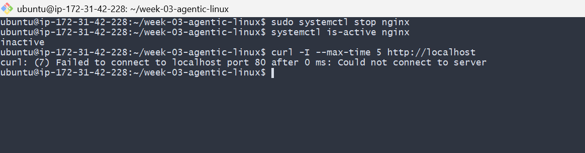

---

#### Screenshot 14 — `/linux-triage` output showing failed evidence, most likely cause, and a suggested recovery command

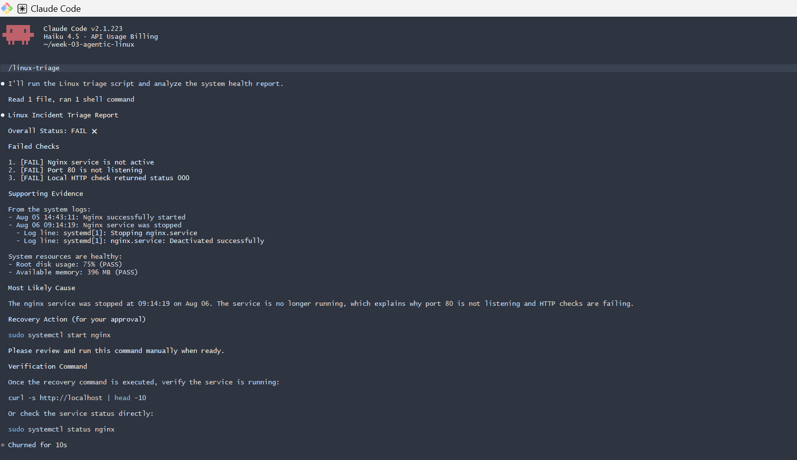

---

#### Screenshot 15 — `incident-failure-report.txt` showing the failed checks and your Full Name

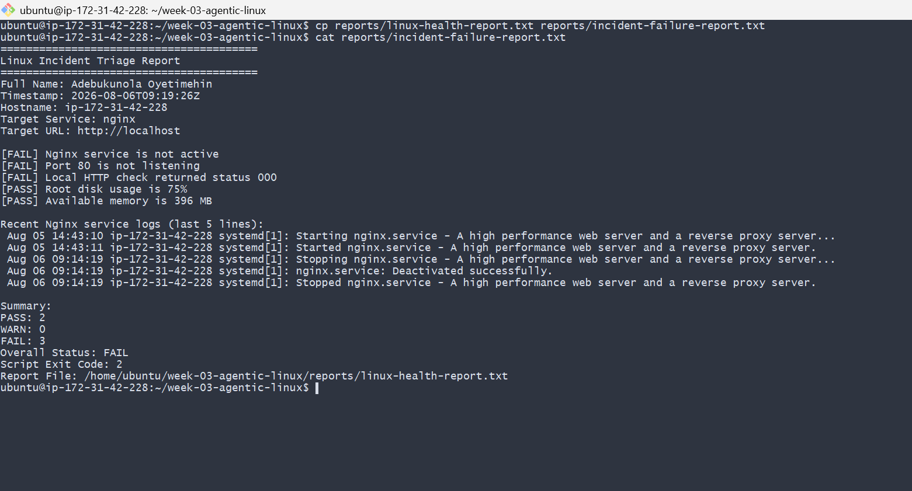

---

### Notes

Answer the following in your own words:

**1. Which three checks failed?**

The **three failed checks** are:

1. **The Nginx service was not active** – The report shows that the Nginx service had been stopped, so it was no longer running.
2. **Port 80 was not listening** – Because Nginx was stopped, the server was no longer listening for incoming HTTP connections on port 80.
3. **The local HTTP health check failed** – The HTTP request to `http://localhost` returned status **000**, indicating that no response was received because the web server was not running.

These three failures are related: stopping the Nginx service caused port 80 to stop listening, which in turn caused the HTTP health check to fail.

---

**2. What evidence supports the conclusion that Nginx is unavailable?**

The conclusion that **Nginx is unavailable** is supported by several pieces of evidence in the incident report:

1. **The Nginx service check failed**, showing:

   * **`[FAIL] Nginx service is not active`**
   * This confirms that the Nginx service is not running.

2. **The port check failed**, showing:

   * **`[FAIL] Port 80 is not listening`**
   * Since Nginx normally listens on port 80 for HTTP traffic, this indicates that it is no longer accepting web requests.

3. **The HTTP health check failed**, showing:

   * **`[FAIL] Local HTTP check returned status 000`**
   * A status code of **000** means that `curl` could not connect to the web server because no HTTP service was available.

4. **The system logs provide supporting evidence**, stating:

   * **"Nginx service was stopped"**
   * **"systemd[1]: nginx.service: Deactivated successfully"**
   * These log entries confirm that the Nginx service was intentionally stopped.

Together, these pieces of evidence clearly show that Nginx is not running, is not listening on port 80, and is therefore unavailable to serve HTTP requests.

---

**3. Did Claude execute the recovery command? Why is that important?**

**No, Claude did not execute the recovery command.** Instead, it **recommended** the command:

```bash
sudo systemctl start nginx
```

and clearly instructed:

> **"Please review and run this command manually when ready."**

This is important because it keeps the human in control of changes to the system. Restarting a service is an operational action that could affect running applications or users if done at the wrong time.

By not executing the command automatically, Claude:

* 🛡️ **Follows the safety rules** in `CLAUDE.md`, which state: *"Recommend a recovery command, but do not execute it."*
* 👤 **Keeps the human responsible** for approving and carrying out recovery actions.
* ✅ **Prevents accidental changes** that could make the situation worse if the diagnosis is incorrect.
* 📋 **Supports safe incident response** by acting as an advisor rather than making changes to the server.

**In summary:** Claude did **not** execute the recovery command. It only recommended `sudo systemctl start nginx` and left the final decision and execution to the human, ensuring a safe and controlled recovery process.

---

**4. Which phase of the Agentic Loop is represented by the Bash report?**

The **Bash report represents the *Observe (or Perceive)* phase of the Agentic Loop.**

In this phase, the system **collects information about the current state of the environment** before making any decisions.

In the workflow:

* 🖥️ The Bash script gathers evidence by checking:

  * Nginx service status
  * Port 80 availability
  * HTTP response
  * Disk usage
  * Memory usage
  * Recent Nginx logs
* 📄 It records all of this information in `linux-health-report.txt`.

Claude then uses this report in the next phase of the Agentic Loop:

* **Observe (Perceive):** Bash collects system data and generates the health report.
* **Think (Reason):** Claude analyzes the report and identifies the most likely cause based on the evidence.
* **Act:** Claude recommends a safe recovery command but does **not** execute it.
* **Verify:** The human runs the recovery command (if approved) and verifies that the system is healthy again.

**In summary:** The Bash report represents the **Observe (Perceive)** phase because it gathers factual evidence about the server's health, which Claude then uses to reason about the incident and recommend the next steps.

---

**5. Which phase is represented by Claude's explanation?**

**Claude's explanation represents the *Think (Reason)* phase of the Agentic Loop.**

In this phase, Claude **analyzes the evidence collected by the Bash script** and determines what it means. Rather than collecting new data, Claude interprets the health report to identify the problem and suggest the appropriate next step.

In your example, Claude:

* 🧠 Reviewed the Bash health report.
* 🔍 Identified the three failed checks (Nginx service, port 80, and HTTP check).
* 📄 Used the system logs as supporting evidence.
* 💡 Determined the **most likely cause**: the Nginx service had been stopped.
* 🛠️ Recommended a safe recovery command for the human to review.

Claude did **not** restart Nginx itself—it only explained the situation and recommended a recovery action based on the available evidence.

**Summary of the Agentic Loop**

* **Observe (Perceive):** Bash collects system health data and generates the report.
* **Think (Reason):** **Claude analyzes the report, explains the findings, and identifies the most likely cause.**
* **Act:** The human reviews and executes the recommended recovery command.
* **Verify:** The human confirms that the service is healthy again by running verification commands.

**In summary:** Claude's explanation represents the **Think (Reason)** phase because it interprets the evidence gathered by Bash and produces an evidence-based diagnosis and recommendation without taking any action itself.

---

# Task 8 — Recover Manually, Verify Again, and Write the Incident Summary

## Goal

Recover the service as the human operator and prove that the system is healthy again.

### Evidence

#### Screenshot 16 — Output showing Nginx is active and `curl -I http://localhost` returns 200 OK

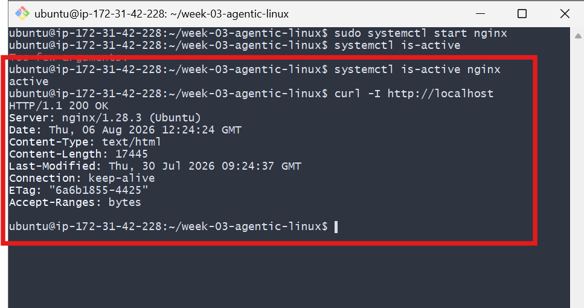

---

#### Screenshot 17 — Second `/linux-triage` output showing successful recovery with no FAIL results

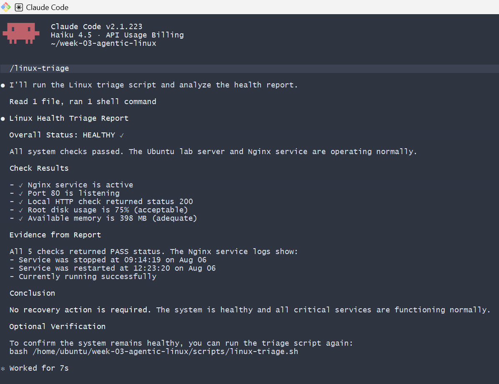

---

#### Screenshot 18 — Output of `ls -lah reports` showing both `incident-failure-report.txt` and `recovery-report.txt`

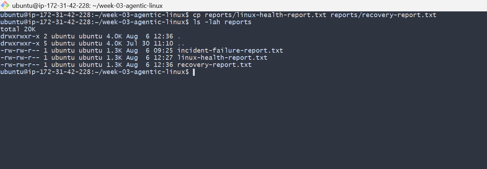

---

#### Screenshot 19 — `incident-summary.md` showing all required sections and your Full Name

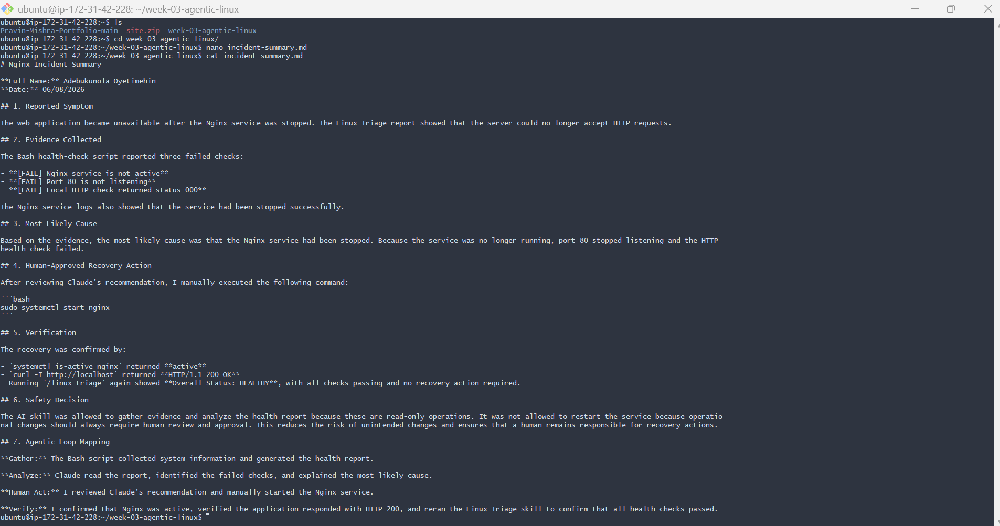

---

### Notes

Answer the following in your own words:

**1. What action did you execute manually?**

**The action I executed manually was starting the Nginx service after reviewing Claude's recommendation.** I approved the recovery action and ran the following command:

```bash
sudo systemctl start nginx
```

This restored the Nginx service, allowing it to listen on port 80 and serve the application again. Afterward, I verified the recovery by confirming that the service was active, the application responded with **HTTP 200 OK**, and the Linux Triage report showed that all health checks had passed.

---

**2. What evidence proves that the service recovered?**

The service recovery was confirmed by several pieces of evidence:

* **`systemctl is-active nginx`** returned **`active`**, proving that the Nginx service was running again.
* **`curl -I http://localhost`** returned **`HTTP/1.1 200 OK`**, confirming that the web application was responding successfully to HTTP requests.
* Running **`/linux-triage`** again showed **Overall Status: HEALTHY**, with all health checks passing.
* The new **recovery report** contained **PASS** results for the Nginx service, port 80 listening, and the local HTTP health check, indicating that the system had returned to a healthy state.

Together, these results provide clear evidence that the Nginx service was successfully restored and the application was functioning normally again.

---

**3. Why is the second triage run necessary?**

The **second triage run is necessary to verify that the recovery was successful**. It confirms that the issue has been resolved and that the system has returned to a healthy state after the human performed the recovery action.

By running `/linux-triage` again:

* ✅ The Bash script performs all the health checks a second time.
* ✅ Claude analyzes the updated report to confirm that the previous failures have been resolved.
* ✅ It verifies that the Nginx service is running, port 80 is listening, and the application is responding correctly.
* ✅ It provides evidence that **no further recovery action is required**.

Without the second triage run, you would know that you executed the recovery command, but you **would not have proof that it actually fixed the problem**.

**In summary:** The second triage run is necessary because it verifies the effectiveness of the recovery action and provides evidence that the server is healthy again, completing the **Verify** phase of the Agentic Loop.

---

**4. What could go wrong if an AI agent automatically restarted every failed service?**

If an AI agent automatically restarted every failed service, it could create new problems instead of solving the original issue. A failed service is often a symptom of a deeper problem, and restarting it without investigation may make the situation worse.

Some risks include:

* 🔍 **Hiding the real problem:** The service might restart temporarily, but the underlying issue (such as a configuration error, full disk, or missing dependency) would remain unresolved.
* ⚠️ **Causing repeated failures:** If the root cause isn't fixed, the service may crash again, leading to a continuous restart loop.
* 📉 **Disrupting users:** Restarting a service at the wrong time could interrupt active users or ongoing transactions.
* 🗑️ **Destroying valuable evidence:** Restarting a service may clear logs or change the system state, making it harder to investigate what caused the failure.
* 👤 **Removing human oversight:** Some recovery actions require human judgment to determine whether restarting the service is safe and appropriate.

**In summary:** An AI agent should **analyze the evidence and recommend a recovery action**, but a human should review and execute it. This approach ensures that recovery is safe, controlled, and based on the actual cause of the problem rather than simply reacting to a service failure.

---

**5. In one sentence, explain the difference between using AI as a chatbot and using AI in this agentic workflow.**

**Using AI as a chatbot means asking general questions and receiving text-based answers, while using AI in an agentic workflow means the AI follows a structured process to gather evidence, analyze it, and provide safe, evidence-based recommendations without taking actions on its own.**


---

# Incident Summary

Fill in all seven sections below in your own words.

**Full Name:** Adebukunola Oyetimehin

**Date:** 06/08/2026

---

**1. Reported Symptom**

The web application became unavailable after the Nginx service was stopped. The Linux Triage report showed that the server could no longer accept HTTP requests.

---

**2. Evidence Collected**

The Bash health-check script reported three failed checks:

* **[FAIL] Nginx service is not active**
* **[FAIL] Port 80 is not listening**
* **[FAIL] Local HTTP check returned status 000**

The Nginx service logs also showed that the service had been stopped successfully.

---

**3. Most Likely Cause**

Based on the evidence, the most likely cause was that the Nginx service had been stopped. Because the service was no longer running, port 80 stopped listening and the HTTP health check failed.

---

**4. Human-Approved Recovery Action**

After reviewing Claude's recommendation, I manually executed the following command:

```bash
sudo systemctl start nginx
```

---

**5. Verification**

The recovery was confirmed by:

* `systemctl is-active nginx` returned **active**
* `curl -I http://localhost` returned **HTTP/1.1 200 OK**
* Running `/linux-triage` again showed **Overall Status: HEALTHY**, with all checks passing and no recovery action required.

---

**6. Safety Decision**

The AI skill was allowed to gather evidence and analyze the health report because these are read-only operations. It was not allowed to restart the service because operational changes should always require human review and approval. This reduces the risk of unintended changes and ensures that a human remains responsible for recovery actions.

---

**7. Agentic Loop Mapping**

**Gather:** The Bash script collected system information and generated the health report.

**Analyze:** Claude read the report, identified the failed checks, and explained the most likely cause.

**Human Act:** I reviewed Claude's recommendation and manually started the Nginx service.

**Verify:** I confirmed that Nginx was active, verified the application responded with HTTP 200, and reran the Linux Triage skill to confirm that all health checks passed.

---

# LinkedIn Post (Required)

## Evidence

#### LinkedIn Post URL

Paste your LinkedIn post URL here:

`(https://www.linkedin.com/posts/bukky-oyetimehin_devops-linux-agenticai-activity-7491168634732576768-9g_1?utm_source=share&utm_medium=member_desktop&rcm=ACoAABEGQlgB1AkrO3hQl21ZivPMvp3RJYKW6KI)`

---

#### Screenshot — Published LinkedIn post

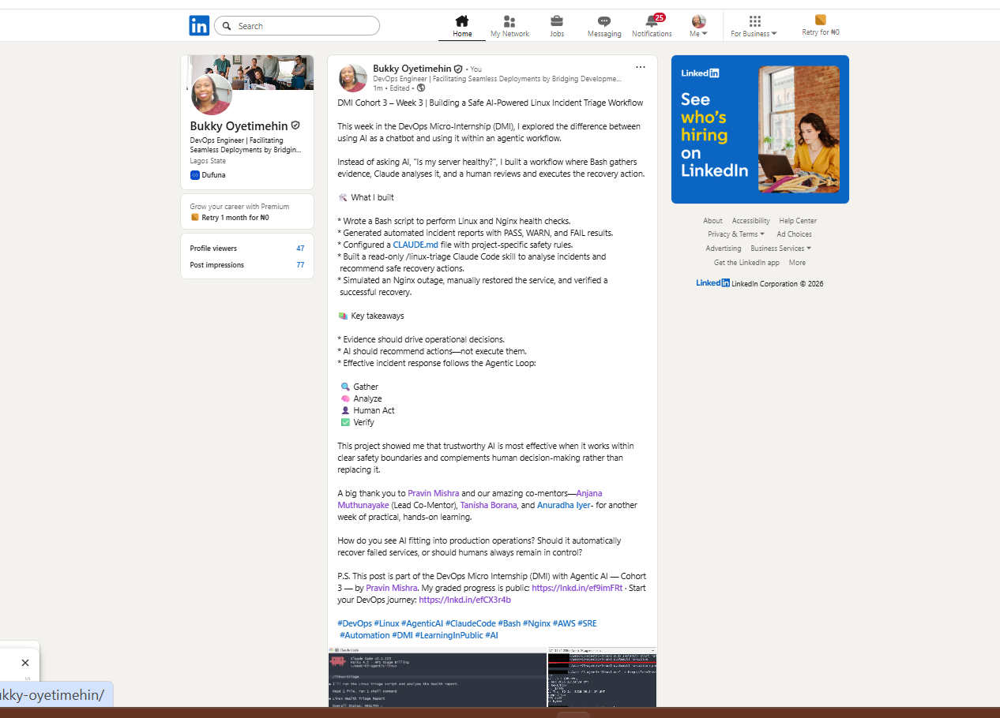
---

# GitHub Repository URL

Paste the URL of your GitHub folder or repository containing the assignment files here:

`(https://github.com/Mayowa2020/devops-micro-internship-interviews)`

---

# Submission Instructions

* Add all required screenshots in your submission
* Full Name must be visible in required screenshots and the Bash report
* All written answers must be in your own words
* Do not expose sensitive information (keys, passwords, AWS account IDs, tokens)
* GitHub URL must be included in this document

---

# Completion Checklist

* [ ] Task 1: Healthy baseline confirmed, workspace created (Screenshots 1–2, Notes answered)
* [ ] Task 2: CLAUDE.md created with all four sections (Screenshot 3, Notes answered)
* [ ] Task 3: Five-check plan produced by Claude using read-only tools (Screenshot 4, Notes answered)
* [ ] Task 4: `linux-triage.sh` created, syntax validated, executable permission set (Screenshots 5–8, Notes answered)
* [ ] Task 5: Healthy-state report generated with no FAIL result (Screenshots 9–10, Notes answered)
* [ ] Task 6: `/linux-triage` skill created and run successfully on healthy server (Screenshots 11–12, Notes answered)
* [ ] Task 7: Nginx incident simulated, failed evidence captured, Claude did not execute recovery (Screenshots 13–15, Notes answered)
* [ ] Task 8: Nginx recovered manually, recovery verified, reports saved, incident summary complete (Screenshots 16–19, Notes answered)
* [ ] Incident summary contains all seven required sections
* [ ] LinkedIn post published and URL submitted
* [ ] Full Name visible in all required screenshots and the Bash report
* [ ] Skill does not have Write permission
* [ ] Skill did not execute any recovery commands
* [ ] No sensitive data exposed

---

## 📌 About DMI & CloudAdvisory

DevOps Micro Internship (DMI) is a project-based DevOps program run by Pravin Mishra (The CloudAdvisory) focused on real-world execution, systems thinking, and career readiness.

It helps learners build strong DevOps foundations with hands-on experience.

---

## 📌 Resources

* 🌐 DMI Official Website: <https://dmi.pravinmishra.com?utm_source=github&utm_medium=readme>  
* 🎓 University: <https://university.pravinmishra.com?utm_source=github&utm_medium=readme>  
* 💬 Discord Community: <https://discord.pravinmishra.com?utm_source=github&utm_medium=readme>  
* 📝 Blog: <https://dmi.pravinmishra.com/blog?utm_source=github&utm_medium=readme>  
* ▶️ YouTube Playlist: <https://www.youtube.com/playlist?list=PLFeSNDtI4Cho>  
* 🔗 Pravin Mishra (LinkedIn): <https://www.linkedin.com/in/pravin-mishra-aws-trainer/>  
* 🏢 CloudAdvisory (LinkedIn): <https://www.linkedin.com/company/thecloudadvisory/>

---

*This submission is part of DevOps Micro Internship (DMI) Cohort 3 — Agentic AI Track.*
