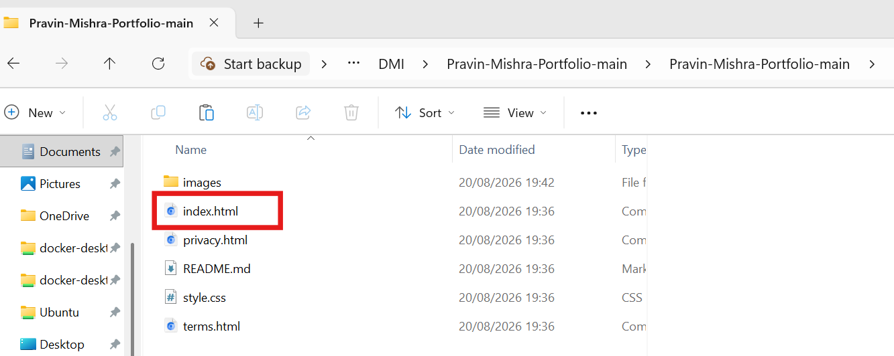
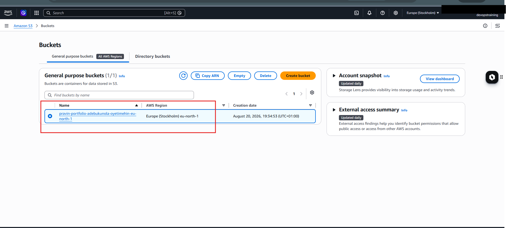
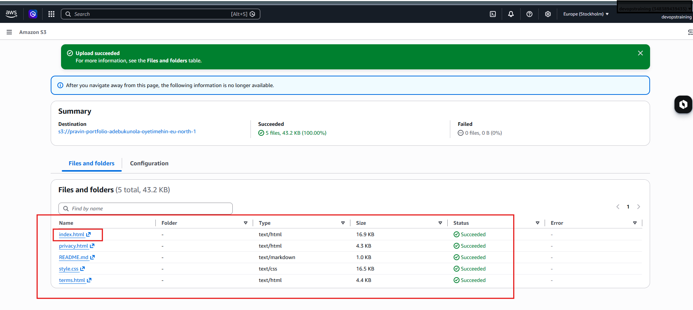

# Assignment 2 — Deploy Personal Portfolio Website on S3

Part of the DevOps Micro Internship (DMI) Cohort 3 with Agentic AI

---

## Purpose

In this assignment, you will deploy a static personal portfolio website quickly and reliably using Amazon S3 Static Website Hosting. You will download the portfolio template, create an S3 bucket, upload the static files, enable static website hosting, configure public read access, and validate the deployment through the S3 website endpoint.

---

# Task 1 — Download the Website Template Locally

## Goal

Download or clone the portfolio website template from GitHub and confirm `index.html` is present.

### Evidence

#### Screenshot 1 — File Explorer or terminal showing the template folder contents with `index.html` visible

---

# Task 2 — Create an S3 Bucket for Website Hosting

## Goal

Create a globally unique S3 bucket in your chosen AWS region.

### Evidence

#### Screenshot 2 — S3 bucket created screen showing the bucket name and region

---

# Task 3 — Upload Website Files to the Bucket

## Goal

Upload the contents of the template folder (not the folder itself) so `index.html` sits at the bucket root.

### Evidence

#### Screenshot 3 — S3 bucket Objects view showing `index.html` at the top or root level

---

# Task 4 — Enable Static Website Hosting

## Goal

Enable S3 Static Website Hosting with `index.html` as the index document and `error.html` as the error document.

### Evidence

#### Screenshot 4 — Static website hosting enabled screen showing the Website endpoint

---

# Task 5 — Make the Website Public (Bucket Policy + Permissions)

## Goal

Adjust Block Public Access settings and save a bucket policy that grants public read access to the website objects.

### Evidence

#### Screenshot 5 — Bucket policy page showing the policy saved successfully, with the bucket name visible

![AWS S3 bucket policy page for the bucket pravin-portfolio-adebukunola-oyetimehin-eu-north-1. A green success banner across the top reads Successfully edited bucket policy. The page includes the heading Block public access bucket settings, the bucket name in the breadcrumb path Amazon S3 > Buckets > pravin-portfolio-adebukunola-oyetimehin-eu-north-1, and a Bucket policy panel showing a JSON policy with Statement containing Sid PublicReadGetObject, Effect Allow, Principal *, Action s3:GetObject, and Resource arn:aws:s3:::pravin-portfolio-adebukunola-oyetimehin-eu-north-1/*.](screenshots/week-06-screenshot-06.png)

---

# Task 6 — Verify Website Works (Public Endpoint Test)

## Goal

Load the site through the S3 website endpoint and confirm the homepage, images, and CSS load correctly.

### Evidence

#### Screenshot 6 — Browser showing the live website with the S3 website endpoint visible in the address bar

![Browser window showing the live S3 hosted portfolio website with the address bar displaying pravin-portfolio-adebukunola-oyetimehin-eu-north-1.s3-website.eu-north-1.amazonaws.com. The website has a dark top navigation bar with Home, University, Blog, Book, Program, and Contact links. A large hero section shows a close-up portrait of the portfolio owner in a light suit, arms crossed, with a turquoise outline around the figure and a collage of student headshots behind him. Large white text across the image reads Empowering thousands of students towards success.](screenshots/week-06-screenshot-07.png)

---

# Task 7 — (Optional) Update One Small Detail and Re-Upload

## Goal

Edit a small visible detail, re-upload it to S3, and confirm the change appears live.

### Evidence

#### Screenshot 7 (optional) — Before and after views, or a browser view showing the updated text

![Browser window showing the live S3 hosted portfolio website with the address bar displaying pravin-portfolio-adebukunola-oyetimehin-eu-north-1.s3-website.eu-north-1.amazonaws.com. The top bar includes a secure website URL and navigation links Home, University, Blog, Book, Program, and Contact. Below, a large hero section shows a close-up portrait of a man in a light suit with his arms crossed, surrounded by a collage of student headshots. Large white text across the image reads Empowering thousands of students to succeed.](screenshots/week-06-screenshot-08.png)

---

# Submission Instructions

- Add all required screenshots in your submission
- Include the live S3 Website Endpoint URL
- Do not expose sensitive AWS account information

---

# Completion Checklist

- [ ] Task 1: Template downloaded/cloned with `index.html` confirmed (Screenshot 1)
- [ ] Task 2: Globally unique S3 bucket created (Screenshot 2)
- [ ] Task 3: Website files uploaded with `index.html` at bucket root (Screenshot 3)
- [ ] Task 4: Static website hosting enabled (Screenshot 4)
- [ ] Task 5: Public-read bucket policy saved (Screenshot 5)
- [ ] Task 6: Live website verified through the S3 website endpoint (Screenshot 6)
- [ ] Task 7: Optional small update re-uploaded and verified (Screenshot 7)
- [ ] S3 Website Endpoint URL included
- [ ] No sensitive account information exposed

---

## 📌 About DMI & CloudAdvisory

DevOps Micro Internship (DMI) is a project-based DevOps program run by Pravin Mishra (The CloudAdvisory) focused on real-world execution, systems thinking, and career readiness.

It helps learners build strong DevOps foundations with hands-on experience.

---

## 📌 Resources

- 🌐 DMI Official Website: https://dmi.pravinmishra.com?utm_source=github&utm_medium=readme  
- 🎓 University: https://university.pravinmishra.com?utm_source=github&utm_medium=readme  
- 💬 Discord Community: https://discord.pravinmishra.com?utm_source=github&utm_medium=readme  
- 📝 Blog: https://dmi.pravinmishra.com/blog?utm_source=github&utm_medium=readme  
- ▶️ YouTube Playlist: https://www.youtube.com/playlist?list=PLFeSNDtI4Cho  
- 🔗 Pravin Mishra (LinkedIn): https://www.linkedin.com/in/pravin-mishra-aws-trainer/  
- 🏢 CloudAdvisory (LinkedIn): https://www.linkedin.com/company/thecloudadvisory/

---

*This submission is part of DevOps Micro Internship (DMI) Cohort 3 — Agentic AI Track.*