# Assignment 02 — Provision Linux VMs with Terraform and Run Ansible Ad-Hoc Commands

Part of the DevOps Micro Internship (DMI) with Agentic AI

---

## Purpose

In this assignment, you will use Terraform to provision three or four Ubuntu Linux Virtual Machines on either Microsoft Azure or Amazon Web Services.

You will configure SSH key-based authentication, organize the servers using a custom Ansible inventory, and run Ansible ad-hoc commands across individual hosts and inventory groups.

---

# Task 1 — Create the Multi-Host Lab Structure

## Goal

Create a separate project directory for the multi-host lab and prepare the Terraform, Ansible, and documentation files.

This project will use the Git repository and Ansible controller prepared in Assignment 01.

### Evidence

#### Screenshot 1 — Terminal showing the complete `ansible-adhoc-lab` project structure

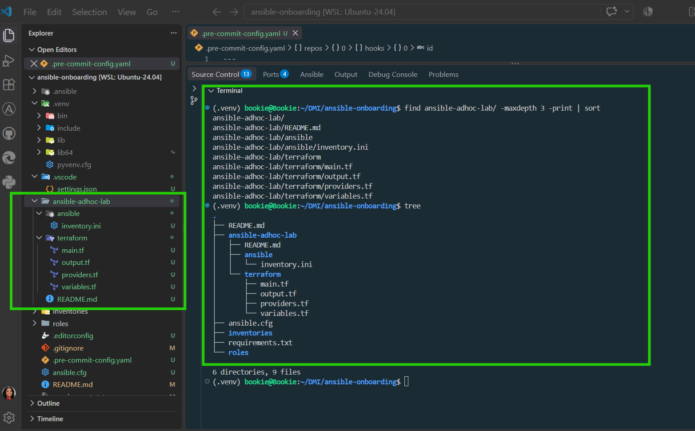

---

#### Screenshot 2 — Terminal showing `git status --short` with the new project files and updated `.gitignore`

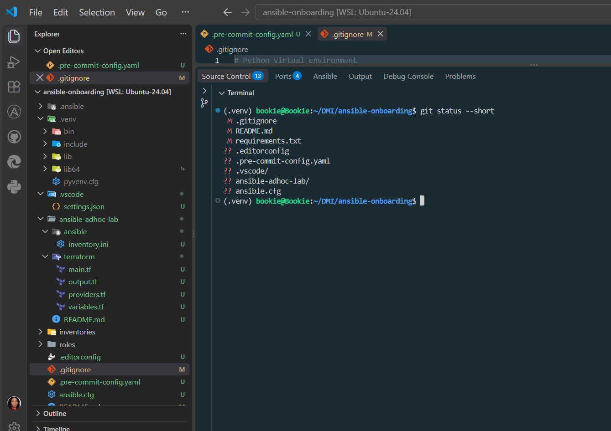

---

### Notes

* **Activate the existing virtual environment** from Assignment 01:

  ```bash
  cd ~/ansible-onboarding
  source .venv/bin/activate
  ```

* **Create the project structure**:

  ```text
  ansible-adhoc-lab/
  ├── README.md
  ├── ansible/
  │   └── inventory.ini
  └── terraform/
      ├── main.tf
      ├── outputs.tf
      ├── providers.tf
      └── variables.tf
  ```

* **Terraform files** will be used to provision and configure the Ubuntu VMs.

* **Ansible `inventory.ini`** will identify and organize the servers that Ansible will manage.

* **Update `.gitignore`** to prevent Terraform state files, working directories, plans, and crash logs from being committed.

* **Do not ignore `.terraform.lock.hcl`** because the provider dependency lock file should be tracked in Git.

* **Verify the project structure** using:

  ```bash
  find ansible-adhoc-lab -maxdepth 3 -print | sort
  ```

* **Check Git status** using:

  ```bash
  git status --short
  ```

* **Do not run `git init`** inside `ansible-adhoc-lab`; it remains part of the existing `ansible-onboarding` repository.

### Overall flow

**Existing Ansible environment → Project structure → Terraform files → Git protection → Verify setup → Provision VMs → Configure Ansible inventory → Run ad-hoc commands.** 🚀

---

# Task 2 — Create the Terraform Configuration

## Goal

Create the Terraform configuration required to provision three or four Ubuntu Linux VMs on your selected cloud platform.

Complete only one option:

* Option A — Microsoft Azure
* Option B — Amazon Web Services

Do not configure both providers for this assignment.

### Evidence

#### Screenshot 3 — Terraform configuration showing the three or four server roles and the `for_each` or `count` implementation

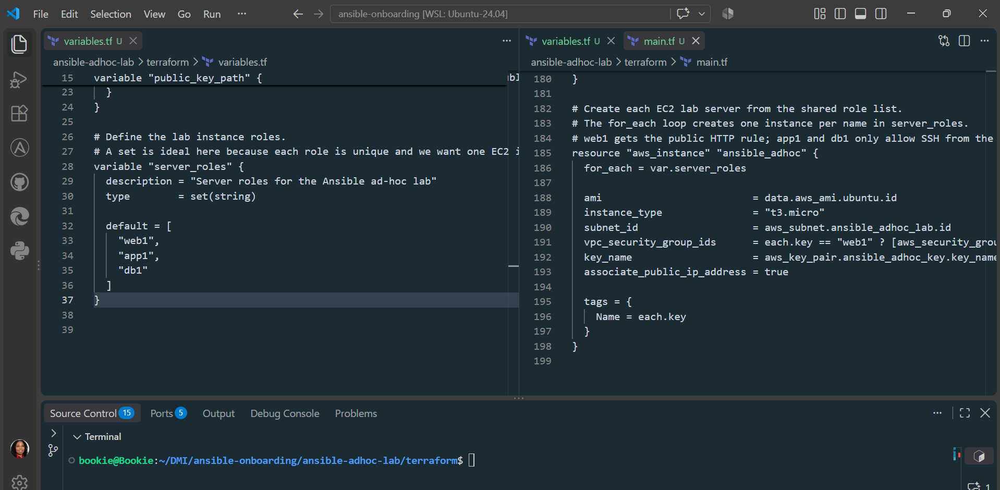

---

#### Screenshot 4 — Terraform configuration showing SSH restricted to the controller IP and HTTP allowed only for web hosts

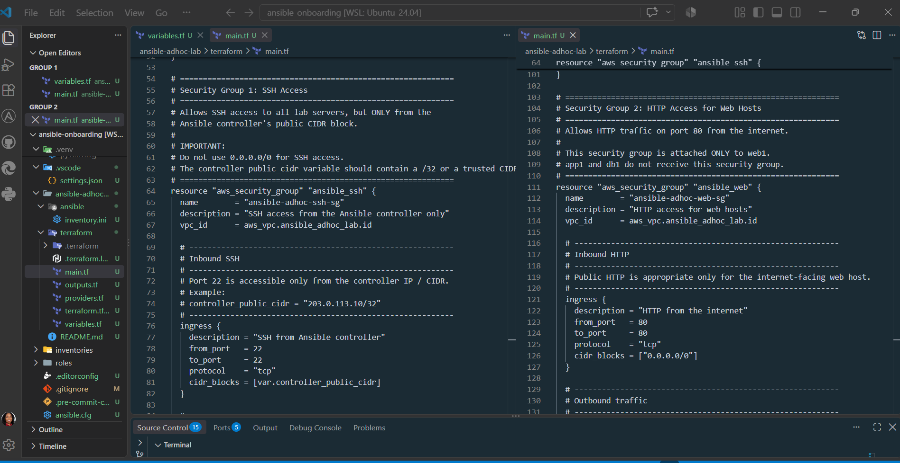

---

#### Screenshot 5 — Terraform output configuration showing how public IP addresses are associated with the server roles

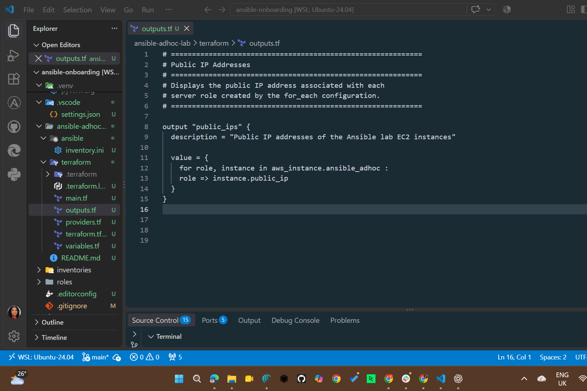

---

### Notes

### DMI Week 09 – Assignment 02: Short Note

**Topic: Terraform + Ansible Ad-Hoc Lab**

In this assignment, I learned how to use **Terraform to provision AWS infrastructure** and prepare it for **Ansible automation**.

Key things I learned:

* Created a custom **AWS VPC, public subnet, Internet Gateway, and route table**.
* Configured **security groups** to restrict SSH access to the Ansible controller's IP.
* Allowed HTTP access only for the `web1` server.
* Used an existing **SSH public key** to create an AWS key pair.
* Provisioned three Ubuntu EC2 servers using Terraform:

  * `web1`
  * `app1`
  * `db1`
* Used Terraform **`for_each`** to create multiple server roles efficiently.
* Used Terraform **outputs** to associate public IP addresses with server roles.
* Learned how Terraform infrastructure can feed into an **Ansible inventory**.
* Reinforced the separation of responsibilities:

  * **Terraform → Provision infrastructure**
  * **Ansible → Configure and manage servers**

**Main takeaway:** I learned how Infrastructure as Code and configuration management work together to create a repeatable and manageable cloud environment. 🚀

---

# Task 3 — Provision the Infrastructure with Terraform

## Goal

Initialize and validate the Terraform configuration, review the execution plan, provision the selected three or four VMs, and retrieve their public IP addresses.

### Evidence

#### Screenshot 6 — Final `terraform apply` output showing `Apply complete`

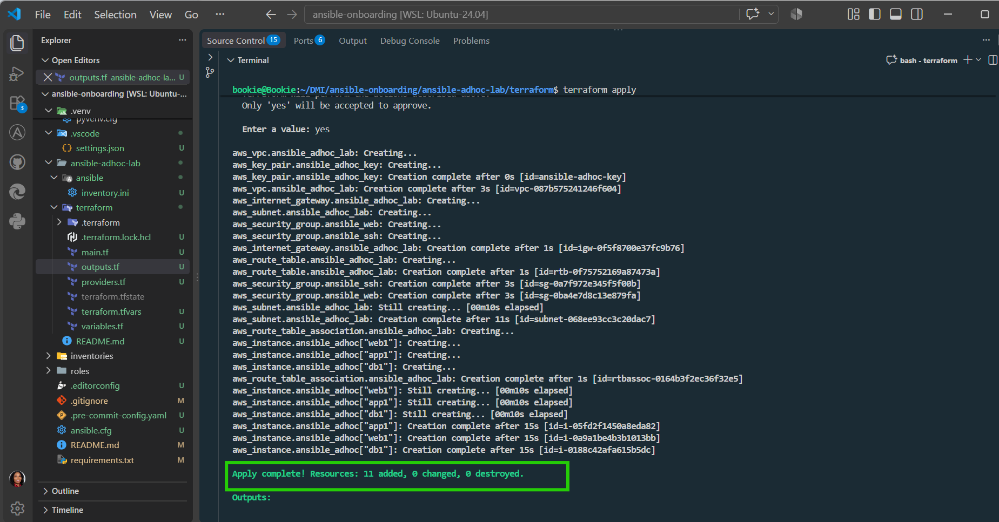

---

#### Screenshot 7 — `terraform output public_ips` showing the role-to-IP mapping for all three or four VMs

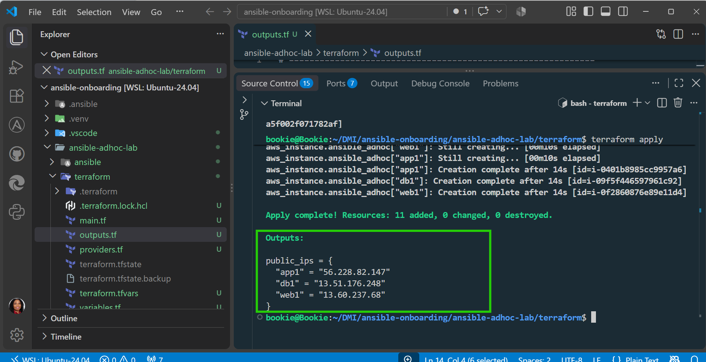

---

#### Screenshot 8 — Azure Portal or AWS Management Console showing all three or four VMs in the `Running` state, with their role-based names visible

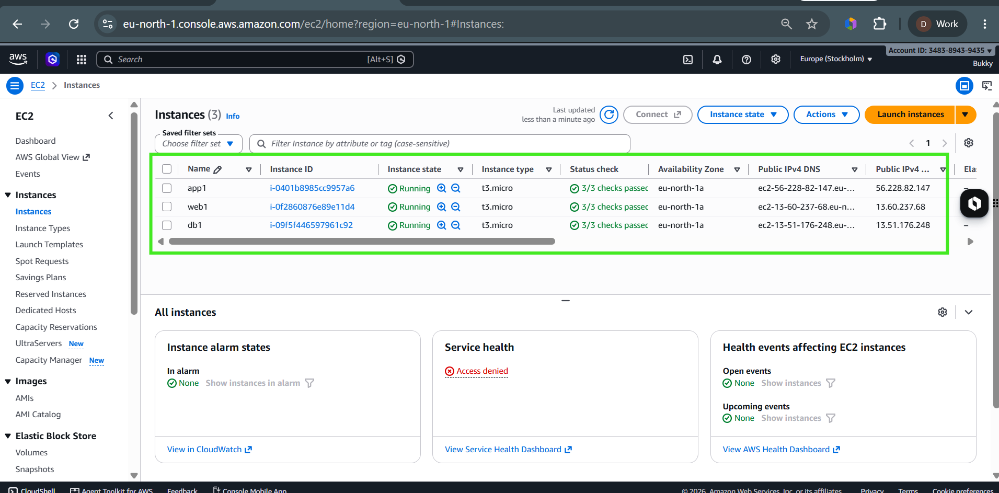

---

### Notes

### Week 09 Assignment 02 — Task 3: Provision the Infrastructure with Terraform

I used **AWS** and selected the **three-VM option** for this assignment:

* `web1`
* `app1`
* `db1`

I initialized, formatted, and validated the Terraform configuration before reviewing the execution plan. I then used Terraform to provision the AWS infrastructure, including the required networking, security groups, SSH key pair, and three Ubuntu Linux EC2 instances.

I configured the EC2 instances with public IP addresses and used the Terraform `public_ips` output to associate each IP address with its server role. These addresses will be used for **SSH testing and creating the Ansible inventory**.

### Issues Encountered

During the task, I encountered a few issues:

* **Terraform was initially not available inside WSL**, even though it was installed on Windows. I installed Terraform within WSL so that my Terraform environment was consistent with the Ansible workstation.
* **AWS CLI was not initially available inside WSL**, resulting in the `aws: command not found` message. This showed me that tools installed on Windows are not automatically available inside my WSL environment.
* I had to carefully configure the **Security Groups** to ensure SSH was restricted to the Ansible controller's public IP rather than using `0.0.0.0/0`.
* I also had to ensure that **HTTP access was assigned only to the `web1` role**, while `app1` and `db1` remained without public HTTP access.
* I learned that **Ubuntu AMI IDs are region-specific**, so the AMI used had to correspond to the selected AWS region, `eu-north-1`.

These issues helped me better understand Terraform configuration, AWS networking and security, WSL tool management, and the relationship between **Terraform infrastructure provisioning and Ansible server management**. 🚀

---

# Task 4 — Verify SSH Key-Based Access

## Goal

Verify that each managed VM can be accessed from the Ansible controller using SSH key-based authentication.

### Evidence

#### Screenshot 9 — Terminal showing successful SSH hostname output from all VMs

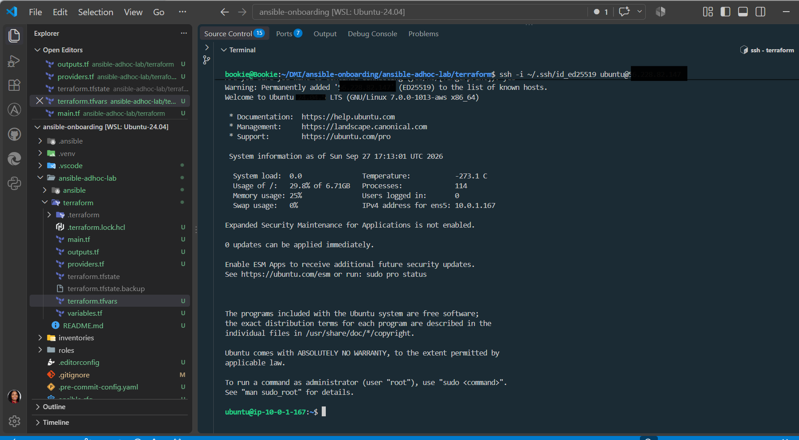

---

### Notes

During SSH testing, I initially received a **“Connection timed out”** error when trying to connect to the EC2 instance. I discovered that my Ansible controller's public IP address had changed from the IP originally configured in the AWS Security Group.

I checked my current public IP using:

```bash
curl -4 https://checkip.amazonaws.com
```

The new IP was **`102.88.166.84`**. I then identified the need to update the Terraform `controller_public_ip` variable with the new IP using `/32`.

This helped me understand that when SSH access is restricted to a specific public IP, a change in the controller's public IP can prevent SSH connectivity to the managed servers. 🔐

---

# Task 5 — Create the Custom Ansible Inventory

## Goal

Create an Ansible inventory file that groups the managed VMs by role.

The inventory allows Ansible to run commands against all servers, or only specific groups such as `web`, `app`, or `db`.

### Evidence

#### Screenshot 10 — `inventory.ini` showing the `web`, `app`, and `db` groups

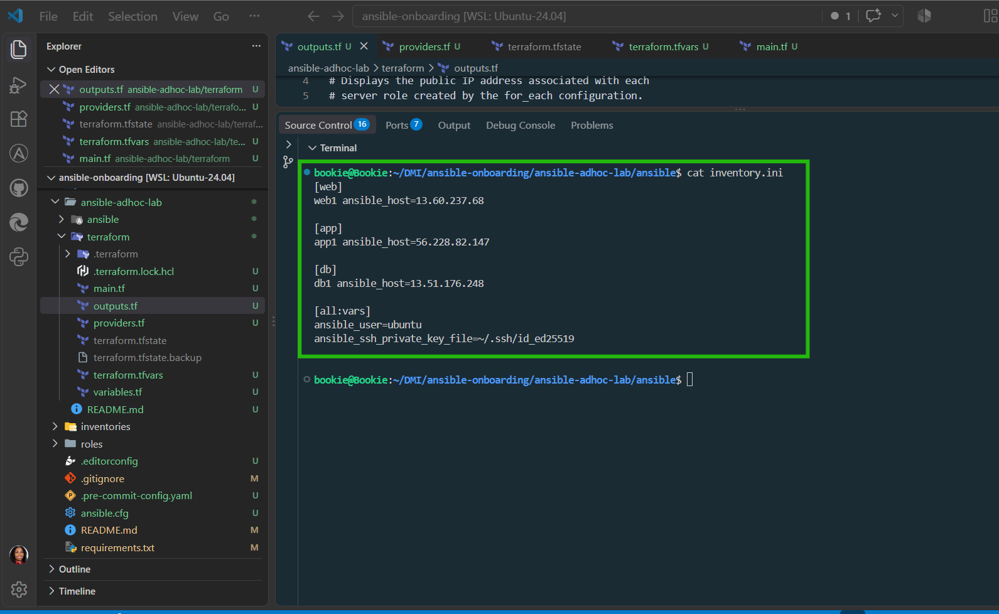

---

#### Screenshot 11 — Output of `ansible-inventory -i inventory.ini --graph`

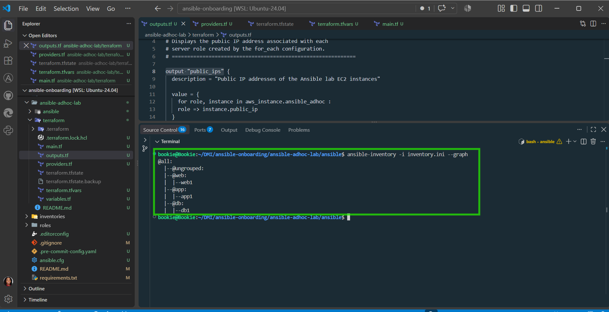

---

### Notes

I created a custom Ansible inventory file (`inventory.ini`) to organize the three AWS EC2 instances by server role:

* **web** → `web1`
* **app** → `app1`
* **db** → `db1`

The inventory uses each EC2 instance's Terraform-generated public IP, the `ubuntu` SSH user, and my existing SSH private key.

I also used `ansible-inventory --graph` to verify that Ansible recognizes the `web`, `app`, and `db` groups.

**Issue encountered:** SSH connectivity to `web1` was not yet successful. I received a connection timeout while testing SSH, so I paused further Ansible connectivity testing to troubleshoot the AWS security group and controller public IP configuration.

**Key learning:** Ansible inventory groups make it possible to target servers by role instead of managing each server individually.

---

# Task 6 — Run Ansible Ad-Hoc Commands

## Goal

Run Ansible ad-hoc commands from the controller to verify connectivity, check server information, and manage packages and services across inventory groups.

This task proves that the inventory is working and that Ansible can control multiple managed VMs without writing a playbook.

### Evidence

#### Screenshot 12 — Output of `ansible all -i inventory.ini -m ping`

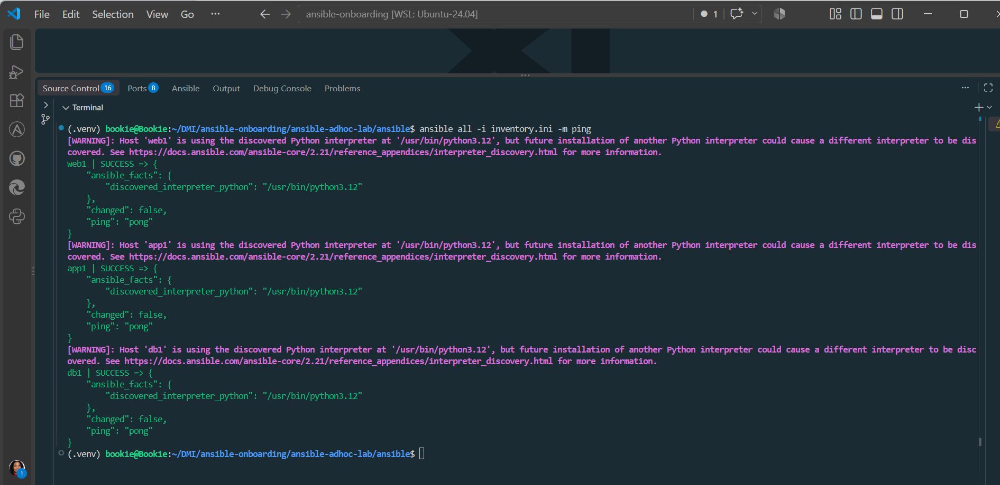

---

#### Screenshot 13 — Output of `ansible all -i inventory.ini -m command -a "uptime"`

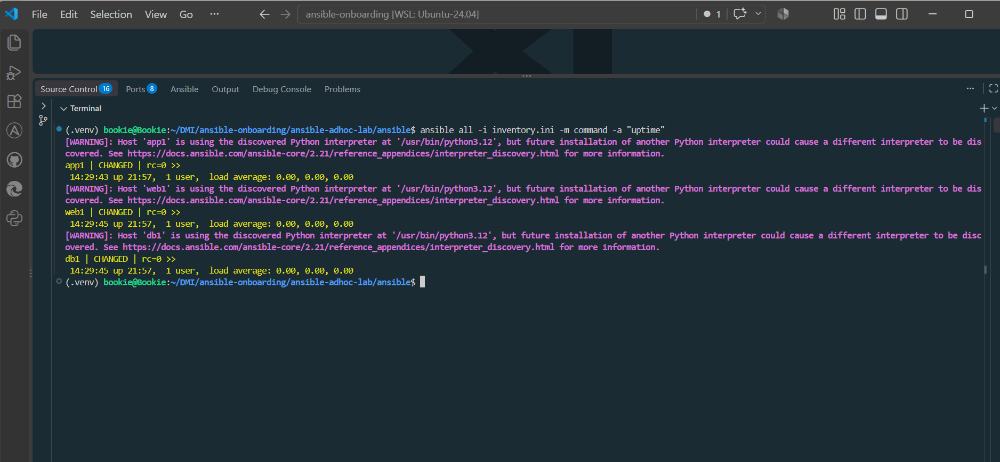

---

#### Screenshot 14 — Output of `ansible web -i inventory.ini -m apt -a "name=nginx state=present update_cache=yes" --become`

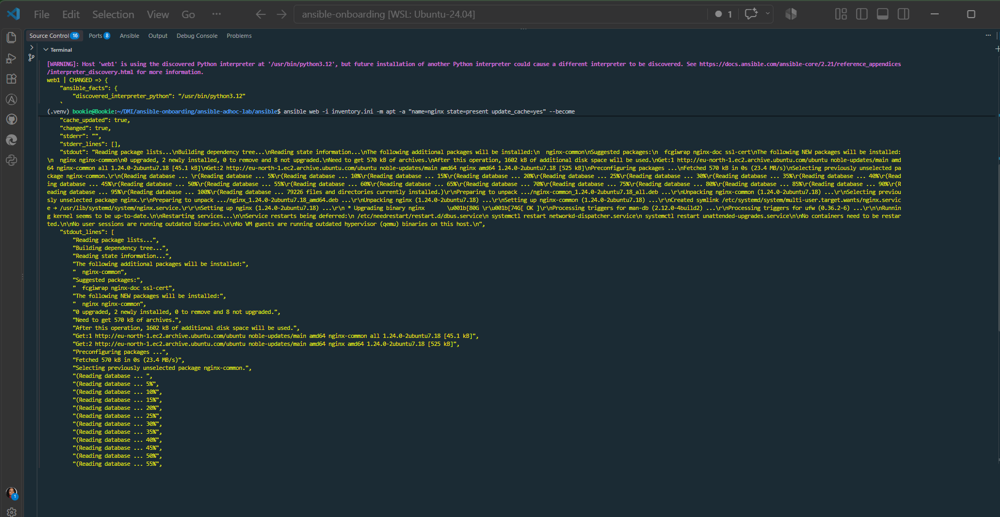

---

#### Screenshot 15 — Output of `ansible web -i inventory.ini -m service -a "name=nginx state=started enabled=yes" --become`

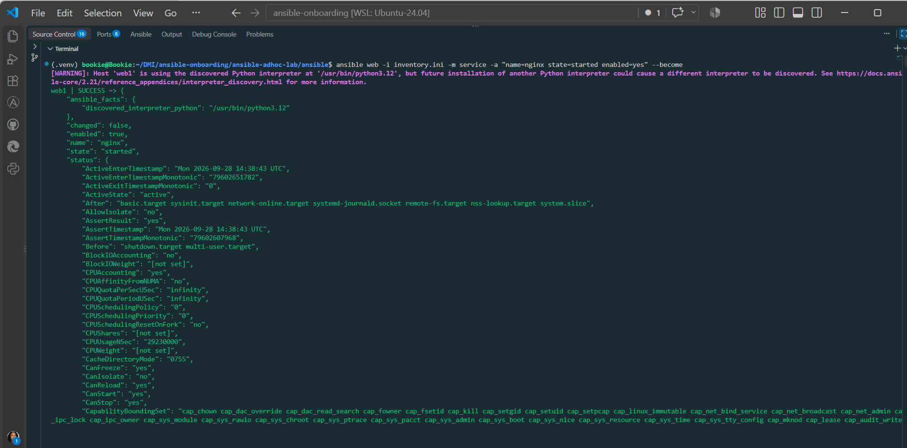

---

#### Screenshot 16 — Output of `ansible all -i inventory.ini -m apt -a "name=htop state=present update_cache=yes" --become`

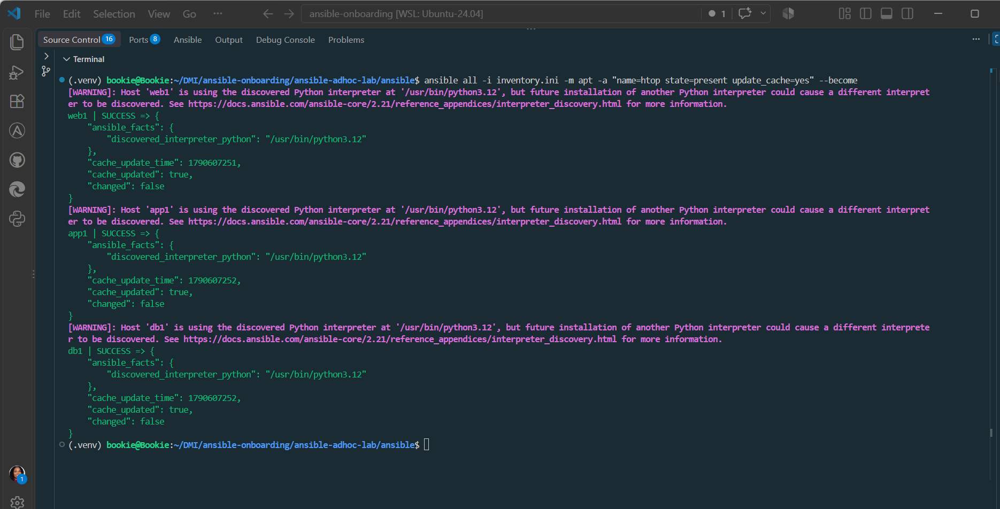

---

#### Screenshot 17 — Output of `ansible web -i inventory.ini -m command -a "systemctl is-active nginx"`

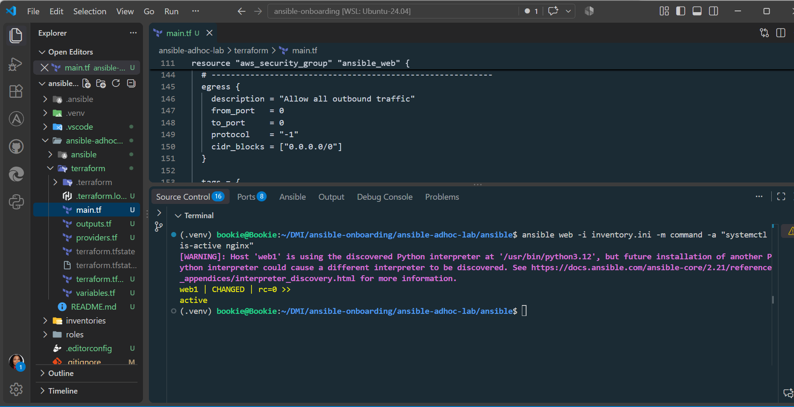

---

### Notes

#### Ansible Ad-Hoc Commands and Service Management

In this task, I used **Ansible ad-hoc commands** to manage and verify software packages and services on the AWS EC2 servers provisioned with Terraform.

##### Activities Completed

* Used the `apt` module to ensure `htop` was installed on `web1`, `app1`, and `db1`.
* Used the `service` module to start and enable Nginx on `web1`.
* Used the `command` module to verify that Nginx was running.
* Confirmed that Nginx returned `active` with a successful return code (`rc=0`).
* Used `--become` when administrative privileges were required.
* Used the `ping` module to confirm Ansible connectivity to the servers.

##### Commands Used

```bash
# Check Ansible connectivity
ansible all -i inventory.ini -m ping

# Install htop on all servers
ansible all -i inventory.ini -m apt -a "name=htop state=present update_cache=yes" --become

# Start and enable Nginx on web servers
ansible web -i inventory.ini -m service -a "name=nginx state=started enabled=yes" --become

# Verify Nginx is running
ansible web -i inventory.ini -m command -a "systemctl is-active nginx"
```

##### Important Notes

* Ad-hoc commands are useful for **quick, one-time actions**.
* Use `--become` when the command requires **administrative privileges**.
* **Package installation and service management** generally require `--become`.
* The `web` group should contain:

  * `web1` and `web2` for the **four-VM option**.
  * `web1` only for the **three-VM option**.
* The Ansible `ping` module is **not an ICMP network ping**. It checks whether Ansible can connect to the host and successfully run Python on the remote server.

### Key Learning

Ansible ad-hoc commands allow me to perform quick administrative and verification tasks across multiple servers without manually connecting to each server. I learned how to use different Ansible modules for specific purposes, including `ping` for connectivity, `apt` for package management, `service` for service management, and `command` for executing remote commands.

---

# LinkedIn Post Required

## Evidence

#### LinkedIn Post URL

Paste your LinkedIn post URL here:

`(https://lnkd.in/p/ekJn7eaC)`

---

#### Screenshot — Published LinkedIn post

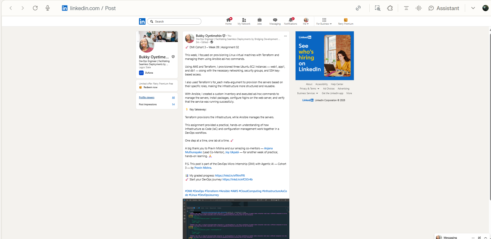

---

# Assignment Questions

Answer the following in your own words:

**1. What is the purpose of an Ansible inventory file?**

An **Ansible inventory file** tells Ansible **which servers it needs to manage and how to connect to them**. It can also organize servers into groups, such as `web`, `app`, and `db`, so commands can be run on specific servers or groups.

In this assignment, the inventory file contains `web1`, `app1`, and `db1`, allowing Ansible to identify and manage each server.

---

**2. What is the difference between the `web`, `app`, and `db` groups in your inventory?**

The `web`, `app`, and `db` groups organize the servers based on their **intended roles**:

* **`web`** — contains the web server(s), such as `web1`, which handles web services like Nginx.
* **`app`** — contains application server(s), such as `app1`, which would run the application or backend services.
* **`db`** — contains database server(s), such as `db1`, which would be used for database-related services.

Grouping servers this way makes it easier to run Ansible commands against only the servers that perform a particular role.

---

**3. What does the Ansible `ping` module verify?**

The Ansible `ping` module verifies that **Ansible can successfully connect to a remote server and execute Python on it**.

It is **not the same as a normal network/ICMP ping**. A successful response such as `"ping": "pong"` confirms that Ansible can communicate with the host and run the required Python code.

---

**4. Why do package installation commands require `--become`?**

Package installation commands require `--become` because installing or modifying system packages usually requires **administrator (root) privileges**.

`--become` allows Ansible to temporarily use elevated privileges, similar to running a command with `sudo`.

For example:

```bash
ansible all -i inventory.ini -m apt -a "name=htop state=present" --become
```

Here, `--become` allows Ansible to install `htop` with the necessary administrative permissions.

---

**5. When would you use an ad-hoc command instead of a playbook?**

I would use an **ad-hoc command** for a **quick, one-time task** or when I need to quickly check or manage something on one or more servers.

For example, checking connectivity, checking a service, or installing a simple package.

I would use a **playbook** when I need to perform **multiple, repeatable, or more complex configuration tasks** that I may need to run again.

**In simple terms:**

* **Ad-hoc command** → quick, one-time task ⚡
* **Playbook** → repeatable, organized automation 📋

---

**6. What is one challenge you faced while setting up SSH or inventory, and how did you fix it?**

One challenge I faced was configuring the **SSH connection between Ansible and the AWS EC2 servers**. I had to ensure that the correct SSH private key, username (`ubuntu`), and server IP addresses were correctly configured in the inventory file. I fixed it by checking my SSH key permissions, confirming the correct connection details in `inventory.ini`, and testing the connection with the Ansible `ping` module.

---

# Required Files

Confirm that the following files are included in your assignment workspace:

* [ ] `ansible-adhoc-lab/README.md`
* [ ] `ansible-adhoc-lab/terraform/providers.tf`
* [ ] `ansible-adhoc-lab/terraform/main.tf`
* [ ] `ansible-adhoc-lab/terraform/variables.tf`
* [ ] `ansible-adhoc-lab/terraform/outputs.tf`
* [ ] `ansible-adhoc-lab/ansible/inventory.ini`
* [ ] Updated `.gitignore`

---

# Submission Instructions

* Add all required screenshots from the tasks.
* Full Name must be visible in required screenshots.
* Mention whether you used Azure or AWS.
* Mention whether you used the three-VM option or four-VM option.
* Add the public IP addresses of the VMs, redacted if preferred.
* Add your `inventory.ini` proof.
* Add a short explanation of what you learned.
* Answer all assignment questions clearly in your own words.
* Add your LinkedIn post URL.
* Do not expose SSH private keys, Terraform state files, cloud credentials, passwords, access keys, secret keys, account IDs, or subscription IDs.

---

# Completion Checklist

* [ ] Task 1: `ansible-adhoc-lab` project structure created
* [ ] Task 1: `.gitignore` updated for Terraform files
* [ ] Task 2: Terraform configuration created
* [ ] Task 2: Server roles defined for either three or four VMs
* [ ] Task 2: `count` or `for_each` used
* [ ] Task 2: SSH restricted to the controller public IP
* [ ] Task 2: HTTP allowed only for web hosts
* [ ] Task 2: Terraform output maps roles to public IPs
* [ ] Task 3: Terraform initialized successfully
* [ ] Task 3: Terraform configuration validated
* [ ] Task 3: Terraform apply completed successfully
* [ ] Task 3: All selected VMs are running
* [ ] Task 4: SSH key-based access works for every VM
* [ ] Task 5: `inventory.ini` contains `web`, `app`, and `db` groups
* [ ] Task 5: `ansible-inventory -i inventory.ini --graph` shows the correct groups
* [ ] Task 6: `ansible all -i inventory.ini -m ping` returns `SUCCESS`
* [ ] Task 6: Ad-hoc commands run successfully
* [ ] Task 6: `--become` was used for package and service tasks
* [ ] Task 6: Nginx is active on the `web` group
* [ ] Screenshots 1–17 are included
* [ ] Assignment questions are answered
* [ ] LinkedIn post published
* [ ] LinkedIn post URL added
* [ ] No sensitive information is exposed

---

## About DMI & CloudAdvisory

DevOps Micro Internship (DMI) is a project-based DevOps program run by Pravin Mishra and The CloudAdvisory, focused on real-world execution, systems thinking, and career readiness.

It helps learners build strong DevOps foundations with hands-on experience.

---

## Resources

* DMI Official Website: [https://dmi.pravinmishra.com?utm_source=github&utm_medium=readme](https://dmi.pravinmishra.com?utm_source=github&utm_medium=readme)
* University: [https://university.pravinmishra.com?utm_source=github&utm_medium=readme](https://university.pravinmishra.com?utm_source=github&utm_medium=readme)
* Discord Community: [https://discord.pravinmishra.com?utm_source=github&utm_medium=readme](https://discord.pravinmishra.com?utm_source=github&utm_medium=readme)
* Blog: [https://dmi.pravinmishra.com/blog?utm_source=github&utm_medium=readme](https://dmi.pravinmishra.com/blog?utm_source=github&utm_medium=readme)
* YouTube Playlist: [https://www.youtube.com/playlist?list=PLFeSNDtI4Cho](https://www.youtube.com/playlist?list=PLFeSNDtI4Cho)
* Pravin Mishra LinkedIn: [https://www.linkedin.com/in/pravin-mishra-aws-trainer/](https://www.linkedin.com/in/pravin-mishra-aws-trainer/)
* CloudAdvisory LinkedIn: [https://www.linkedin.com/company/thecloudadvisory/](https://www.linkedin.com/company/thecloudadvisory/)

---

*This submission is part of DevOps Micro Internship (DMI) — Agentic AI Track.*
