# Assignment 03 — Deploy a Static Website to Multiple Servers Using a Multi-Play Ansible Playbook

Part of the DevOps Micro Internship (DMI) with Agentic AI

---

## Student Details

**Full Name:** Adebukunola Oyetimehin
**Cloud Platform Used:** Azure  
**Server 1 URL:** `http://52.149.224.147`  
**Server 2 URL:** `http://20.85.217.80`

---

## Purpose

In this assignment, you will create a multi-play Ansible playbook to install Nginx, deploy a static website to two Ubuntu servers, and verify that the website is accessible from both servers.

You may use either AWS EC2 instances or Azure Virtual Machines as your managed servers.

---

# Task 1 — Create the Project Structure

## Goal

Create the required folders and files for the Ansible project.

## Evidence

### Screenshot 1 — Terminal or VS Code showing the complete `static-web` project structure

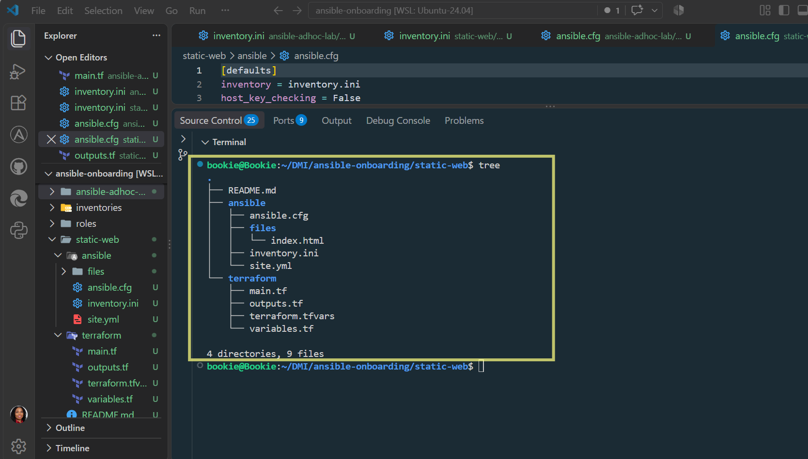

---

# Task 2 — Configure the Ansible Inventory

## Goal

Add both Ubuntu servers to the Ansible inventory.

## Evidence

### Screenshot 2 — Output of `ansible-inventory -i inventory.ini --graph` showing `web1` and `web2`

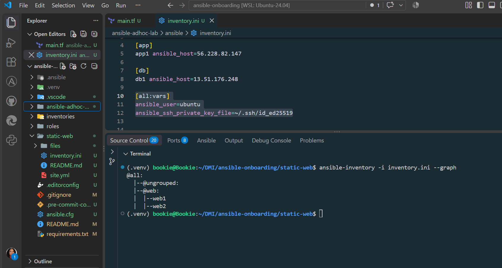

---

## Configuration File

Copy and paste the complete contents of your `inventory.ini` file below:

```ini
[webservers]
web1 ansible_host=WEB1_PUBLIC_IP
web2 ansible_host=WEB2_PUBLIC_IP

[webservers:vars]
ansible_user=azureuser
ansible_ssh_private_key_file=~/.ssh/id_ed25519

```

---

# Task 3 — Verify Ansible Connectivity

## Goal

Confirm that the Ansible controller can connect to both servers.

## Evidence

### Screenshot 3 — Ansible ping output showing `SUCCESS` and `pong` for both servers

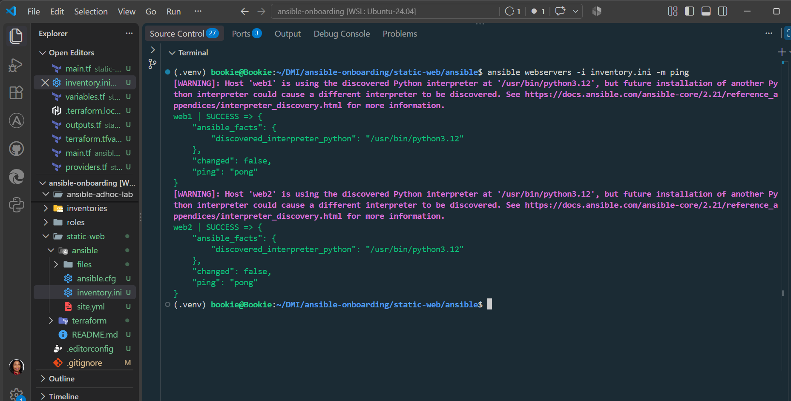

---

# Task 4 — Download and Personalize the Static Website

## Goal

Download `index.html` to the Ansible controller and personalize the website with your full name.

## Evidence

### Screenshot 4 — Edited `files/index.html` showing the footer line with your full name

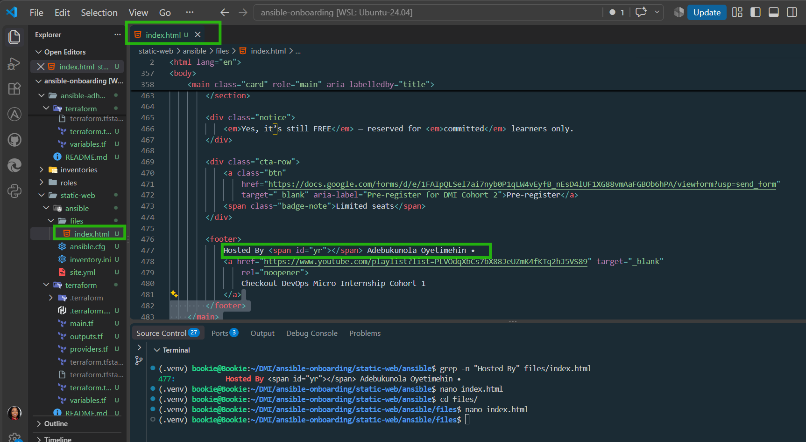

---

# Task 5 — Create the Multi-Play Ansible Playbook

## Goal

Create a single Ansible playbook containing separate plays for installation, deployment, and verification.

## Configuration File

Copy and paste the complete contents of your `site.yml` file below:

```yaml
---
# ============================================================
# PLAY 1: Install and configure Nginx
# ============================================================
- name: Install and configure Nginx
  hosts: webservers
  become: true

  tasks:
    - name: Update apt package cache
      ansible.builtin.apt:
        update_cache: true
        cache_valid_time: 3600

    - name: Install Nginx
      ansible.builtin.apt:
        name: nginx
        state: present

    - name: Ensure Nginx is running and enabled
      ansible.builtin.service:
        name: nginx
        state: started
        enabled: true


# ============================================================
# PLAY 2: Deploy the static website
# ============================================================
- name: Deploy static website
  hosts: webservers
  become: true

  tasks:
    - name: Copy website index.html
      ansible.builtin.copy:
        src: files/index.html
        dest: /var/www/html/index.html
        owner: root
        group: root
        mode: "0644"
      notify: Reload Nginx

  handlers:
    - name: Reload Nginx
      ansible.builtin.service:
        name: nginx
        state: reloaded


# ============================================================
# PLAY 3: Verify both web servers
# ============================================================
- name: Verify website availability
  hosts: webservers
  become: false

  tasks:
    - name: Check website HTTP response
      ansible.builtin.uri:
        url: "http://{{ ansible_host }}"
        method: GET
        status_code: 200
        return_content: false
      register: website_response

    - name: Assert website returns HTTP 200
      ansible.builtin.assert:
        that:
          - website_response.status == 200
        success_msg: "{{ inventory_hostname }} is serving the website successfully."
        fail_msg: "{{ inventory_hostname }} did not return HTTP 200."
```

---

# Task 6 — Validate the Playbook Syntax

## Goal

Check the playbook for YAML or Ansible syntax errors before running it.

## Evidence

### Screenshot 5 — Successful syntax-check output showing `playbook: site.yml`

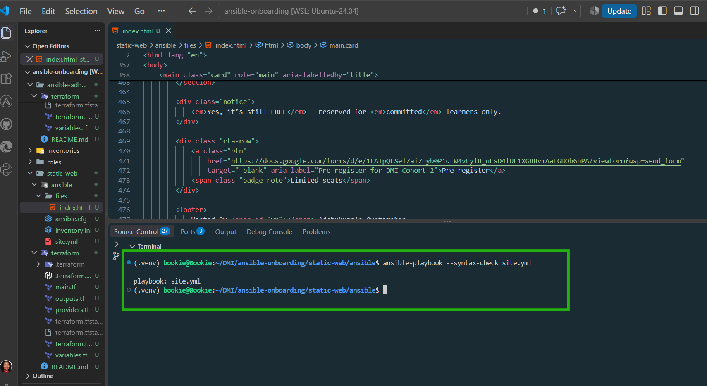

---

# Task 7 — Run the Multi-Play Playbook

## Goal

Install Nginx, deploy the website, and verify both servers in one playbook run.

## Evidence

### Screenshot 6 — Play 3 verification showing HTTP `200` for both servers

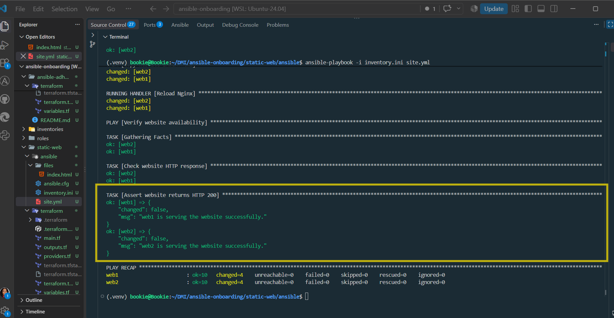


---

### Screenshot 7 — Final play recap showing `unreachable=0` and `failed=0` for `web1`, `web2`, and `localhost`

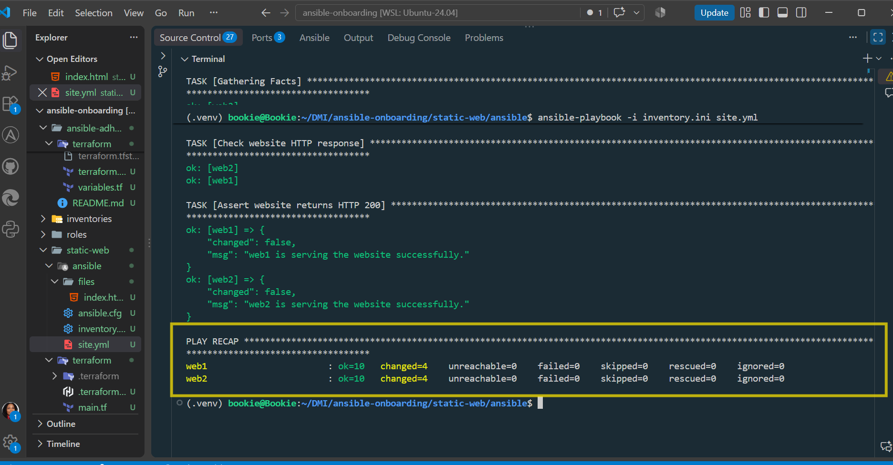

---

# Task 8 — Verify Idempotency

## Goal

Run the playbook again and confirm that it does not make unnecessary changes.

## Evidence

### Screenshot 8 — Second playbook run showing the play recap with `changed=0`, `unreachable=0`, and `failed=0` for both web servers

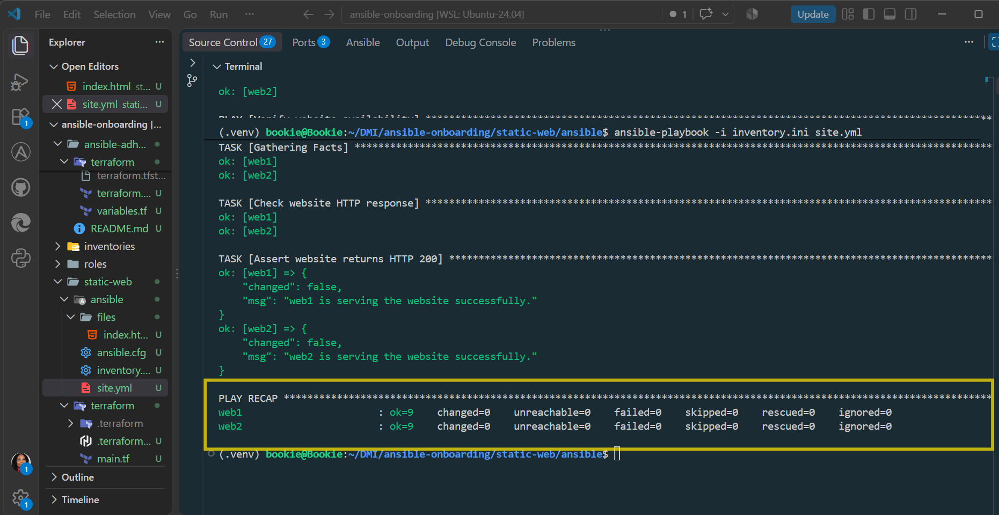

---

# Task 9 — Test Both Websites Manually

## Goal

Confirm that the static website is accessible from both public IP addresses.

## Evidence

### Screenshot 9 — `curl -I` output showing HTTP `200 OK` from both servers

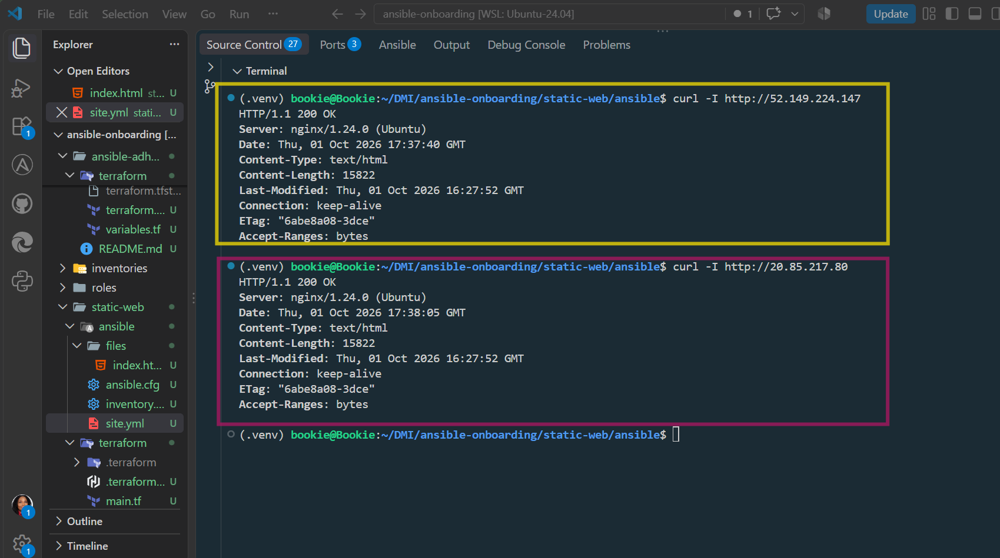

---

### Screenshot 10 — Browser showing the website from Server 1 with the public IP and your full name visible

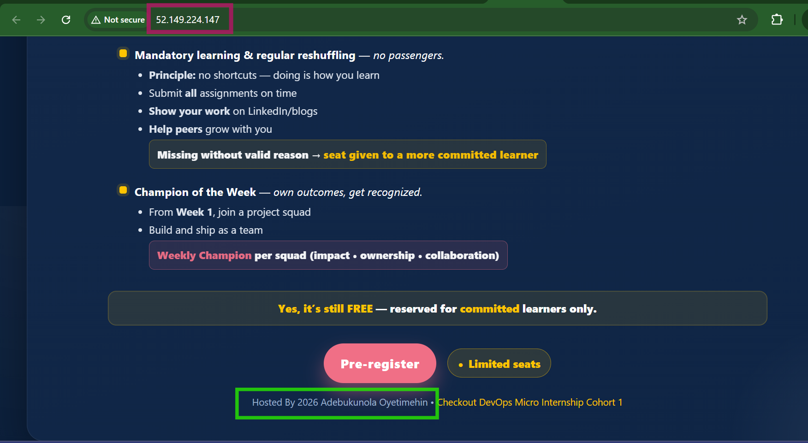

---

### Screenshot 11 — Browser showing the website from Server 2 with the public IP and your full name visible

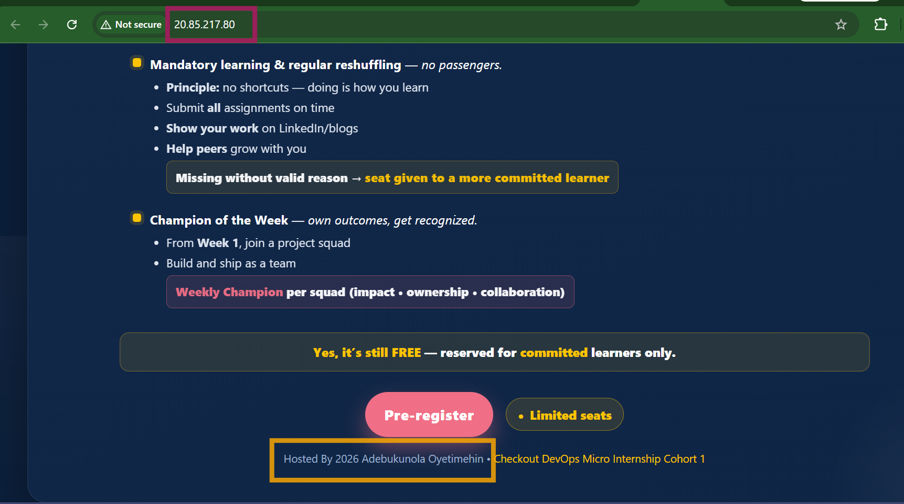

---

## Website URLs

Add both deployed website URLs below:

```text
Server 1: http://52.149.224.147
Server 2: http://20.85.217.80
```

---

# Task 10 — Complete the Project README

## Goal

Document how the project works and record what you learned.

## README Content

Copy and paste the complete contents of your `README.md` file below:

```markdown
Absolutely. I’ll continue without the file-generation tool and give you the complete `README.md` content ready to copy into:

```text
~/DMI/ansible-onboarding/static-web/README.md
```

I’ve kept it aligned with what you actually completed, including the **two Azure VMs, three-play Ansible structure, HTTP 200 verification, troubleshooting, and `changed=0` idempotency result**.

# DMI Cohort 3 – Week 09 Assignment 03

# Deploy a Static Website to Multiple Servers Using a Multi-Play Ansible Playbook

## Project Overview

This assignment demonstrates how to use Ansible to configure multiple Ubuntu Azure virtual machines and deploy the same static website to both servers.

A single multi-play Ansible playbook is used to:

1. Install and configure Nginx.
2. Deploy the static website.
3. Verify that both web servers return HTTP 200.

The project also demonstrates Ansible idempotency, handlers, inventory management, privilege escalation, and automated verification.

---

## Project Objective

Deploy a static website to two Ubuntu Azure VMs using Ansible and verify that the website is accessible from both servers.

---

## Architecture

```text
                    Ansible Controller
                    WSL2 Ubuntu
                         |
                         | SSH
             +-----------+-----------+
             |                       |
             v                       v
        Azure VM: web1          Azure VM: web2
        Public IP:              Public IP:
        52.149.224.147          20.85.217.80
             |                       |
             +-----------+-----------+
                         |
                       Nginx
                         |
                  /var/www/html/
                     index.html
```

### Components

* **Controller:** WSL2 Ubuntu 24.04.5 LTS
* **Configuration management:** Ansible Core 2.21.4
* **Infrastructure:** Microsoft Azure
* **Operating system:** Ubuntu Linux
* **Web server:** Nginx
* **Website:** Static HTML
* **Authentication:** SSH key-based authentication
* **Servers:** `web1` and `web2`

---

## Project Structure

```text
static-web/
├── README.md
├── ansible/
│   ├── ansible.cfg
│   ├── inventory.ini
│   ├── site.yml
│   └── files/
│       └── index.html
└── terraform/
    ├── main.tf
    ├── outputs.tf
    ├── providers.tf
    ├── terraform.tfvars
    └── variables.tf
```

---

## Ansible Inventory

The two Azure VMs are defined in `inventory.ini`:

```ini
[webservers]
web1 ansible_host=52.149.224.147
web2 ansible_host=20.85.217.80

[webservers:vars]
ansible_user=azureuser
ansible_ssh_private_key_file=~/.ssh/id_ed25519
```

The `webservers` group allows the same Ansible tasks to be executed against both servers.

---

## Multi-Play Ansible Playbook

The main playbook is:

```text
ansible/site.yml
```

It contains three separate plays.

### Play 1 – Install and Configure Nginx

This play:

* Updates the APT package cache.
* Installs Nginx.
* Ensures Nginx is running.
* Ensures Nginx starts automatically when the server boots.

Example:

```yaml
- name: Install and configure Nginx
  hosts: webservers
  become: true
```

The `become: true` setting allows Ansible to perform administrative tasks using elevated privileges.

---

### Play 2 – Deploy the Static Website

This play copies the local website file to the Nginx document root:

```text
/var/www/html/index.html
```

The task uses the Ansible `copy` module.

A handler reloads Nginx only when the website file changes:

```yaml
notify: Reload Nginx
```

This avoids unnecessarily reloading Nginx when there is no change.

---

### Play 3 – Verify Website Availability

The final play uses the Ansible `uri` module to make an HTTP request to each server.

It expects:

```text
HTTP 200 OK
```

An `assert` task then confirms that the HTTP status is exactly `200`.

Successful verification messages:

```text
web1 is serving the website successfully.
web2 is serving the website successfully.
```

---

## Running the Playbook

Change into the Ansible directory:

```bash
cd ~/DMI/ansible-onboarding/static-web/ansible
```

### Syntax Check

Before running the playbook:

```bash
ansible-playbook --syntax-check site.yml
```

Expected result:

```text
playbook: site.yml
```

### Run the Playbook

```bash
ansible-playbook -i inventory.ini site.yml
```

---

## First Playbook Run

The first run made the required configuration changes.

The important changes included:

* Updating the APT package cache.
* Installing Nginx.
* Copying `index.html`.
* Reloading Nginx after the website file changed.

The verification play returned HTTP 200 from both servers.

Example successful messages:

```text
web1 is serving the website successfully.
web2 is serving the website successfully.
```

---

## Idempotency Test

The playbook was executed a second time without changing the configuration.

The second run produced:

```text
PLAY RECAP
web1 : ok=9 changed=0 unreachable=0 failed=0 skipped=0 rescued=0 ignored=0
web2 : ok=9 changed=0 unreachable=0 failed=0 skipped=0 rescued=0 ignored=0
```

### What this demonstrates

`changed=0` confirms that Ansible did not make unnecessary changes when the servers were already in the desired state.

The following tasks remained unchanged:

* Nginx installation
* Nginx service configuration
* Website file
* Website availability

The Nginx reload handler also did not run because `index.html` had not changed.

This demonstrates **Ansible idempotency**.

---

## Website Verification

The websites are available from the public IP addresses:

### web1

```text
http://52.149.224.147
```

### web2

```text
http://20.85.217.80
```

They can also be checked from the terminal using:

```bash
curl -I http://52.149.224.147
curl -I http://20.85.217.80
```

Expected response:

```text
HTTP/1.1 200 OK
```

The Ansible `uri` verification also confirmed HTTP 200 from both servers.

---

## Key Ansible Concepts Demonstrated

### Inventory

Defines the managed servers and their connection information.

### `become`

Allows Ansible to perform privileged operations such as installing packages and writing to `/var/www/html`.

### `apt`

Used to update the package cache and install Nginx.

### `service`

Used to ensure Nginx is running and enabled.

### `copy`

Used to deploy the static website.

### Handlers

The Nginx reload handler runs only when the website file changes.

### `uri`

Used to test HTTP availability.

### `assert`

Used to confirm that each server returned HTTP status `200`.

### Idempotency

Running the playbook again does not make unnecessary changes.

---

## Troubleshooting Encountered

### 1. Incorrect Ansible Host Group

An initial command used:

```bash
ansible web -i inventory.ini -m ping
```

This produced:

```text
Could not match supplied host pattern, ignoring: web
No hosts matched, nothing to do
```

The inventory group was actually named `webservers`.

The correct command was:

```bash
ansible webservers -i inventory.ini -m ping
```

### 2. Website File Download Path

An initial attempt to download `index.html` failed because the `files` directory did not exist in the current working directory.

The directory was created and the file was downloaded into the correct Ansible location:

```bash
mkdir -p files
curl -L https://raw.githubusercontent.com/pravinmishraaws/Azure-Static-Website/main/index.html -o files/index.html
```

---

## Learning Outcomes

This assignment provided practical experience with:

* Multi-play Ansible playbooks.
* Managing multiple servers with an inventory.
* SSH key-based server access.
* Privilege escalation with `become`.
* Installing and configuring Nginx.
* Deploying static website content.
* Using handlers and notifications.
* HTTP verification with the `uri` module.
* Assertions with the `assert` module.
* Ansible idempotency.
* Managing Azure VMs with Terraform.
* Separating infrastructure provisioning from configuration management.

---

## Verification Checklist

* [x] Two Ubuntu Azure VMs provisioned.
* [x] Ansible inventory configured.
* [x] SSH connectivity established.
* [x] Nginx installed on both servers.
* [x] Nginx enabled and running.
* [x] Static website deployed to both servers.
* [x] Nginx reload handler configured.
* [x] HTTP 200 verified on both servers.
* [x] Second playbook run completed with `changed=0`.
* [x] Idempotency demonstrated.
* [x] Website accessible through both public IP addresses.

---

## Conclusion

This project demonstrates how Ansible can automate the consistent configuration and deployment of a static website across multiple servers.

Using a single multi-play playbook, both Azure VMs were configured with Nginx, the same website was deployed, and HTTP availability was automatically verified.

The successful second run with `changed=0` demonstrates that the configuration is idempotent and can be safely repeated without making unnecessary changes.

---

# LinkedIn Post Required

## Evidence

### LinkedIn Post URL

Paste your LinkedIn post URL here:

`(https://lnkd.in/p/e2hpPHdk)`

---

### Screenshot — Published LinkedIn post

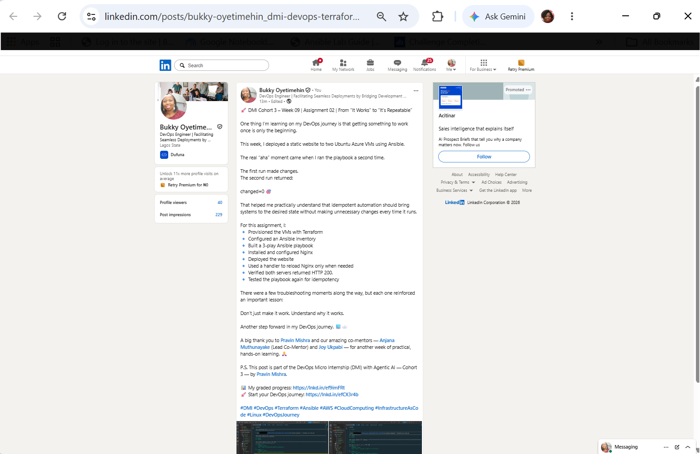

---

# Assignment Questions

Answer the following in your own words:

**1. What issue did you face while completing this assignment, and how did you fix it?**

One issue I faced was getting the Ansible inventory and file paths correct. At first, I used the wrong inventory group name when testing the servers, and I also had an issue downloading the website file because the `files` directory did not exist in the correct location.

I fixed these by checking my project structure, using the correct `webservers` inventory group, creating the required `files` directory, and downloading the `index.html` file to the correct location. After that, Ansible successfully connected to both servers and deployed the website.

---

**2. What did you learn from this assignment?**

I learned how Ansible works as an automation tool from beginning to end. First, I define the servers in an inventory file so Ansible knows which machines to manage. The playbook then connects to those servers through SSH and runs the tasks in the order I specify.

In this assignment, the workflow had three stages:

**Stage 1 – Install and Configure Nginx:**
Ansible connected to both Ubuntu servers, updated the package cache, installed Nginx, and ensured that the Nginx service was running and enabled.

**Stage 2 – Deploy the Website:**
Ansible copied the `index.html` file to `/var/www/html/` on both servers. I also used a **handler** to manage the Nginx reload.

The handler is important because it is only triggered when the website file is actually changed. The `copy` task uses `notify: Reload Nginx`. If Ansible detects that `index.html` is different from the version already on the server, the task reports `changed` and notifies the handler. The handler then reloads Nginx so it can serve the updated website.

If the file has not changed, the task reports `ok`, the handler is not triggered, and Nginx is not unnecessarily reloaded. This makes the playbook more efficient and supports idempotent automation.

**Stage 3 – Verify the Website:**
Ansible checked both servers using the `uri` module and confirmed that they returned HTTP 200. The `assert` task then confirmed that both websites were serving successfully.

I also tested **idempotency** by running the playbook a second time. Both servers reported:

`changed=0`
`failed=0`
`unreachable=0`

The `Copy website index.html` task returned `ok` instead of `changed`, so the reload handler did not run. This showed me that Ansible only makes changes when they are actually required.

Overall, I learned that Ansible is not just about executing commands remotely. It allows me to define the desired state of multiple servers and maintain that state consistently, while handlers help ensure that dependent services are updated only when necessary.

---

**3. Why is it useful to split installation, deployment, and verification into separate plays?**

Splitting installation, deployment, and verification into separate plays makes the playbook **clearer, easier to troubleshoot, and easier to maintain**.

Each play has one main responsibility. The first play installs and configures Nginx, the second deploys the website, and the third verifies that the website is working and returning HTTP 200.

This separation also supports **idempotency** because each stage checks the current state before making changes. For example, if Nginx is already installed and running, Ansible does not reinstall or restart it unnecessarily.

It also allows for **selective reruns** when troubleshooting. If Nginx is already configured but I only changed the website files, I can focus on the deployment play instead of repeating the entire setup process. Similarly, I can run the verification play to check the current state without changing the servers.

Overall, separating the plays makes the automation more organized, efficient, repeatable, and easier to troubleshoot.

---

**4. What is one benefit of using the Ansible `copy` module instead of cloning the website directly from Git on every managed server?**

One benefit of using the Ansible `copy` module is **centralized, consistent, and more controlled deployment**. Instead of cloning the Git repository separately on every server, I keep the website file on the Ansible controller and Ansible copies the same approved version to all managed servers.

There is also a **security benefit** because the managed servers do not need direct access to the Git repository or Git credentials. The servers only receive the files they need through the existing Ansible connection.

The `copy` module also supports **idempotency** because Ansible checks whether the file has changed before copying it. If the file is already up to date, no unnecessary change is made.

This gives me better control over what is deployed, reduces unnecessary access to external repositories, and keeps the website content consistent across all servers.

---

**5. What does idempotency mean in this assignment?**

In this assignment, **idempotency** means that I can run the same Ansible playbook multiple times and Ansible will only make changes when they are actually needed.

For example, on the first run, Ansible installed Nginx and copied the website because those changes were required. When I ran the playbook a second time, both servers showed:

`changed=0`
`failed=0`
`unreachable=0`

The website file was already up to date, so the `copy` task returned `ok` and the Nginx reload handler was not triggered.

This shows that the playbook maintains the desired state without repeatedly making unnecessary changes. It makes the automation **safe, predictable, and repeatable**.

---

**6. What does the Ansible `uri` module verify in Play 3?**

The Ansible `uri` module in Play 3 verifies that the website is **accessible over HTTP** from each managed server. It sends a GET request to the server's public IP address and checks the HTTP response.

In this assignment, the `uri` task expects a **200 OK** response. If the server returns HTTP 200, it confirms that Nginx is responding and the website is available.

The `assert` task then uses this result to confirm that both `web1` and `web2` are successfully serving the website.

---

# Required Files

Confirm that the following files are included in your assignment folder:

- [ ] `inventory.ini`
- [ ] `site.yml`
- [ ] `files/index.html`
- [ ] `README.md`

---

# Submission Instructions

- Add all required screenshots in the correct order.
- Full Name must be visible in required screenshots.
- Include both deployed website URLs.
- Paste `inventory.ini`, `site.yml`, and `README.md` as editable text.
- Answer all assignment questions clearly in your own words.
- Add your LinkedIn post URL.
- Do not expose SSH private keys, passwords, cloud account IDs, or other sensitive information.

---

# Completion Checklist

- [ ] Task 1: `static-web` folder structure is complete
- [ ] Task 2: Both servers are listed under the `[web]` group in `inventory.ini`
- [ ] Task 2: Inventory graph shows `web1` and `web2`
- [ ] Task 3: Ansible ping returns `SUCCESS` and `pong` for both servers
- [ ] Task 4: `files/index.html` contains your full name
- [ ] Task 5: `site.yml` contains three separate plays
- [ ] Task 5: Play 1 installs, starts, and enables Nginx
- [ ] Task 5: Play 2 deploys `index.html` using the `copy` module
- [ ] Task 5: Nginx reload handler is included
- [ ] Task 5: Play 3 verifies both web servers from the controller
- [ ] Task 6: Playbook syntax check passes
- [ ] Task 7: First playbook run completes with `unreachable=0` and `failed=0`
- [ ] Task 7: URI verification returns HTTP `200` for both servers
- [ ] Task 8: Second playbook run demonstrates idempotency
- [ ] Task 8: Second run shows `changed=0` for both web servers
- [ ] Task 9: Both `curl -I` commands return HTTP `200 OK`
- [ ] Task 9: Website loads from Server 1
- [ ] Task 9: Website loads from Server 2
- [ ] Task 9: Full name is visible on both deployed websites
- [ ] Task 10: `README.md` contains all required explanations
- [ ] Screenshots 1–11 are included
- [ ] `inventory.ini`, `site.yml`, and `README.md` are pasted as editable text
- [ ] Both website URLs are included
- [ ] Assignment questions are answered
- [ ] LinkedIn post published
- [ ] LinkedIn post URL added
- [ ] No sensitive information is exposed

---

## About DMI & CloudAdvisory

DevOps Micro Internship (DMI) is a project-based DevOps program run by Pravin Mishra and The CloudAdvisory, focused on real-world execution, systems thinking, and career readiness.

It helps learners build strong DevOps foundations with hands-on experience.

---

## Resources

- DMI Official Website: [https://dmi.pravinmishra.com?utm_source=github&utm_medium=readme](https://dmi.pravinmishra.com?utm_source=github&utm_medium=readme)
- University: [https://university.pravinmishra.com?utm_source=github&utm_medium=readme](https://university.pravinmishra.com?utm_source=github&utm_medium=readme)
- Discord Community: [https://discord.pravinmishra.com?utm_source=github&utm_medium=readme](https://discord.pravinmishra.com?utm_source=github&utm_medium=readme)
- Blog: [https://dmi.pravinmishra.com/blog?utm_source=github&utm_medium=readme](https://dmi.pravinmishra.com/blog?utm_source=github&utm_medium=readme)
- YouTube Playlist: [https://www.youtube.com/playlist?list=PLFeSNDtI4Cho](https://www.youtube.com/playlist?list=PLFeSNDtI4Cho)
- Pravin Mishra LinkedIn: [https://www.linkedin.com/in/pravin-mishra-aws-trainer/](https://www.linkedin.com/in/pravin-mishra-aws-trainer/)
- CloudAdvisory LinkedIn: [https://www.linkedin.com/company/thecloudadvisory/](https://www.linkedin.com/company/thecloudadvisory/)

---

*This submission is part of DevOps Micro Internship (DMI) — Agentic AI Track.*
